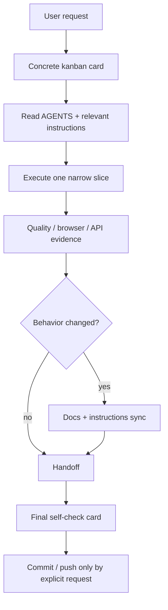

# Agent workflow и инструкции проекта

Этот документ описывает, как агентам работать с проектом `django_6_blog` и поддерживать инструкции.

## Точки входа

1. `README.md` — короткая входная точка для человека.
2. `doc/README.md` — каталог актуальной документации.
3. `AGENTS.md` — мастер-инструкция/роутер для агентов.
4. `instructions/*.instructions.md` — атомарные инструкции по зонам ответственности.
5. `doc/kanban.md` — правила Hermes Kanban-доски проекта.

## Принцип атомарности

Каждый актуальный документ и каждая инструкция должны отвечать за одну тему:

- development setup;
- architecture;
- content import;
- media content;
- public UI;
- testing/quality gates;
- docs/instruction style.
- kanban workflow для проектных слайсов.

Если текст начинает описывать две независимые зоны, его нужно разделить.

## Что попадает в инструкции

В `instructions/` попадают только фундаментальные правила:

- архитектурные границы;
- safety gates;
- устойчивые contracts;
- правила тестирования и visual QA;
- правила работы с документацией;
- запреты, нарушение которых создаёт регрессии.
- правила Hermes Kanban, если они меняют card contract, зависимости, dispatch boundary или финальный commit/push gate.

Не попадает:

- release notes;
- история коммитов;
- временные планы;
- отчёты о выполненных задачах;
- длинные логи;
- косметические детали одного слайса, если они не стали устойчивым правилом.

## Формат instruction-файлов

Файлы лежат в `instructions/` и называются так:

```text
PREFIX.topic.instructions.md
```

Каждый файл начинается с YAML frontmatter:

```yaml
---
applyTo: "glob/or/path"
name: "PREFIX.Topic"
description: "Когда использовать эту инструкцию: подсистема, trigger-слова, файлы."
---
```

`description` нужен не как summary, а как routing trigger: агент должен понять, когда файл читать.

## Поддержка актуальности

Перед изменением инструкции:

1. Проверь реальные файлы и текущий код.
2. Убедись, что правило действительно фундаментальное.
3. Не копируй большие куски из соседних инструкций.
4. Не добавляй устаревшие имена, старые workflow или историю.
5. Если инструкция стала описывать две темы — раздели её.
6. После изменения проверь ссылки из `AGENTS.md`.

## Рабочий порядок агента

1. Проверить `git status --short --branch`.
2. Прочитать `AGENTS.md`.
3. Определить затронутые подсистемы.
4. Прочитать соответствующие `instructions/*.instructions.md`.
5. Сделать минимальный проверяемый слайс.
6. Запустить smallest relevant tests, затем broader gate при необходимости.
7. Перед commit проверить staged files и отсутствие секретов/локальных артефактов.
8. Commit/push делать только по явной просьбе пользователя.

## Kanban workflow

Для агентной разработки используется отдельная Hermes Kanban-доска проекта:

```text
slug: django-6-blog
default workdir: /home/v/code/django_6_blog
```

Перед работой с карточками прочитай [`kanban.md`](kanban.md) и [`../instructions/AGENT.kanban.instructions.md`](../instructions/AGENT.kanban.instructions.md).



Ключевые правила:

1. CLI/database — источник истины по состоянию доски.
2. Browser dashboard и Telegram — только view/reporting layer.
3. Карточка должна иметь точные файлы для чтения, узкую задачу, measurable done condition и evidence gate.
4. Создание карточек не означает запуск автономных воркеров; `dispatch` запускается только если пользователь ожидает старт работы.
5. Финальная commit/push карточка зависит от рабочих карточек текущей волны.

## Documentation sync rule

Если слайс меняет поведение, которое пользователь или будущий агент должен помнить, обнови документацию в том же слайсе:

- CLI поведение → `doc/cli.md`;
- импорт → `doc/content-import.md`;
- медиа/таймкоды → `doc/media-content.md`;
- публичный UI → `doc/public-ui.md`;
- архитектурная граница → `doc/architecture.md`;
- агентные правила → `AGENTS.md` и `instructions/`.
- kanban workflow → `doc/kanban.md`, `instructions/AGENT.kanban.instructions.md`, `AGENTS.md`.
