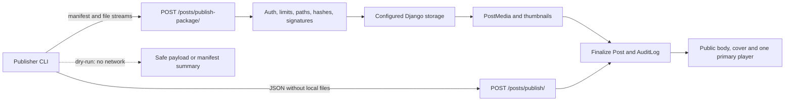

# Blog API

API для агент-управляемой публикации постов. Все эндпоинты живут под `/api/v1/` в отдельном приложении `api/`.

## Контур API



## Авторизация

Token-based auth через заголовок:

```http
Authorization: Bearer <token>
```

API ключи создаются и управляются через Django admin (`/admin/api/apikey/`). Каждый ключ имеет:

- `name`
- `token`
- `is_active`
- `expires_at`
- `permissions`
- `last_used_at`
- `revoked_at`

### Permissions

| Permission | Endpoints |
|---|---|
| `read` | list, detail |
| `publish` | JSON publish, multipart package publish, bulk publish |
| `delete` | soft delete |
| `status` | status transition |
| `stats` | stats endpoint |

## Rate limiting

Each API key is limited to **60 requests per minute**. Exceeding returns:

```json
{"error": "Rate limit exceeded", "retry_after": 17}
```

## Публичные endpoints

### `GET /api/v1/health/`

Публичный health-check. API key не нужен.

Ответ:

```json
{
  "status": "ok",
  "db": "ok",
  "post_count": 42,
  "version": "1.0"
}
```

### `POST /api/v1/posts/<slug>/read-depth/`

Публичный telemetry endpoint. API key не нужен.

```http
POST /api/v1/posts/<slug>/read-depth/
Content-Type: application/json

{"read_depth": 0.75}
```

Работает только для опубликованных и не удалённых постов.

## Агентские endpoints

### `POST /api/v1/posts/publish/`

Создаёт или обновляет пост из JSON payload.

**Required:**

| Поле | Тип | Описание |
|---|---|---|
| `title` | string | Заголовок |
| `description` | string | Описание для карточек / OG |
| `content` | string | Markdown body |

**Optional:**

| Поле | Тип | Default | Описание |
|---|---|---|---|
| `content_type` | string | `article` | `article/video/audio/podcast` |
| `media_url` | string | `""` | Обязателен для `video/audio/podcast` |
| `timecodes` | list | `[]` | `[{time, label}, ...]` |
| `tags` | list | `[]` | Список строк |
| `category` | string | `null` | Категория, создаётся если не существует |
| `series` | string | `null` | Серия, создаётся если не существует |
| `series_order` | int | `0` | Порядок в серии |
| `status` | string | `published` | `published/draft/archived` |
| `slug` | string | auto | Явный slug |
| `replace` | bool | `false` | Перезаписать существующий slug |
| `source_id` | string | `null` | Внешний идемпотентный ключ |

**Behavior:**

- если slug занят и `replace=false`, возвращается `409`
- если передан `source_id`, и активный пост с ним уже существует, publish работает идемпотентно
- mutating actions пишут `AuditLog`

### `POST /api/v1/posts/publish-package/`

Публикует одну Markdown-запись вместе с локальными изображениями, обложкой и, для media-post, одним primary audio/video. Требует Bearer token с permission `publish`, `multipart/form-data` и `Idempotency-Key` длиной 8–128 символов (`A-Z`, `a-z`, `0-9`, `.`, `_`, `-`).

Форма содержит JSON-поле `manifest` протокола 1 и ровно по одной файловой части `asset_<id>` для каждого asset. Manifest связывает логические Markdown-ссылки, роли `body`/`cover`/`primary`, имя, размер, MIME и SHA-256; `package_sha256` защищает весь контракт.

Ответы:

- `201` — новый пакет завершён;
- `200` — точный повтор завершённого пакета тем же API-ключом;
- `400` — неверный manifest, файл, путь, роль, тип или лимит;
- `409` — idempotency key использован для другого payload, пакет pending/failed или slug занят без `replace`;
- `500` — безопасная общая ошибка финализации; внутренняя причина остаётся в логах.

Post сначала сохраняется как draft. Запрошенный `published` применяется только после storage-записи, создания `PostMedia`, thumbnails, тегов и audit state. Для media-post разрешён ровно один источник: внешний HTTP(S) `media_url` либо локальный primary подходящего типа. Primary embed удаляется из Markdown body, поэтому detail рендерит один player.

### Multipart limits и безопасность

Значения по умолчанию:

| Ограничение | Значение | Django setting |
|---|---:|---|
| Manifest | 256 KiB | `PUBLISH_PACKAGE_MANIFEST_MAX` |
| Markdown content | 2 MiB | `PUBLISH_PACKAGE_CONTENT_MAX` |
| Assets | 32 | `PUBLISH_PACKAGE_ASSET_MAX_COUNT` |
| Package total | 512 MiB | `PUBLISH_PACKAGE_TOTAL_MAX` |
| Image / audio / video | 20 / 200 / 500 MiB | `PUBLISH_PACKAGE_IMAGE_MAX` / `PUBLISH_PACKAGE_AUDIO_MAX` / `PUBLISH_PACKAGE_VIDEO_MAX` |

Разрешены JPEG, PNG, WebP, GIF, MP4, WebM, MP3, OGG/Opus, WAV, FLAC и M4A. Сервер сверяет расширение, MIME, magic bytes, размер и SHA-256. Абсолютные пути, `..`, undeclared parts, дубли имён и более одной cover/primary роли отклоняются. В manifest остаются только относительные логические ссылки — пути машины-источника не передаются.

Storage вызывается через Django Storage API. Код не зависит от локального `file.path`, поэтому совместим с pathless S3-compatible backend. Имена новых объектов детерминированы пакетом; storage backend должен сохранить запрошенное имя без автоматического переименования.

### Идемпотентность и recovery

`PublishPackage` хранит ledger по паре API key + idempotency key, payload hash, state, response и только принадлежащие пакету storage names. При ошибке финализации новые объекты удаляются best-effort, пакет становится `failed`. Тот же failed/pending key не запускается повторно автоматически: после диагностики нужен новый idempotency key.

При `replace` новая версия коммитится до best-effort удаления старых объектов. Ошибка удаления старого файла логируется и не отменяет успешную замену.

Для stale pending/failed записей:

```bash
uv run python manage.py cleanup_publish_packages --dry-run
uv run python manage.py cleanup_publish_packages --older-than-hours 24
```

Команда затрагивает только имена из package ledger; произвольный storage prefix удалять нельзя.

### `POST /api/v1/posts/bulk/`

Массовая публикация нескольких постов:

```json
{
  "posts": [
    {"title": "Post 1", "description": "...", "content": "..."},
    {"title": "Post 2", "description": "...", "content": "..."}
  ]
}
```

Возвращает per-item `results`, `created`, `errors`.

### `GET /api/v1/posts/`

Список постов для агентов.

Поддерживает фильтры:

- `status=published|draft|archived`
- `content_type=article|video|audio|podcast`
- `category=<slug-or-name>`
- `search=<text>`
- `sort=created_at|-created_at|title|-title|view_count|-view_count|published_at|-published_at`
- `page=<n>`
- `per_page=<1..100>`

Ответ содержит `results` и `pagination`.

### `GET /api/v1/posts/<slug>/`

Возвращает полную serialized-структуру поста, включая `content`, `timecodes`, `series`, `series_order`.

### `PATCH /api/v1/posts/<slug>/status/`

Меняет статус поста между `published`, `draft`, `archived`.

### `DELETE /api/v1/posts/<slug>/`

Мягкое удаление (soft delete):

- ставит `deleted_at`
- переводит пост в `archived`
- сохраняет строку в БД
- пишет audit trail

### `GET /api/v1/stats/`

Агрегатная статистика:

- количество постов по статусам
- количество по content type
- top-5 категорий
- total views
- total likes
- featured count

## Validation rules

- JSON endpoint остаётся JSON in/out; локальные assets используют отдельный multipart endpoint
- Timecodes нормализуются до `{time, seconds, label}`
- Для JSON endpoint у `video`, `audio`, `podcast` обязателен `media_url`; multipart endpoint может вместо него принять один local primary asset
- Timecodes должны соответствовать допустимому clock format (`M:SS`, `MM:SS`, `H:MM:SS`, `HH:MM:SS`)
- Public site и list/detail API не должны показывать soft-deleted записи как активные

## Пример curl

```bash
curl -X POST https://blog.example.com/api/v1/posts/publish/ \
  -H "Authorization: Bearer $BLOG_API_KEY" \
  -H "Content-Type: application/json" \
  -d '{
    "title": "Новый пост",
    "description": "Краткое описание",
    "content": "# Привет\n\nТекст поста.",
    "tags": ["Python", "Django"],
    "category": "Testing",
    "series": "Python Basics",
    "series_order": 2,
    "source_id": "obsidian:python-basics:02"
  }'
```
