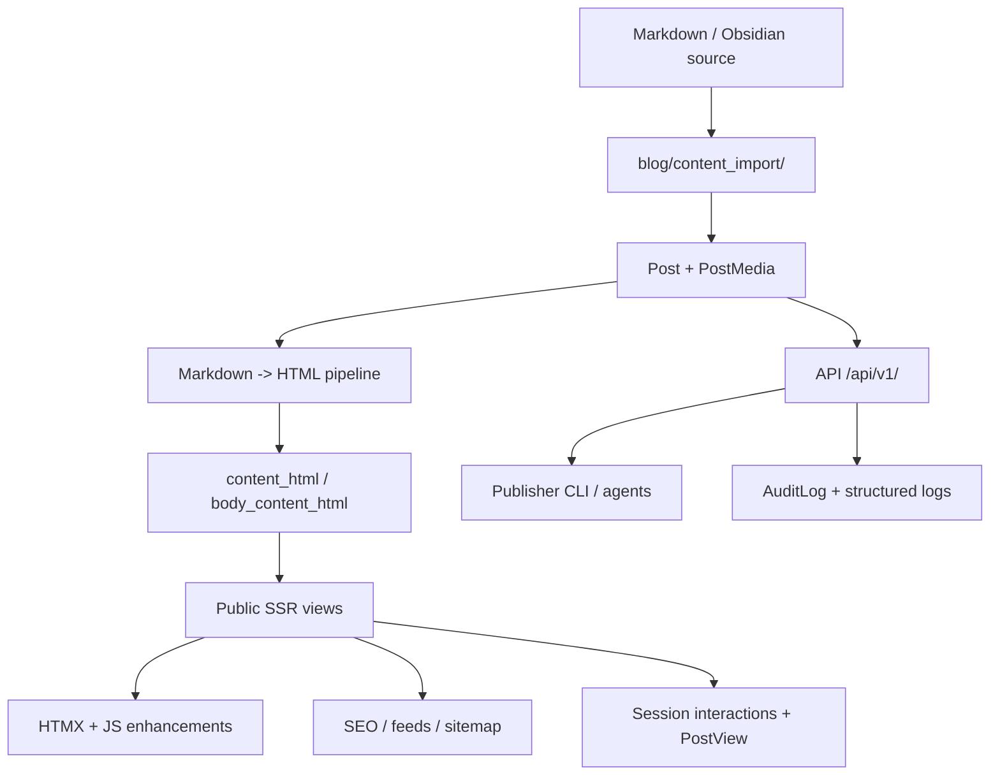
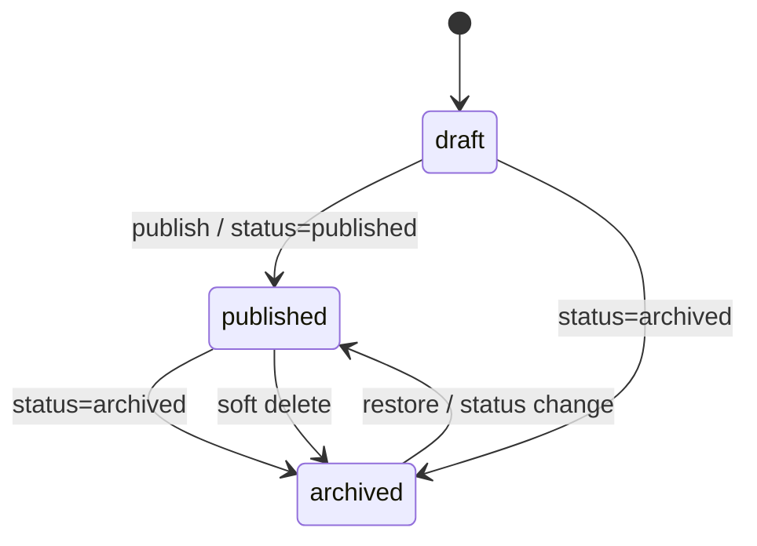
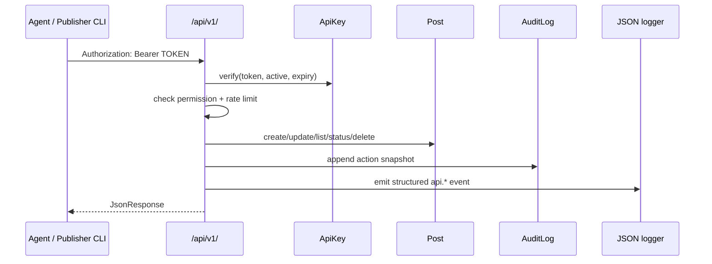

# Архитектура проекта

`django_6_blog` — SSR-first Django 6 контент-платформа: публичный блог, Markdown/Obsidian импорт, агентский API публикации и лёгкая фронтенд-интерактивность без SPA.

## Текущий стек

- Python `>=3.12`, окружение через `uv`
- Django `6.0.x`
- SQLite — текущая база проекта
- Bootstrap 5 + django-components
- HTMX для progressive enhancement
- Python Markdown + `pymdown-extensions` + BeautifulSoup processors
- Mermaid + `svg-pan-zoom` на фронтенде

## Карта системы

## Основные зоны

- `config/` — настройки Django, root URLs, logging
- `blog/models.py` — доменная модель постов, серий, медиа, просмотров и audit trail
- `blog/views.py` — SSR public views: список, деталка, about, series, reactions
- `blog/content_import/` — доменный импорт Markdown/Obsidian
- `blog/services/` — Markdown → HTML pipeline и HTML processors
- `blog/management/commands/` — import, backup, scheduled publishing, asset collection
- `api/` — token-based agent API, telemetry endpoints, permission/rate-limit layer
- `publisher/` — standalone stdlib-only CLI для публикации через API
- `templates/blog/` — публичные страницы и partials
- `static/css/`, `static/js/` — стили и небольшие интерактивные сценарии

## Данные

Главные модели:

- `Category` — публичная категория записи
- `Tag` — сквозная тема записи
- `Series` — упорядоченная серия материалов
- `Post` — запись с Markdown body, cached HTML, type, media, status, counters и lifecycle fields
- `PostMedia` — прикреплённые image/video/audio/document assets
- `SessionPostInteraction` — anonymous session history для просмотров и лайков
- `PostView` — события чтения / read-depth telemetry
- `AuditLog` — append-only audit trail API-операций
- `ApiKey` (`api/models.py`) — токен, permissions, expiry, last_used

## Lifecycle поста

## Публикация и видимость

`Post.status` имеет три состояния:

- `draft` — скрыт от публичного сайта
- `published` — виден в ленте и на detail page
- `archived` — скрыт от публичного сайта, но запись остаётся в БД

Дополнительно:

- `deleted_at IS NULL` — пост активен
- `deleted_at IS NOT NULL` — soft-deleted, должен быть скрыт из публичного сайта и из agent list/detail API
- `source_id` — внешний идемпотентный ключ для агентской публикации
- `published_at` — метка публикации / scheduled publishing
- `is_featured` — рекомендованный материал

## Markdown → HTML

При сохранении `Post` Markdown конвертируется в `content_html`. Detail template использует `body_content_html`, чтобы не показывать дублирующий H1 и не дублировать primary media embed.

Pipeline:

1. `blog/content_import/` связывает локальные media references с `PostMedia`
2. Python Markdown конвертирует Markdown в HTML
3. BeautifulSoup processors добавляют проектные классы для таблиц, изображений, callouts и code
4. Mermaid blocks экранируют исходник и рендерятся как управляемые pan/zoom диаграммы
5. `body_content_html` кэшируется отдельно и инвалидируется в `save()`

Любой HTML, который потом идёт в template через `|safe`, считается security boundary: пользовательский исходник нужно экранировать, а локальные пути assets не должны выходить за `assets_dir`.

## Public UI

Список постов использует обычные SEO-friendly query-string фильтры и pagination links. HTMX — только progressive enhancement.

Detail page отвечает за:

- header, badges, breadcrumbs и meta
- optional media player и timecodes
- rendered Markdown body
- reading progress
- lightbox для изображений
- related posts
- series navigation
- session reactions

## API слой

Agent API включает:

- publish / bulk publish
- list / detail
- status transitions
- soft delete
- stats
- public health
- public read-depth telemetry

## Наблюдаемость

- `AuditLog` — факт мутаций по API
- `LOGGING` в `config/settings.py` — JSON console logging для `api.*`
- `GET /api/v1/health/` — health endpoint
- `backup` command — операционный JSON dump
- GitHub Actions — минимальный CI gate (`check` + `pytest`)

## Архитектурные границы

- Импорт контента не расползается в templates или views: доменная логика живёт в `blog/content_import/`
- Markdown rendering не дублируется: общий вход — `convert_markdown_to_html`
- Public views должны фильтровать `status=published` **и** `deleted_at__isnull=True`
- Publisher CLI остаётся Django-free и stdlib-only
- Soft delete — поведение по умолчанию; жёсткое удаление только через явный `hard_delete()`
- UI-полировка закрывается тестами и browser/visual QA, когда меняется видимая поверхность
- SQLite-only остаётся текущей границей, пока Postgres/pgvector не выделены в отдельный слайс
