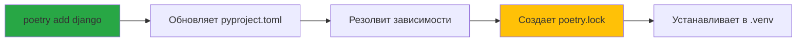
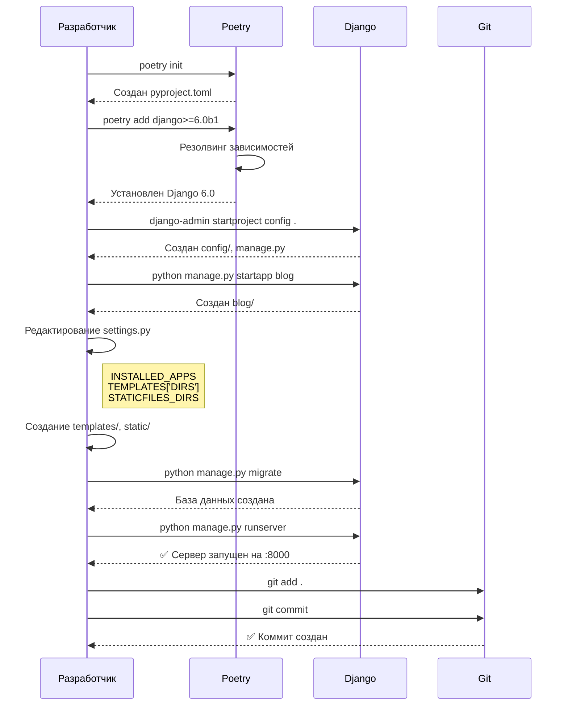

# Серия 01: Фундамент проекта — Django 6, Poetry и структура

> **Коммиты:** `f28d8ba`, `1bcef2f`  
> **Фаза:** 1.1 — Инициализация Django 6 проекта

---

## 🎯 Что было сделано

Создан базовый Django 6 проект с приложением `blog`, настроена структура директорий для шаблонов и статики, подключен Poetry для управления зависимостями.

**Итог:** Рабочий проект на Django 6.0 beta с чистой архитектурой, готовый к разработке функционала.

---

## 🤔 Почему Django 6 (beta)?

Django 6 еще в бете, но мы выбрали его по **одной ключевой причине**.

### Template Partials — революция в шаблонах

Django 6 вводит **Template Partials** (частичные шаблоны) — возможность определять именованные фрагменты HTML **прямо внутри** основного шаблона.

**Зачем это нужно?**

Раньше для HTMX приходилось создавать отдельные файлы для каждого динамического фрагмента:

```text
❌ Старый подход (Django 5):
templates/
  post_list.html          # Полная страница
  _post_list_partial.html # Фрагмент для HTMX
  _comments_partial.html  # Еще один фрагмент
  _sidebar_partial.html   # И еще один...
```

С Django 6 **всё в одном файле**:

```text
✅ Новый подход (Django 6):
templates/
  post_list.html  # Содержит и страницу, и partials внутри
```

**Схема работы Template Partials:**

```mermaid
graph TB
    A[post_list.html] --> B{Запрос от браузера}
    B -->|Обычный GET /posts/| C[Рендерится вся страница]
    B -->|HTMX GET /posts/?partial=list| D[Рендерится только partial 'list']
    
    A --> E[]
    A --> F[]
    
    E --> D
    F --> D
    
    style A fill:#fff3cd
    style E fill:#d1ecf1
    style F fill:#d1ecf1
```

**Преимущества:**

| Критерий | Django 5 | Django 6 Partials |
|----------|----------|-------------------|
| Файлов | Много мелких | Один файл |
| Контекст | Дублируется | Единый |
| Поддержка | Поиск по файлам | Всё рядом |
| HTMX | Нужны view для каждого partial | Один view, разные partials |

---

## 📦 Poetry вместо pip/venv — зачем?

Poetry — это **менеджер зависимостей и виртуальных окружений** в одном инструменте.

### Проблема с pip + requirements.txt

```text
❌ Традиционный подход:
1. python -m venv .venv
2. source .venv/bin/activate (или .venv\Scripts\activate)
3. pip install django
4. pip freeze > requirements.txt
5. Коллеги делают: pip install -r requirements.txt
6. Конфликты версий? Решай сам!
```

### Решение с Poetry

```text
✅ Poetry подход:
1. poetry add django
2. Всё! (окружение создано, зависимости заблокированы)
```

**Что дает Poetry:**



**Сравнение:**

| Возможность | pip + requirements.txt | Poetry |
|-------------|------------------------|--------|
| Файл конфигурации | requirements.txt | pyproject.toml (стандарт PEP 518) |
| Блокировка версий | ❌ Вручную | ✅ Автоматически (poetry.lock) |
| Виртуальное окружение | Отдельно (venv) | ✅ Встроено |
| Разделение dev/prod | ❌ Два файла | ✅ Секции в одном файле |
| Резолвинг конфликтов | ❌ Ошибка при установке | ✅ Проверка до установки |

**Наш pyproject.toml:**

```toml
[project]
requires-python = ">=3.12"  # Django 6 требует Python 3.12+

dependencies = [
  "django==6.0"  # Точная версия Django
]
```

Poetry автоматически создал `poetry.lock` с **точными** версиями всех зависимостей (включая транзитивные):

- `django==6.0`
- `asgiref==3.11.0`
- `sqlparse==0.5.4`
- `tzdata==2025.2`

---

## 🏗️ Структура проекта: config/ вместо projectname/

Традиционно Django создает проект так:

```text
❌ Традиционная структура:
myproject/
  myproject/      # 😕 Название дублируется
    settings.py
    urls.py
  myapp/
  manage.py
```

Мы используем **более чистый подход**:

```text
✅ Наша структура:
django_6_blog/    # Корень репозитория
  config/         # 🎯 Конфигурация (не дублирует имя)
    settings.py
    urls.py
  blog/           # Приложение блога
  templates/      # Шаблоны (в корне!)
  static/         # Статика (в корне!)
  manage.py
```

**Команда создания:**

```bash
django-admin startproject config .
#                         ^^^^^^ ^
#                         имя    точка = текущая папка
```

### Зачем `config` а не `django_6_blog`?

**Семантика:**

- `config/` = "Это конфигурация проекта" ✅
- `django_6_blog/django_6_blog/` = "Э... что?" ❌

**Универсальность:**

- Переименовали проект? `config/` остается `config/`
- С традиционным подходом — рефакторинг импортов

**Схема:**

```text
django_6_blog/              ← Репозиторий
│
├── config/                 ← Сердце проекта
│   ├── settings.py         ← Настройки (БД, apps, middleware)
│   ├── urls.py             ← Главный маршрутизатор
│   ├── asgi.py / wsgi.py   ← Серверы
│   
├── blog/                   ← Приложение (бизнес-логика)
│   ├── models.py           ← Модели данных
│   ├── views.py            ← Контроллеры
│   ├── urls.py             ← Маршруты приложения
│   
├── templates/              ← Шаблоны (см. следующий раздел)
├── static/                 ← Статика (CSS, JS, изображения)
└── manage.py               ← CLI Django
```

---

## 📁 templates/ и static/ в корне — почему не в приложениях?

### Традиционный подход (шаблоны в приложениях)

```text
❌ Шаблоны распределены:
blog/
  templates/
    blog/
      post_list.html
      post_detail.html
accounts/
  templates/
    accounts/
      login.html
```

**Проблемы:**

- Поиск шаблонов по всем папкам
- Нет единого места для `base.html`
- Компоненты (navbar, footer) где хранить?

### Наш подход (централизованные шаблоны)

```text
✅ Всё в одном месте:
templates/
  base.html           # Базовый шаблон
  blog/
    post_list.html
    post_detail.html
  components/         # Переиспользуемые части (позже)
    navbar.html
    footer.html
```

**Настройка в settings.py:**

```python
TEMPLATES = [{
    'DIRS': [BASE_DIR / 'templates'],  # 👈 Сначала смотрим в корне
    'APP_DIRS': True,                   # Потом в приложениях (если нужно)
}]
```

**Преимущества:**

| Критерий | В приложениях | В корне |
|----------|---------------|---------|
| Поиск шаблона | Во всех app/templates/ | В одной папке |
| Общие части (base.html) | Дублирование или хаки | Один файл |
| Компоненты UI | Непонятно куда класть | templates/components/ |
| Работа с дизайнером | "Файлы где-то внутри кода" | "Вот папка templates/" |

### Аналогично для static/

```text
static/
  css/
    style.css       # Кастомные стили
  js/
    main.js         # Основной JS
```

**Настройка:**

```python
STATIC_URL = 'static/'
STATICFILES_DIRS = [BASE_DIR / 'static']  # 👈 Наша статика
```

---

## 🗂️ Итоговая структура проекта

```text
django_6_blog/
│
├── .venv/                  # Виртуальное окружение (Poetry)
├── .gitignore              # Игнорируем __pycache__, db.sqlite3, .venv
│
├── config/                 # 🎛️ Конфигурация Django
│   ├── settings.py
│   ├── urls.py
│   ├── asgi.py
│   └── wsgi.py
│
├── blog/                   # 📝 Приложение блога
│   ├── models.py
│   ├── views.py
│   ├── admin.py
│   ├── apps.py
│   └── migrations/
│
├── templates/              # 🎨 Все шаблоны в одном месте
│   └── .gitkeep
│
├── static/                 # 🖼️ Статика (CSS, JS, images)
│   ├── css/
│   └── js/
│
├── manage.py               # Django CLI
├── pyproject.toml          # Poetry конфигурация
└── poetry.lock             # Заблокированные версии
```

**Цветовая легенда:**

- 🎛️ **config/** — Настройки и маршруты
- 📝 **blog/** — Бизнес-логика
- 🎨 **templates/** — Представление
- 🖼️ **static/** — Ресурсы

---

## ⚙️ Настройки: что изменили в settings.py

### 1. Подключили приложение blog

```python
INSTALLED_APPS = [
    # ... встроенные Django приложения
    # Local apps
    'blog',  # 👈 Наше приложение
]
```

### 2. Настроили шаблоны

```python
TEMPLATES = [{
    'DIRS': [BASE_DIR / 'templates'],  # 👈 Корневая папка
    # ...
}]
```

### 3. Настроили статику

```python
STATIC_URL = 'static/'
STATICFILES_DIRS = [BASE_DIR / 'static']  # 👈 Корневая папка
```

---

## 🧹 .gitignore: что не попадает в репозиторий

Создали правильный `.gitignore` **до** первого коммита кода:

```gitignore
# Python
__pycache__/          # Скомпилированные файлы Python
*.py[cod]             # .pyc, .pyo, .pyd
*.so                  # Бинарные расширения

# Django
*.log                 # Логи
db.sqlite3            # База данных (локальная)
/media                # Загрузки пользователей

# Virtual Environment
.venv/                # Poetry окружение
venv/

# IDE
.vscode/              # Настройки VS Code
.idea/                # Настройки PyCharm
```

**Зачем это важно?**

Если бы мы **не** добавили `.gitignore` сразу:

```text
❌ Первый коммит без .gitignore:
Коммит: 500 файлов
  - blog/__pycache__/__init__.cpython-313.pyc  😱
  - blog/__pycache__/models.cpython-313.pyc
  - config/__pycache__/settings.cpython-313.pyc
  - db.sqlite3  (с тестовыми данными)
  - ...

✅ Первый коммит С .gitignore:
Коммит: 18 файлов
  - blog/__init__.py
  - blog/models.py
  - config/settings.py
  - ...
```

---

## 🎬 Процесс создания: пошагово

Вот что было выполнено в терминале (упрощенно):



**Ключевые команды:**

```bash
# 1. Инициализация Poetry
poetry init --python ">=3.12"
poetry add "django>=6.0b1"

# 2. Создание проекта
poetry run django-admin startproject config .
poetry run python manage.py startapp blog

# 3. Миграции
poetry run python manage.py migrate

# 4. Запуск
poetry run python manage.py runserver
```

---

## ✅ Чеклист: что получили на выходе

- [x] Django 6.0 beta установлен через Poetry
- [x] Проект создан с конфигурационным пакетом `config/`
- [x] Приложение `blog` создано и подключено
- [x] Централизованные `templates/` и `static/` настроены
- [x] `.gitignore` настроен (без мусора в репозитории)
- [x] База данных создана (SQLite)
- [x] Сервер запускается без ошибок
- [x] Чистая история git (3 атомарных коммита)

---

## 🔗 Следующая серия

**[Серия 02: Маршрутизация и первые представления](02_routing_and_views.md)** (фаза 1.2)

Создадим URL-паттерны для блога, напишем первые view-функции и разберемся с системой маршрутизации Django.

---

**Дата создания серии:** 12 декабря 2025 г.
