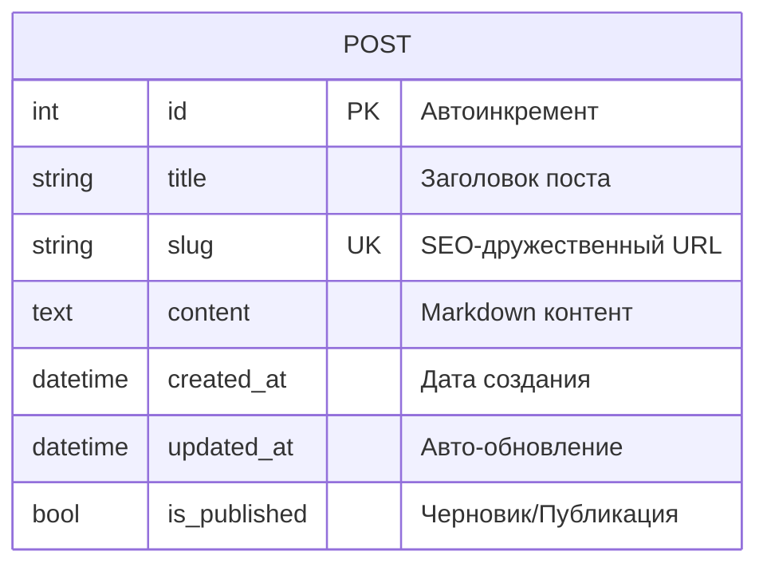
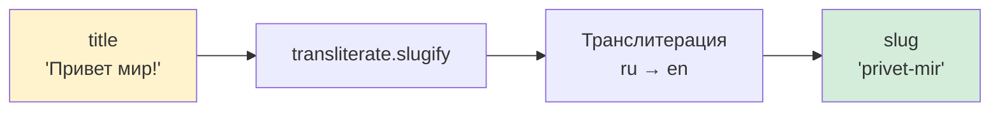
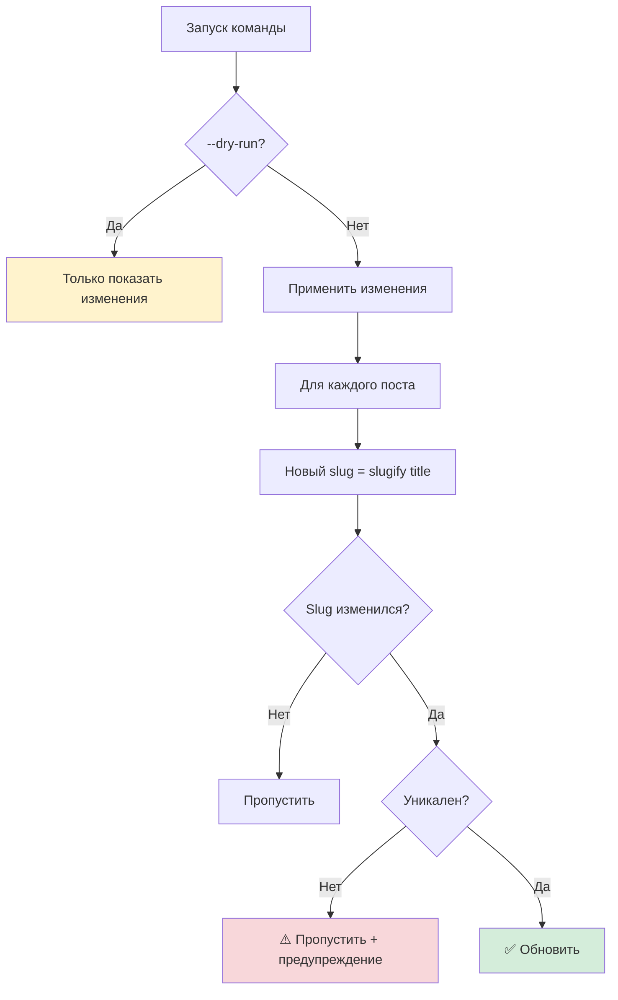
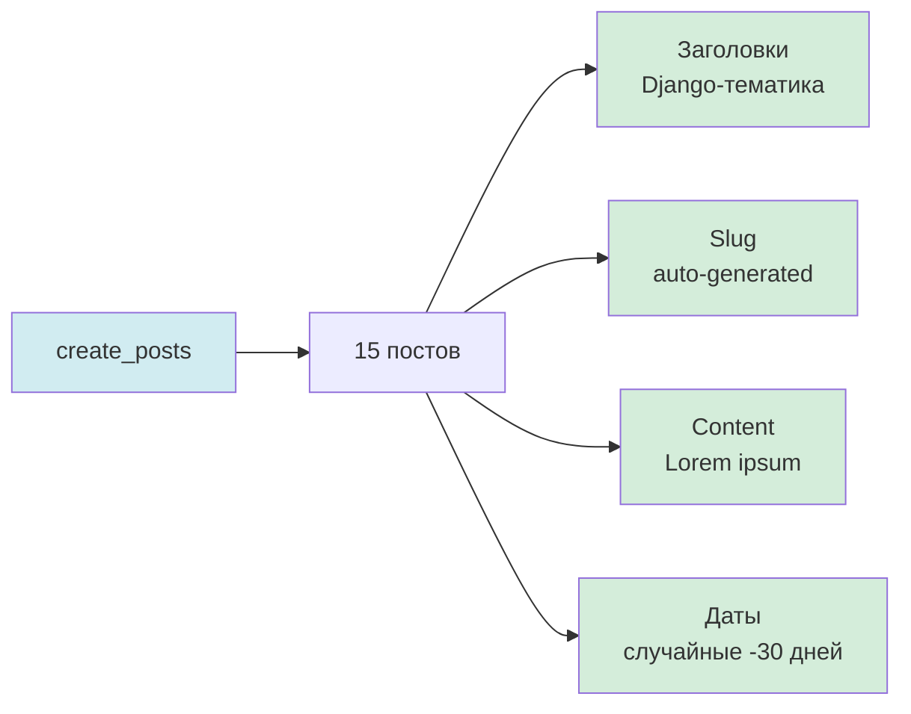
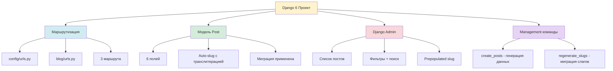

# 🏗️ Серия 02: Базовая структура проекта

> Маршрутизация, модель данных и первый hotfix

**Коммиты этой серии:**

```
ff56832 - phase 1.2 feat: Созданы view-функции заглушки
c28dd00 - phase 1.2 feat: Созданы URL-маршруты приложения blog  
d69676c - phase 1.2 feat: Подключены маршруты blog в главный urls.py
c264d34 - phase 1.3 feat: Создана модель Post для блога
a6e9c00 - phase 1.3 feat: Создана и применена миграция для модели Post
eba10d4 - phase 1.3 feat: Создана management команда для генерации тестовых постов
4efb0b1 - phase 1.3 feat: Настроен Django Admin для модели Post
ba7c711 - hotfix: Исправлена проблема с транслитерацией кириллицы в слагах
```

---

## 📌 Что мы построили?

В этой серии мы заложили фундамент блога:
1. **Маршрутизацию** — URL-структуру приложения
2. **Модель данных** — схему хранения постов
3. **Административную панель** — интерфейс управления контентом
4. **Инструмент для разработки** — команду генерации тестовых данных
5. **Hotfix транслитерации** — решение классической проблемы с кириллицей

---

## 🎯 Архитектура маршрутизации

### Структура URL в Django 6

Django использует двухуровневую систему маршрутизации:

```mermaid
graph TB
    A[config/urls.py<br/>Главный роутер] --> B[/admin/ → Django Admin]
    A --> C["'' → include('blog.urls')"]
    C --> D[blog/urls.py<br/>Роутер приложения]
    D --> E[/ → post_list]
    D --> F[/post/pk/ → post_detail]
    D --> G[/about/ → about]
    
    style A fill:#fff3cd
    style D fill:#d1ecf1
    style B fill:#f8d7da
    style E fill:#d4edda
    style F fill:#d4edda
    style G fill:#d4edda
```

### Философия разделения

| Уровень       | Файл             | Зона ответственности                 |
| ------------- | ---------------- | ------------------------------------ |
| **Проект**    | `config/urls.py` | Подключение приложений, admin, API   |
| **Приложение** | `blog/urls.py`   | Маршруты внутри домена (блог, форум) |

**Зачем разделять?**
- **Модульность**: можно отключить приложение одной строкой
- **Переиспользование**: `blog.urls` работает с любым префиксом
- **Читаемость**: каждый файл отвечает за свой уровень

### Пример маршрутов blog/urls.py

```python
urlpatterns = [
    path('', post_list, name='post_list'),
    path('post/<int:pk>/', post_detail, name='post_detail'),
    path('about/', about, name='about'),
]
```

**Почему `<int:pk>`, а не `<slug>`?**
На этапе MVP используем первичный ключ — проще для отладки. Slug добавим в phase 1.5.

---

## 🗄️ Модель данных Post

### Концепция: Минимальный блог-пост

**Что нужно для публикации контента?**



### Ключевые решения

| Поле          | Тип          | Решение                      | Зачем                          |
| ------------- | ------------ | ---------------------------- | ------------------------------ |
| `slug`        | SlugField    | Unique, auto_generated       | SEO + читаемые URL             |
| `content`     | TextField    | Markdown (рендер потом)      | Гибкость форматирования        |
| `created_at`  | DateTimeField | auto_now_add=True            | Метка создания автоматически   |
| `updated_at`  | DateTimeField | auto_now=True                | Обновляется при каждом save()  |
| `is_published` | BooleanField | default=True                 | Система черновиков из коробки  |

### Авто-генерация slug в методе save()

**Концепция**: При создании поста, если slug пустой — генерируем из title.

```python
def save(self, *args, **kwargs):
    if not self.slug:
        self.slug = slugify(self.title)
    super().save(*args, **kwargs)
```

**Проблема**: встроенный Django `slugify()` игнорирует кириллицу! 😱

---

## ⚠️ Проблема: Django slugify и кириллица

### Что происходило?

**Входные данные:**
```
"Django Admin: Кастомизация для реальных проектов"
```

**Результат Django slugify:**
```
"django-admin"  ❌ Потеряно 70% заголовка!
```

**Ожидаемый результат:**
```
"django-admin-kastomizatsija-dlja-realnyh-proektov"  ✅
```

### Почему Django не транслитерирует?

Django `slugify()` использует стандарт **ASCII-only**:
- Латиница → остаётся (`Django` → `django`)
- Кириллица → удаляется (`Кастомизация` → ``)
- Символы → заменяются на `-` (`: ` → `-`)

**Философия Django**: "Мы не знаем, как транслитерировать ваш язык".

### Сравнение подходов

| Подход              | Результат                        | SEO | Проблемы                        |
| ------------------- | -------------------------------- | --- | ------------------------------- |
| Django slugify      | `django-admin`                   | ❌  | Теряет смысл, коллизии          |
| Allow unicode       | `django-admin-кастомизация`      | ⚠️  | Не все браузеры/серверы         |
| **Транслитерация**  | `django-admin-kastomizatsija`    | ✅  | SEO-friendly + универсально     |

---

## 🔧 Hotfix: Пакет transliterate

### Решение в 2 строки

**Было:**
```python
from django.utils.text import slugify
```

**Стало:**
```python
from transliterate import slugify
```

### Как работает transliterate?



**Пакет `transliterate`**:
- Поддерживает 10+ языков (русский, украинский, сербский...)
- Автоопределение языка (можно не указывать `language_code`)
- Специальная функция `slugify()` для URL

### Установка

```bash
poetry add transliterate
```

---

## 🔄 Management команда: Регенерация слагов

### Проблема миграции данных

**Ситуация**: 15 постов уже созданы с неправильными слагами.

**Решение**: написали команду `regenerate_slugs`.

### Архитектура команды



### Ключевые фичи команды

| Фича              | Зачем                              |
| ----------------- | ---------------------------------- |
| `--dry-run`       | Предпросмотр без изменений БД      |
| Проверка уникальности | Избежать коллизий slug             |
| `update_fields`   | Обновить только slug (оптимизация) |
| Цветной вывод     | Наглядность (зелёный/жёлтый/красный)|

### Результат миграции

```
✓ Обновлено слагов: 15
○ Пропущено: 1 (тестовый пост)
```

**До:**
```
django-admin
graphql-django-strawberry  
django-security
```

**После:**
```
django-admin-kastomizatsija-dlja-realnyh-proektov
graphql-v-django-integratsija-s-strawberry
django-security-luchshie-praktiki-zaschity-veb-prilozhenij
```

---

## 🛠️ Management команда: Генерация тестовых данных

### Зачем нужны фейковые данные?

**Проблема разработки**: пустая БД → нечего тестировать.

**Решение**: команда `create_posts` генерирует реалистичные посты.

### Что генерируется?



### Преимущества подхода

| Преимущество      | Описание                                     |
| ----------------- | -------------------------------------------- |
| **Повторяемость** | `python manage.py create_posts` → одинаковые данные |
| **Реалистичность** | Заголовки похожи на реальные статьи         |
| **Очистка**       | Легко удалить: `Post.objects.all().delete()` |
| **Командная работа** | Коллеги могут накатить те же данные       |

### Тематика постов

Команда создаёт посты о:
- Django 6 новинках (Template Partials, async)
- Интеграции (HTMX, Bootstrap 5, django-components)
- Продакшен (Docker, Nginx, тестирование)
- API (DRF, GraphQL, WebSockets)

**Почему Django-тематика?** Контент соответствует концепции блога — технический блог о Django.

---

## 🎨 Django Admin: Быстрый интерфейс управления

### Что настроили?

```python
@admin.register(Post)
class PostAdmin(admin.ModelAdmin):
    list_display = ('title', 'slug', 'is_published', 'created_at')
    prepopulated_fields = {'slug': ('title',)}
    list_filter = ('is_published', 'created_at')
    search_fields = ('title', 'content')
```

### Визуализация админки

```
┌─────────────────────────────────────────────────────────────────┐
│ СПИСОК ПОСТОВ                                                   │
├──────────────────────┬──────────────────────┬──────┬────────────┤
│ Заголовок            │ Slug                 │ Опубл│ Дата       │
├──────────────────────┼──────────────────────┼──────┼────────────┤
│ Django 6: Что нового │ django-6-chto-novogo │  ✓   │ 2025-11-15 │
│ HTMX и Django        │ htmx-i-django        │  ✓   │ 2025-11-20 │
└──────────────────────┴──────────────────────┴──────┴────────────┘

📌 ФИЛЬТРЫ               🔍 ПОИСК
├─ ✓ Опубликовано         [Поиск по заголовку...]
├─ ○ Черновик
└─ ○ Все

📅 ПО ДАТЕ
├─ Сегодня
├─ За 7 дней
└─ В этом месяце
```

### Ключевые настройки

| Параметр              | Что делает                           |
| --------------------- | ------------------------------------ |
| `list_display`        | Колонки в таблице списка             |
| `prepopulated_fields` | Авто-заполнение slug при вводе title |
| `list_filter`         | Боковая панель фильтров              |
| `search_fields`       | Поиск по полям                       |

**Особенность `prepopulated_fields`**: работает только в JavaScript, не вызывает `save()`.

---

## 📊 Итоги фазы 1.2 + 1.3

### Что построено?



### Статистика

| Метрика          | Значение |
| ---------------- | -------- |
| **Коммитов**     | 8        |
| **Файлов создано** | 6      |
| **Строк кода**   | ~250     |
| **Постов сгенерировано** | 15 |
| **Hotfix-ов**    | 1        |

### Важные уроки

1. **Django slugify не для кириллицы** — используйте `transliterate`
2. **Management команды — ваши друзья** — автоматизируют рутину
3. **Dry-run обязателен** — миграция данных без страха
4. **Django Admin ≠ production UI** — только для администраторов

---

## 🔗 Следующая серия

**Серия 03**: Шаблоны и компоненты

В следующей серии:
- Создадим base.html с Bootstrap 5
- Разработаем компоненты navbar и post_card
- Настроим статику (CSS/JS)
- Отрендерим первые страницы

→ [03_templates_and_components.md](03_templates_and_components.md)

---

**Последнее обновление**: 12 декабря 2025
