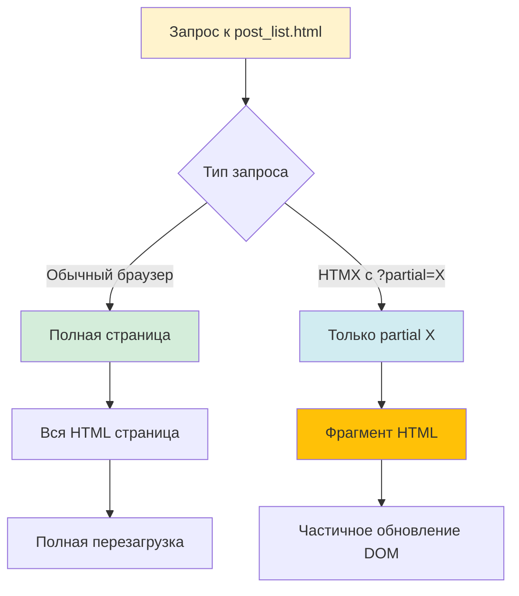
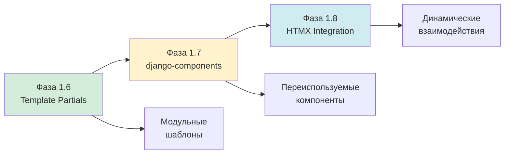

# 🧩 Серия 04: Django 6 Template Partials

> Модульность без лишних файлов, подготовка к HTMX

**Коммит этой серии:**

```
dda7c01 - phase 1.6 feat: Внедрены Django 6 Template Partials во все шаблоны
```

---

## 📌 Что мы построили?

В этой серии мы рефакторили шаблоны с использованием **Template Partials** — новой фичи Django 6:
1. **Модульные карточки постов** — partial для переиспользования
2. **Структурированные детальные страницы** — разделение на логические блоки
3. **Переиспользуемая навигация** — partial для будущих фич
4. **Подготовка к HTMX** — возможность возвращать только части страницы

---

## 🤔 Что такое Template Partials и зачем они нужны?

### Проблема до Django 6

Представьте: у вас есть страница со списком постов, и вы хотите добавить HTMX для динамической подгрузки. Как это делали раньше?

```text
❌ Старый подход (Django 5):
templates/
├── blog/
│   ├── post_list.html           # Полная страница
│   ├── _post_card.html          # Отдельный файл для карточки
│   ├── _post_list_htmx.html     # Версия для HTMX запросов
│   └── _empty_state.html        # Еще один файл для пустого состояния
```

**Проблемы:**
- 🤯 Куча мелких файлов
- 🔄 Дублирование логики
- 🐛 Контекст может расходиться
- 📂 Сложно найти нужный фрагмент

### Решение Django 6: Template Partials

```text
✅ Новый подход (Django 6):
templates/
└── blog/
    ├── post_list.html    # Всё в одном: страница + partials внутри!
    └── post_detail.html  # То же самое
```

**Преимущества:**
- ✨ Всё в одном файле
- 🎯 Единый контекст
- 📝 Легче поддерживать
- 🚀 Готово для HTMX

---

## 🏗️ Архитектура Template Partials

### Как это работает?

**Схема работы partials:**

```
┌─────────────────────────────────────────┐
│         post_list.html                  │
│                                         │
│  ┌───────────────────────────────────┐ │
│  │         │ │
│  │   <div class="card">              │ │
│  │     {{ post.title }}              │ │
│  │   </div>                          │ │
│  │                │ │
│  └───────────────────────────────────┘ │
│                                         │
│  ┌───────────────────────────────────┐ │
│  │       │ │
│  │   <div class="alert">Нет постов</div> │
│  │                │ │
│  └───────────────────────────────────┘ │
│                                         │
│                  │
│         ← вызов │
│                             │
└─────────────────────────────────────────┘
```

### Два режима рендеринга

**Обычный запрос** (GET `/`):
```
Browser → Django → Рендерит весь post_list.html
                   (включая все partials внутри)
```

**HTMX запрос** (GET `/?partial=post_card`):
```
Browser → Django → Рендерит ТОЛЬКО partial 'post_card'
  HTMX              (без остального шаблона)
```

**Диаграмма потока:**



---

## 📝 Что мы рефакторили?

### 1. post_list.html — Список постов

**Выделенные partials:**

| Partial | Что внутри | Зачем |
|---------|-----------|--------|
| `post_card` | Карточка поста с заголовком, датой, превью | Переиспользуется в цикле, готово для HTMX подгрузки |
| `empty_state` | Блок "постов пока нет" | Может показываться отдельно при AJAX-запросах |

**Структура шаблона:**

```
post_list.html
├── Определения partials:
│   ├── 
│   │   └── Bootstrap card с данными поста
│   └── 
│       └── Bootstrap alert для пустого списка
│
└── Использование:
    ├── 
    │   └── 
    └── 
        └── 
```

**Код до рефакторинга:**

```django

    <div class="col">
        <div class="card h-100 shadow-sm">
            <div class="card-body">
                <h2 class="card-title h4 mb-3">
                    <a href="">
                        {{ post.title }}
                    </a>
                </h2>
                <!-- Много кода... -->
            </div>
        </div>
    </div>

```

**Код после рефакторинга:**

```django
{# Определение partial #}

    <div class="col">
        <div class="card h-100 shadow-sm">
            <div class="card-body">
                <h2 class="card-title h4 mb-3">
                    <a href="">
                        {{ post.title }}
                    </a>
                </h2>
                <!-- Тот же код, но в partial -->
            </div>
        </div>
    </div>


{# Использование #}

    

```

**Что изменилось:**
- 📦 Весь HTML карточки в именованном блоке
- ♻️ Можно вызвать `` где угодно
- 🎯 Единый источник правды
- 🚀 **Готово для HTMX:** view может вернуть только `post_card`

---

### 2. post_detail.html — Детальный просмотр

**Выделенные partials:**

| Partial | Что внутри | Зачем |
|---------|-----------|--------|
| `post_header` | Заголовок + даты создания/обновления | Можно обновлять отдельно |
| `post_content` | Основной текст поста | Для live-редактирования (будущее) |
| `post_meta` | Навигация внизу + метаданные | Переиспользуемый блок |

**Структура разделения:**

```
post_detail.html
│
├── 📋 Определения partials:
│   │
│   ├── post_header
│   │   ├── <h1> Заголовок
│   │   ├── 📅 Дата создания
│   │   └── 📝 Дата обновления (если есть)
│   │
│   ├── post_content
│   │   └── {{ post.content|linebreaks }}
│   │
│   └── post_meta
│       ├── ← Назад к списку (кнопка)
│       └── 👁️ Пост #ID
│
└── 🎨 Использование:
    └── <article>
        ├── 
        ├── 
        └── 
```

**Визуальная структура страницы:**

```
┌──────────────────────────────────────────┐
│  ╔════════════════════════════════════╗  │
│  ║           ║  │
│  ║  Заголовок поста                   ║  │
│  ║  📅 Создано: 12.12.2025            ║  │
│  ╚════════════════════════════════════╝  │
│                                          │
│  ╔════════════════════════════════════╗  │
│  ║          ║  │
│  ║  Содержимое поста...               ║  │
│  ║  Многострочный текст...            ║  │
│  ╚════════════════════════════════════╝  │
│                                          │
│  ─────────────────────────────────────  │
│                                          │
│  ╔════════════════════════════════════╗  │
│  ║             ║  │
│  ║  [← Назад]      👁️ Пост #15       ║  │
│  ╚════════════════════════════════════╝  │
└──────────────────────────────────────────┘
```

**Зачем такое разделение?**

1. **post_header** — можно обновлять через HTMX при редактировании
2. **post_content** — live-preview при написании (будущая фича)
3. **post_meta** — переиспользовать в других местах

---

### 3. base.html — Базовый layout

**Выделенный partial:**

| Partial | Что внутри | Зачем |
|---------|-----------|--------|
| `navigation` | Navbar с логотипом, меню, активными состояниями | Можно обновлять меню без перезагрузки страницы |

**Структура навигации:**

```
base.html
├── <head> (стили, мета-теги)
├── <body>
│   ├── <header>
│   │   └── 
│   │       ├── 🏠 Логотип
│   │       ├── 📱 Toggler (мобильная версия)
│   │       └── <ul> Меню:
│   │           ├── Главная (active если на главной)
│   │           └── О блоге (active если на about)
│   │
│   ├── <main>
│   │   └── 
│   │
│   └── <footer>
│       └── Copyright и инфо
```

**Активное состояние через partial:**

```django

    <nav class="navbar">
        <ul class="navbar-nav">
            <li class="nav-item">
                <a class="nav-link 
                   
                       active  {# ← Желтый акцент #}
                   " 
                   href="">
                    Главная
                </a>
            </li>
            <!-- Другие пункты меню -->
        </ul>
    </nav>

```

**Почему это круто:**

- 🎯 Навигация в одном месте (DRY)
- 🔄 Можно обновить меню через HTMX (например, после логина)
- 🎨 Активное состояние автоматически (желтый акцент)

---

## 🎯 Документация в шаблонах

Каждый partial мы задокументировали прямо в коде:

```django
{# Определение partial для карточки поста #}
{# Использует контекст: post #}
{# Пример вызова:  #}

    <!-- HTML карточки -->

```

**Зачем комментарии?**

| Что объясняем | Пример | Польза |
|---------------|--------|--------|
| Назначение | "partial для карточки поста" | Быстро понять зачем |
| Контекст | "Использует: post, user" | Знаем какие данные нужны |
| Пример вызова | `` | Copy-paste готов |

---

## 🚀 Подготовка к HTMX

### Как это будет работать с HTMX?

**Сценарий:** Пользователь нажимает "Загрузить еще" → подгружаются новые посты

**Без partials (сложно):**

```python
# Нужны отдельные view и шаблоны
def post_list(request):
    return render(request, 'post_list.html', {...})

def post_list_htmx(request):  # ← Дубль!
    return render(request, '_post_list_htmx.html', {...})
```

**С partials (просто):**

```python
def post_list(request):
    posts = Post.objects.all()
    
    # HTMX запрашивает partial?
    if request.htmx:
        # Рендерим ТОЛЬКО partial из того же шаблона!
        return render(request, 'post_list.html#post_card', {
            'posts': posts
        })
    
    # Обычный запрос — вся страница
    return render(request, 'post_list.html', {'posts': posts})
```

**Схема работы:**

```
Обычный запрос (первая загрузка):
┌────────────┐      ┌────────────┐      ┌────────────────┐
│  Браузер   │─────▶│   Django   │─────▶│ post_list.html │
│            │      │            │      │  (вся страница)│
└────────────┘      └────────────┘      └────────────────┘

HTMX запрос (подгрузка):
┌────────────┐      ┌────────────┐      ┌──────────────────┐
│   HTMX     │─────▶│   Django   │─────▶│ post_list.html#  │
│ (клик кн.) │      │request.htmx│      │    post_card     │
│            │◀─────│            │◀─────│ (только partial!)│
└────────────┘      └────────────┘      └──────────────────┘
      │
      └─▶ Вставляет HTML в существующую страницу
```

---

## 📊 Сравнение: До и После

### Количество файлов

| Подход | Файлов шаблонов | Поддержка |
|--------|----------------|-----------|
| **До (без partials)** | 3 основных + 6 частичных = **9 файлов** | 😰 Сложно |
| **После (с partials)** | **3 файла** (все partials внутри) | 😊 Легко |

### Контекст и данные

```
❌ Без partials:
post_list.html        ─┐
_post_card.html       ─┼─ Контекст может расходиться!
_post_list_htmx.html  ─┘

✅ С partials:
post_list.html
  ├─ partialdef post_card       ─┐
  └─ partialdef empty_state     ─┤─ Единый контекст!
         ─┘
      
```

### Читаемость кода

**До:** Прыгаешь между файлами  
**После:** Всё перед глазами

```
До:
1. Открыл post_list.html
2. Увидел 
3. Открыл _post_card.html
4. Там 
5. Открыл _post_meta.html
6. ...забыл зачем пришел 🤯

После:
1. Открыл post_list.html
2. Видишь все partials сразу ✅
```

---

## 🎓 Best Practices Template Partials

### ✅ Когда использовать partials

- **Повторяющиеся блоки** (карточки, кнопки)
- **HTMX endpoints** (возврат фрагментов)
- **Логические разделы** (header, content, footer)

### ❌ Когда НЕ использовать

- **Простой статический контент** (один раз используется)
- **Блоки без контекста** (лучше обычные )

### 💡 Советы

1. **Документируй partial:**
   ```django
   {# Что делает, какой контекст, пример вызова #}
   
   ```

2. **Понятные имена:**
   ```django
   ✅ post_card, user_info, comment_form
   ❌ partial1, tmp, fragment
   ```

3. **Один файл = одна страница + её partials:**
   ```django
   post_list.html ─┬─ post_card
                   └─ empty_state
   
   post_detail.html ─┬─ post_header
                     ├─ post_content
                     └─ post_meta
   ```

---

## 🔮 Что дальше?

**Готовая инфраструктура** для следующих фаз:



**Что мы получили:**

- ✅ Модульная структура шаблонов
- ✅ Меньше файлов, больше ясности
- ✅ Готовность к HTMX запросам
- ✅ Единый контекст для всех partials
- ✅ Документированный код

---

## 📚 Итоги серии

**Технологии:**
- Django 6 Template Partials
- `` и ``
- ``

**Файлы:**
- `templates/blog/post_list.html` — 2 partials
- `templates/blog/post_detail.html` — 3 partials
- `templates/base.html` — 1 partial

**Результат:**
- Модульные шаблоны без лишних файлов
- Подготовка к HTMX интеграции
- Улучшенная читаемость и поддержка

---

**Следующая серия:** Фаза 1.7 — django-components для переиспользуемых UI-компонентов

**Последнее обновление:** 13 декабря 2025 г.
