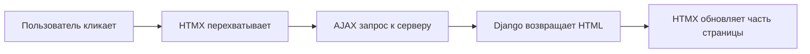
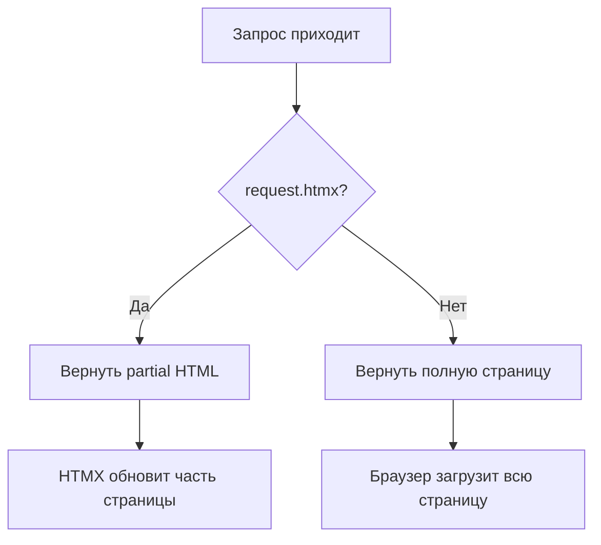

# 🚀 HTMX интеграция: SPA без JavaScript-фреймворков

> Как мы добавили динамические взаимодействия без React/Vue

**Коммиты:**

- `f0f88f6` - Установлен django-htmx 1.27.0
- `aecb561` - Настройка Django для HTMX
- `a0454e5` - Интеграция HTMX в базовый шаблон
- `dc52e10` - Интеграция HTMX в главную страницу
- `2edc84e` - CSS анимации для HTMX

---

## 📌 Что такое HTMX?

**HTMX** — это библиотека, которая позволяет делать AJAX-запросы прямо из HTML-атрибутов, без написания JavaScript кода.

**Философия**: Вместо отправки JSON и построения DOM в JavaScript, сервер отправляет готовый HTML, а HTMX просто вставляет его на страницу.



---

## 🎯 Зачем нам HTMX?

**Проблема**: Хотим динамический поиск, пагинацию, загрузку контента БЕЗ:

- Фреймворков (React, Vue)
- Написания JavaScript кода
- Дублирования шаблонов на фронтенде

**Решение**: HTMX даёт интерактивность через атрибуты:

| Традиционный подход | С HTMX |
|---------------------|---------|
| JavaScript обработчик | `hx-get="/api/posts"` |
| fetch() + JSON | Сервер отдаёт HTML |
| Ручное построение DOM | `hx-target="#container"` |
| State management | Django + Шаблоны |

---

## 🔧 Установка и настройка

### Шаг 1: Установка библиотеки

```bash
poetry add django-htmx
```

**Что даёт `django-htmx`:**

- Middleware для определения HTMX-запросов (`request.htmx`)
- Хелперы для работы с HTMX в Django

### Шаг 2: Настройка Django

Изменения в `config/settings.py`:

```python
INSTALLED_APPS = [
    # ...
    "django_htmx",  # 1. Добавили в INSTALLED_APPS
]

MIDDLEWARE = [
    "django.middleware.csrf.CsrfViewMiddleware",
    "django_htmx.middleware.HtmxMiddleware",  # 2. После CSRF!
    # ...
]
```

**Важно**: `HtmxMiddleware` должен быть **после** `CsrfViewMiddleware`, чтобы `request.htmx` был доступен во view.

### Шаг 3: Подключение HTMX в шаблоне

В `templates/base.html`:

```django-html
<head>
    {# CSRF токен для HTMX запросов #}
    <meta name="csrf-token" content="{{ csrf_token }}">
    
    {# HTMX CDN #}
    <script src="https://unpkg.com/htmx.org@2.0.4" 
            integrity="sha384-HGfztof..." 
            crossorigin="anonymous"></script>
    
    {# Автоматическая передача CSRF #}
    <script>
        document.body.addEventListener('htmx:configRequest', (event) => {
            event.detail.headers['X-CSRFToken'] = 
                document.querySelector('meta[name="csrf-token"]').content;
        });
    </script>
</head>
```

**Что происходит:**

1. Django генерирует CSRF токен в meta-теге
2. HTMX перехватывает событие `htmx:configRequest`
3. Мы добавляем токен в заголовок `X-CSRFToken`
4. Все AJAX запросы защищены от CSRF-атак

---

## 💡 Базовый пример: Поиск с debouncing

Традиционный подход требует JavaScript:

```javascript
// ❌ БЕЗ HTMX - 15 строк кода
const input = document.querySelector('#search');
let timeout;

input.addEventListener('keyup', (e) => {
    clearTimeout(timeout);
    timeout = setTimeout(async () => {
        const response = await fetch(`/api/search?q=${e.target.value}`);
        const data = await response.json();
        updateDOM(data); // Ещё 20 строк...
    }, 500);
});
```

С HTMX — просто атрибуты:

```django-html
{# ✅ С HTMX - 0 строк JavaScript #}
<input 
    type="search" 
    name="search"
    hx-get=""
    hx-trigger="keyup changed delay:500ms"
    hx-target="#post-container"
    hx-swap="innerHTML"
    placeholder="Поиск...">
    
<div id="post-container">
    {# Сюда HTMX вставит результаты #}
</div>
```

**Разбор атрибутов:**

| Атрибут | Значение | Что делает |
|---------|----------|------------|
| `hx-get` | URL | Отправит GET запрос |
| `hx-trigger` | `keyup changed delay:500ms` | После ввода + 500ms задержка |
| `hx-target` | `#post-container` | Куда вставить ответ |
| `hx-swap` | `innerHTML` | Заменить содержимое |

---

## 🔄 Как работает view для HTMX?

Django view определяет, HTMX это или обычный запрос:

```python
def post_list(request):
    posts = Post.objects.all()
    search = request.GET.get('search', '')
    
    if search:
        posts = posts.filter(title__icontains=search)
    
    # Пагинация
    page_obj = Paginator(posts, 5).get_page(request.GET.get('page', 1))
    
    context = {'posts': page_obj, 'search_query': search}
    
    # 🎯 Ключевая проверка
    if request.htmx:
        # Вернуть только HTML карточек (без <html>, <body>)
        return render(request, 'blog/_post_list_partial.html', context)
    
    # Полная страница для обычных запросов
    return render(request, 'blog/post_list.html', context)
```

**Почему `request.htmx`?**



HTMX автоматически добавляет заголовок `HX-Request: true`. Middleware `django-htmx` проверяет его и устанавливает `request.htmx = True`.

---

## 🎨 CSS анимации для HTMX

HTMX добавляет CSS-классы во время работы:

```css
/* Индикатор загрузки */
.htmx-indicator {
    opacity: 0;
    transition: opacity 200ms;
}

.htmx-request .htmx-indicator {
    opacity: 1;  /* Показать во время запроса */
}

/* Анимация появления новых элементов */
.htmx-added {
    animation: fadeInUp 300ms ease-in;
}

@keyframes fadeInUp {
    from {
        opacity: 0;
        transform: translateY(20px);
    }
    to {
        opacity: 1;
        transform: translateY(0);
    }
}
```

**Как использовать:**

```django-html
<input 
    hx-get="/search"
    hx-indicator="#spinner">

<span id="spinner" class="htmx-indicator">
    <i class="spinner-border"></i>
</span>
```

Пока идёт запрос, HTMX добавит класс `.htmx-request`, и спиннер станет видимым.

---

## ⚠️ Важные нюансы

### 1. CSRF защита обязательна

Без настройки CSRF все POST/PUT/DELETE запросы будут получать **403 Forbidden**.

### 2. Partial шаблоны должны быть минимальными

```django-html
{# ❌ ПЛОХО - лишний HTML #}
<!DOCTYPE html>
<html>
<head>...</head>
<body>
    <div class="posts">...</div>
</body>
</html>

{# ✅ ХОРОШО - только нужный контент #}
<div class="posts">
    
        ...
    
</div>
```

### 3. Разделяй полные и partial шаблоны

```text
templates/
├── blog/
│   ├── post_list.html           ← Полная страница
│   ├── _post_list_partial.html  ← Для HTMX (с _)
│   └── _post_cards_only.html    ← Только карточки
```

Префикс `_` — соглашение для partial-шаблонов.

---

## 📊 Результаты интеграции

| До HTMX | После HTMX |
|---------|------------|
| Полная перезагрузка при поиске | Обновляется только список |
| Без задержки (спам запросов) | Debouncing 500ms |
| JavaScript обработчики | 0 строк JS |
| SEO проблемы (SPA) | Работает без JS (graceful degradation) |

---

## 🔗 Следующий шаг

Теперь посмотрим, как HTMX работает с **Django Components** и **Partial шаблонами** →

**Следующая статья**: [07_htmx_components_partials.md](07_htmx_components_partials.md)

---

**Последнее обновление**: 13 декабря 2025
