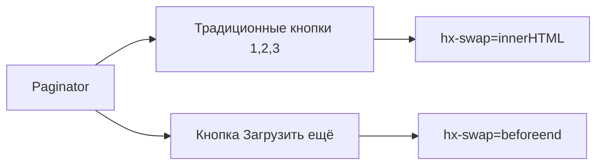
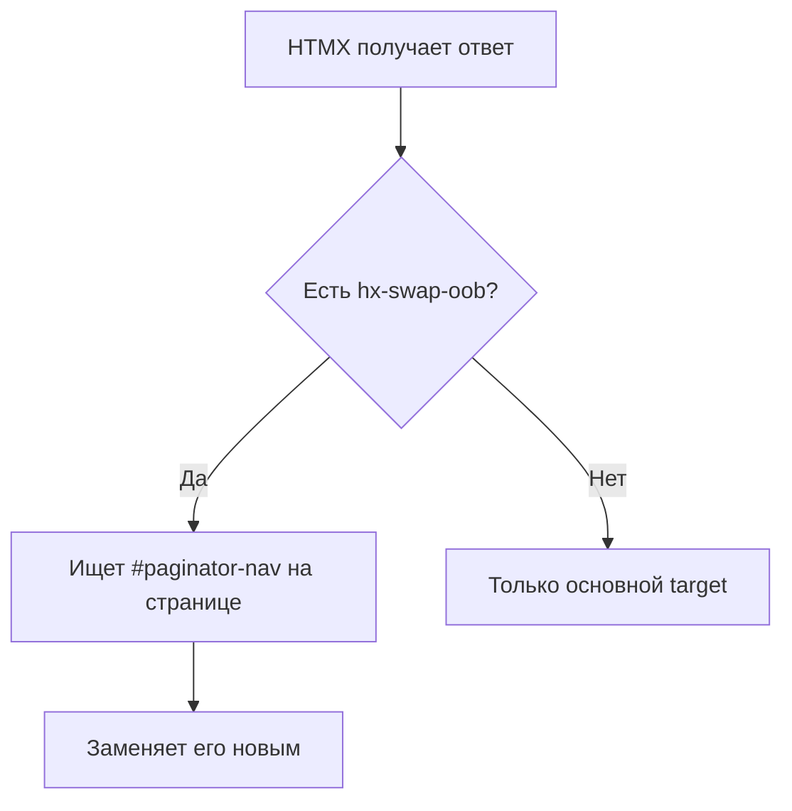
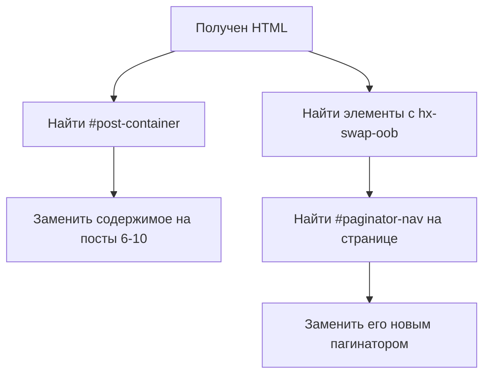

# 📄 Paginator: Компонент с двумя режимами работы

> SEO-friendly пагинация + прогрессивная загрузка в одном компоненте

**Коммиты:**

- `9a138e5` - Создан Paginator компонент с HTMX
- `ac6bd67` - Исправлена ошибка с арифметикой в шаблонах

---

## 📌 Что такое Paginator?

**Paginator** — это компонент, который решает две задачи:

1. **Традиционная пагинация** — кнопки 1, 2, 3 для перехода между страницами
2. **Прогрессивная загрузка** — кнопка "Загрузить ещё" для добавления постов



---

## 🎯 Зачем два режима?

**Проблема**: Пользователи хотят разное:

- **Быстрый переход** на страницу 5 → кнопки страниц
- **Бесконечный скролл** → кнопка "Загрузить ещё"

**Решение**: Даём оба варианта в одном компоненте!

| Режим | Когда использовать | UX |
|-------|-------------------|-----|
| Кнопки страниц | Известно примерное количество | Контроль |
| Загрузить ещё | Просмотр ленты | Непрерывность |

---

## 🏗️ Структура компонента

```text
blog/components/paginator/
├── paginator.py       ← Python логика
├── paginator.html     ← Шаблон с HTMX
└── paginator.css      ← Стили (желтая активная кнопка)
```

---

## 🐍 Python логика (`paginator.py`)

### Входные параметры

```python
@register("paginator")
class Paginator(Component):
    template_name = "paginator/paginator.html"
    
    def get_template_data(self, args, kwargs, slots, context):
        """
        Параметры:
            page_obj: Django Paginator page object (обязательно)
            search_query: текущий поисковый запрос
            show_load_more: показывать ли кнопку "Загрузить ещё"
        """
        page_obj = kwargs.get("page_obj")
        search_query = kwargs.get("search_query", "")
        show_load_more = kwargs.get("show_load_more", True)
        
        if not page_obj:
            raise ValueError("Paginator requires 'page_obj'")
```

### Формирование URL параметров

```python
        # Добавляем search в URL, если он есть
        search_param = f"&search={search_query}" if search_query else ""
        
        # Пример: ?page=2&search=Django
```

### Умная логика диапазона страниц

**Задача**: Показывать максимум 5 кнопок, но "умно":

- Если страниц ≤ 5 → показать все
- Если на странице 1-3 → [1, 2, 3, 4, 5]
- Если на последних 3 → [N-4, N-3, N-2, N-1, N]
- Иначе → [current-2, current-1, current, current+1, current+2]

```python
        current_page = page_obj.number
        total_pages = page_obj.paginator.num_pages
        
        page_range = []
        if total_pages <= 5:
            # Показать все страницы
            page_range = list(range(1, total_pages + 1))
        else:
            # Умная пагинация
            if current_page <= 3:
                page_range = list(range(1, 6))  # [1, 2, 3, 4, 5]
            elif current_page >= total_pages - 2:
                page_range = list(range(total_pages - 4, total_pages + 1))
            else:
                page_range = list(range(current_page - 2, current_page + 3))
```

**Примеры работы:**

| Всего страниц | Текущая | Результат |
|---------------|---------|-----------|
| 3 | 1 | [1, 2, 3] |
| 10 | 1 | [1, 2, 3, 4, 5] |
| 10 | 5 | [3, 4, 5, 6, 7] |
| 10 | 9 | [6, 7, 8, 9, 10] |

### Возвращаемые данные

```python
        return {
            "page_obj": page_obj,
            "current_page": current_page,
            "total_pages": total_pages,
            "page_range": page_range,
            "search_param": search_param,
            "show_load_more": show_load_more,
            "has_previous": page_obj.has_previous(),
            "has_next": page_obj.has_next(),
            "previous_page": page_obj.previous_page_number() if page_obj.has_previous() else None,
            "next_page": page_obj.next_page_number() if page_obj.has_next() else None,
        }
```

---

## 🎨 HTML шаблон (`paginator.html`)

### Корневой элемент с OOB

```django-html
{# Out-of-Band swap для автоматической замены #}
<nav id="paginator-nav" hx-swap-oob="true" aria-label="Навигация по страницам">
    <div class="d-flex justify-content-between">
        {# Слева: кнопки страниц #}
        <ul class="pagination">...</ul>
        
        {# Справа: кнопка "Загрузить ещё" #}
        <button>...</button>
    </div>
</nav>
```

**Зачем `hx-swap-oob="true"`?**

Когда HTMX получает ответ, он:

1. Вставляет основной контент в `hx-target`
2. Ищет элементы с `hx-swap-oob`
3. Находит на странице элемент с таким же `id`
4. Заменяет его



---

### Кнопка "Предыдущая"

```django-html
<li class="page-item disabled">
    
        <a class="page-link" 
           href="?page={{ previous_page }}{{ search_param }}"
           hx-get="?page={{ previous_page }}{{ search_param }}"
           hx-target="#post-container"
           hx-swap="innerHTML"
           hx-push-url="true">
            <i class="bi bi-chevron-left"></i> Назад
        </a>
    
        <span class="page-link">
            <i class="bi bi-chevron-left"></i> Назад
        </span>
    
</li>
```

**Разбор атрибутов:**

| Атрибут | Значение | Зачем |
|---------|----------|-------|
| `href` | `?page=1&search=...` | SEO, работает без JS |
| `hx-get` | То же самое | HTMX запрос |
| `hx-target` | `#post-container` | Куда вставить |
| `hx-swap` | `innerHTML` | Заменить содержимое |
| `hx-push-url` | `true` | Обновить URL в браузере |

**SEO-friendly**: Если JavaScript отключён, ссылка всё равно работает!

---

### Кнопки номеров страниц

```django-html

    <li class="page-item active">
        <a class="page-link" 
           href="?page={{ page_num }}{{ search_param }}"
           hx-get="?page={{ page_num }}{{ search_param }}"
           hx-target="#post-container"
           hx-swap="innerHTML"
           hx-push-url="true">
            {{ page_num }}
        </a>
    </li>

```

**Класс `.active`**: Желтый фон для текущей страницы (через CSS).

---

### Троеточие для длинных списков

```django-html
{# Показать "..." если есть ещё страницы справа #}

    
        <li class="page-item disabled">
            <span class="page-link">...</span>
        </li>
    

```

**Проблема с `total_pages - 2`:**

Django шаблоны НЕ умеют арифметику с дефисом внутри ``!

```django-html
{# ❌ ОШИБКА: TemplateSyntaxError: Invalid character '-' #}


{# ✅ РЕШЕНИЕ: Используем фильтр add #}

```

**Почему это важно?**

Фильтр `|add:"-2"` это **вычитание** (добавление отрицательного числа).

---

### Кнопка "Загрузить ещё"

```django-html

    <button 
        class="btn btn-dark"
        hx-get="?page={{ next_page }}{{ search_param }}&load_more=true"
        hx-target="#post-container"
        hx-swap="beforeend"
        hx-indicator="#load-more-spinner">
        <span id="load-more-spinner" class="htmx-indicator spinner-border"></span>
        Загрузить ещё
        <i class="bi bi-arrow-down-circle"></i>
    </button>

```

**Отличия от кнопок страниц:**

| Параметр | Кнопки страниц | Загрузить ещё |
|----------|----------------|---------------|
| URL | `?page=2` | `?page=2&load_more=true` |
| `hx-swap` | `innerHTML` (замена) | `beforeend` (добавление) |
| `hx-push-url` | `true` | НЕТ (не меняем URL) |

**Почему `beforeend`?**

```html
<div id="post-container">
    <!-- Посты 1-5 -->
    <div>Пост 1</div>
    <div>Пост 2</div>
    
    <!-- beforeend вставит СЮДА -->
    <div>Пост 6</div>  ← Новые посты
    <div>Пост 7</div>
</div>
```

---

## 🎨 CSS стили (`paginator.css`)

### Желтая активная кнопка

```css
.pagination {
    --bs-pagination-active-bg: #ffc107;  /* Желтый */
    --bs-pagination-active-color: #212529;  /* Черный текст */
}

.page-item.active .page-link {
    background-color: var(--bs-pagination-active-bg);
    font-weight: 600;
}
```

### Hover эффекты

```css
.page-link:hover:not(.disabled) {
    transform: translateY(-2px);
    box-shadow: 0 2px 4px rgba(0, 0, 0, 0.1);
}
```

### Адаптивность для мобильных

```css
@media (max-width: 576px) {
    .pagination {
        font-size: 0.875rem;
    }
    
    /* Скрываем текст, оставляем иконки */
    .page-link i + * {
        display: none;
    }
}
```

**На мобильном:**

- `< Назад` → `<`
- `Вперед >` → `>`

---

## 🔄 Как работает замена пагинатора?

### 1. Начальное состояние страницы

```html
<div id="post-container">
    <!-- Посты 1-5 -->
</div>

<nav id="paginator-nav">
    <ul>
        <li class="active">1</li>
        <li>2</li>
        <li>3</li>
    </ul>
</nav>
```

### 2. Пользователь кликает "Страница 2"

HTMX отправляет: `GET /?page=2`

### 3. Django возвращает `_post_list_partial.html`

```html
<!-- Посты 6-10 -->
<div class="col">Пост 6</div>
<div class="col">Пост 7</div>
...

<!-- Обновлённый пагинатор -->
<nav id="paginator-nav" hx-swap-oob="true">
    <ul>
        <li>1</li>
        <li class="active">2</li>  ← Теперь активна 2
        <li>3</li>
    </ul>
</nav>
```

### 4. HTMX обрабатывает ответ



### 5. Результат

```html
<div id="post-container">
    <!-- Теперь посты 6-10 -->
</div>

<nav id="paginator-nav">
    <ul>
        <li>1</li>
        <li class="active">2</li>  ← Обновилось!
        <li>3</li>
    </ul>
</nav>
```

---

## 🔄 Режим "Загрузить ещё"

### 1. Пользователь кликает "Загрузить ещё"

HTMX отправляет: `GET /?page=2&load_more=true`

### 2. Django распознаёт режим

```python
if request.htmx and load_more:
    return render(request, 'blog/_post_cards_only.html', context)
```

### 3. Возвращается `_post_cards_only.html`

```html
<!-- Только карточки -->
<div class="col">Пост 6</div>
<div class="col">Пост 7</div>

<!-- Пагинатор с новыми кнопками -->
<nav id="paginator-nav" hx-swap-oob="true">
    <ul>
        <li>1</li>
        <li class="active">2</li>
        <li>3</li>
    </ul>
</nav>
```

### 4. HTMX применяет `beforeend`

```html
<div id="post-container">
    <div class="col">Пост 1</div>  ← Было
    <div class="col">Пост 2</div>
    <div class="col">Пост 3</div>
    <div class="col">Пост 4</div>
    <div class="col">Пост 5</div>
    
    <div class="col">Пост 6</div>  ← Добавилось
    <div class="col">Пост 7</div>
</div>

<nav id="paginator-nav">
    <!-- Автоматически заменён на страницу 2 -->
    <li class="active">2</li>
</nav>
```

---

## 🐛 Распространённые ошибки и решения

### Ошибка 1: Пагинатор не обновляется при "Загрузить ещё"

**Причина**: Отсутствует `hx-swap-oob="true"`.

```django-html
{# ❌ ПЛОХО #}
<nav id="paginator-nav">
    ...
</nav>

{# ✅ ХОРОШО #}
<nav id="paginator-nav" hx-swap-oob="true">
    ...
</nav>
```

---

### Ошибка 2: TemplateSyntaxError с дефисом

```django-html
{# ❌ ОШИБКА #}


{# ✅ РЕШЕНИЕ #}

```

---

### Ошибка 3: load_more всегда True

```python
# ❌ ПЛОХО
load_more = request.GET.get('load_more', False)
# request.GET.get() возвращает СТРОКУ 'true', не булево!

# ✅ ХОРОШО
load_more = request.GET.get('load_more') == 'true'
```

---

### Ошибка 4: Карточки дублируются

**Причина**: `hx-swap="beforeend"` на кнопках страниц.

```django-html
{# ❌ ПЛОХО - добавит вместо замены #}
<a hx-swap="beforeend">Страница 2</a>

{# ✅ ХОРОШО - заменит содержимое #}
<a hx-swap="innerHTML">Страница 2</a>
```

---

## 📊 Сравнение режимов

| Аспект | Кнопки страниц | Загрузить ещё |
|--------|----------------|---------------|
| URL параметр | `?page=2` | `?page=2&load_more=true` |
| hx-swap | `innerHTML` | `beforeend` |
| Шаблон | `_post_list_partial.html` | `_post_cards_only.html` |
| Результат | Заменить все посты | Добавить посты |
| hx-push-url | `true` (обновить URL) | НЕТ |
| SEO | Да (href) | Нет (JavaScript) |

---

## 🎯 Преимущества компонента

1. **SEO-friendly**: Ссылки работают без JavaScript
2. **Два режима в одном**: Кнопки + бесконечный скролл
3. **Переиспользуемый**: Можно использовать для комментариев, галерей
4. **Адаптивный**: Работает на мобильных
5. **Умная пагинация**: Показывает релевантные страницы

---

## 🔗 Следующий шаг

Теперь разберём **решение проблем с дефисами** →

**Следующая статья**: [09_template_syntax_fixes.md](09_template_syntax_fixes.md)

---

**Последнее обновление**: 13 декабря 2025
