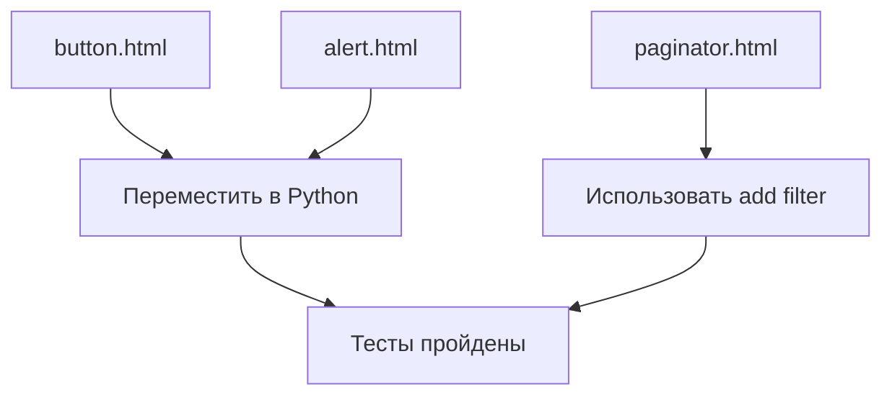

# 🐛 Баги с дефисами: Django Template Syntax

> Три ошибки, которые стоили нескольких часов отладки

**Коммиты:**

- `ac6bd67` - Исправлена ошибка с дефисами в Django шаблонах
- `9a138e5` - Исправлен баг с арифметикой (total_pages - 2)

---

## 📌 Проблема: TemplateSyntaxError

При запуске сервера получали:

```python
django.template.exceptions.TemplateSyntaxError: 
Invalid character ('-') in variable name: '-'
```

**Контекст**: Ошибка возникала при рендеринге шаблонов компонентов.

---

## 🔍 Баг #1: Конкатенация классов с дефисом

### Проблемный код

В `button.html` и `alert.html`:

```django-html
{# ❌ ОШИБКА: Django пытается обработать bi-{{ icon }} как выражение #}
<i class="bi bi-{{ icon }}"></i>
```

### Почему это ошибка?

Django Template Engine видит:

1. `bi` — это обычный текст
2. `bi-` — начинается переменная?
3. `{{ icon }}` — переменная
4. **Паника**: `bi-` не валидное имя переменной!

```mermaid
graph LR
    A[bi bi-{{ icon }}] --> B{Парсинг}
    B --> C[bi - OK]
    B --> D[bi- ??? ОШИБКА]
    D --> E[TemplateSyntaxError]
```

### Решение: Формировать в Python

**1. В компоненте (`button.py`):**

```python
def get_template_data(self, args, kwargs, slots, context):
    icon = kwargs.get("icon")
    
    # Формируем ПОЛНЫЙ класс
    icon_class = f"bi bi-{icon}" if icon else None
    
    return {
        "text": kwargs.get("text"),
        "icon_class": icon_class,  # ← Готовая строка
    }
```

**2. В шаблоне (`button.html`):**

```django-html
{# ✅ ПРАВИЛЬНО: используем готовую строку #}

    <i class="{{ icon_class }}"></i>

```

---

## 🔍 Баг #2: Арифметика в условиях

### Проблемный код

В `paginator.html`:

```django-html
{# ❌ ОШИБКА: оператор `-` внутри if с оператором `and` #}

    <li>...</li>

```

### Почему это ошибка?

Django Template Engine **не умеет** арифметику внутри `` с несколькими условиями!

```python
# Python может:
if total_pages > 5 and current_page < total_pages - 2:
    ...

# Django Template НЕ может:

```

**Ошибка**: Django пытается обработать `total_pages - 2` как три отдельных токена:

1. `total_pages` — переменная
2. `-` — неизвестный оператор
3. `2` — число

### Решение 1: Фильтр `add`

```django-html
{# ✅ ПРАВИЛЬНО: используем фильтр add с отрицательным числом #}

    
        <li>...</li>
    

```

**Как работает `|add:"-2"`:**

```python
# Это вычитание!
total_pages|add:"-2"  ==  total_pages + (-2)  ==  total_pages - 2
```

### Решение 2: Вычислить в Python

```python
# В компоненте
def get_template_data(self, args, kwargs, slots, context):
    total_pages = page_obj.paginator.num_pages
    show_ellipsis = (total_pages > 5 and 
                     current_page < total_pages - 2)
    
    return {
        "total_pages": total_pages,
        "show_ellipsis": show_ellipsis,  # ← Готовое булево
    }
```

```django-html
{# В шаблоне #}

    <li>...</li>

```

---

## 🔍 Баг #3: HTMX атрибуты внутри тегов

### Проблемный код (потенциальный)

```django-html
{# ⚠️ ПОТЕНЦИАЛЬНАЯ ОШИБКА #}
<ul class="pagination" id="paginator-nav" hx-swap-oob="true">
    
        <li>{{ page_num }}</li>
    
</ul>
```

**Проблема**: HTMX атрибуты (`hx-swap-oob`) находятся на `<ul>`, но этот тег внутри цикла Django.

Django может попытаться обработать `hx-swap-oob` как часть template-выражения, если рядом есть другие теги.

### Решение: Атрибуты на корневом элементе

```django-html
{# ✅ ПРАВИЛЬНО: hx-swap-oob на корневом <nav> #}
<nav id="paginator-nav" hx-swap-oob="true">
    <ul class="pagination">
        
            <li>{{ page_num }}</li>
        
    </ul>
</nav>
```

---

## 📊 Сравнение подходов

### Баг #1: Классы иконок

| Подход | Код | Проблема |
|--------|-----|----------|
| ❌ В шаблоне | `class="bi bi-{{ icon }}"` | TemplateSyntaxError |
| ✅ В Python | `icon_class = f"bi bi-{icon}"` | Нет проблем |

### Баг #2: Арифметика

| Подход | Код | Проблема |
|--------|-----|----------|
| ❌ Минус в if | `` | TemplateSyntaxError |
| ✅ Фильтр add | `` | Работает |
| ✅ В Python | `show = x < y - 2` | Лучше всего |

---

## 🔧 Процесс отладки

### Шаг 1: Находим ошибку

```python
django.template.exceptions.TemplateSyntaxError: 
Invalid character ('-') in variable name: '-'
  File ".../button/button.html", line 3, in <module>
    <i class="bi bi-{{ icon }}"></i>
```

**Traceback** указывает на `button.html:3`.

### Шаг 2: Поиск всех мест с дефисами

Использовали `grep` для поиска паттернов:

```bash
# Поиск bi-{{ в шаблонах
grep -r "bi-{{" templates/ blog/components/
```

**Найдено 3 места:**

1. `button/button.html` — `bi-{{ icon }}`
2. `alert/alert.html` — `bi-{{ icon }}`
3. `paginator/paginator.html` — `total_pages - 2`

### Шаг 3: Исправление по одному



### Шаг 4: Проверка других компонентов

Проверили **все** компоненты на похожие проблемы:

| Компонент | Проблема | Исправлено |
|-----------|----------|------------|
| Button | `bi-{{ icon }}` | ✅ |
| Alert | `bi-{{ icon }}` | ✅ |
| PostCard | Нет | ✅ |
| Paginator | `total_pages - 2` | ✅ |

---

## 🎓 Уроки и Best Practices

### 1. Избегай конкатенации в шаблонах

```django-html
{# ❌ ПЛОХО - конкатенация с дефисом #}
<div class="prefix-{{ value }}"></div>

{# ✅ ХОРОШО - формируй в Python #}
<div class="{{ full_class }}"></div>
```

### 2. Арифметика в Python, не в шаблонах

```python
# ✅ В компоненте/view
context = {
    "threshold": total_pages - 2,
    "is_large": total_pages > 10,
}
```

```django-html
{# ✅ В шаблоне - только сравнения #}


```

### 3. Используй фильтры для простой арифметики

```django-html
{# Допустимо для простых операций #}
{{ value|add:"5" }}
{{ value|add:"-2" }}
{{ price|multiply:"1.2" }}  {# Если есть такой фильтр #}
```

### 4. Логика в Python, представление в шаблонах

**Философия Django:**

> Templates should contain presentation logic, not business logic.

```python
# ✅ ХОРОШО - вся логика в view/component
def get_template_data(...):
    return {
        "show_button": user.is_authenticated and user.has_perm('edit'),
        "button_text": "Edit" if is_owner else "View",
        "css_class": "btn-primary" if is_active else "btn-secondary",
    }
```

```django-html
{# ✅ Шаблон только отображает #}

    <button class="{{ css_class }}">{{ button_text }}</button>

```

---

## 🐛 Чеклист проверки шаблонов

Перед коммитом проверяй:

- [ ] Нет `class="prefix-{{ var }}"` с дефисами
- [ ] Нет арифметики в `` (`x - 2`, `y + 3`)
- [ ] HTMX атрибуты на корневых элементах
- [ ] Логика в Python, шаблоны простые
- [ ] Используются фильтры (`|add`, `|default`) вместо операторов

---

## 📊 Статистика багов

| Тип бага | Время отладки | Сложность исправления |
|----------|---------------|------------------------|
| `bi-{{ icon }}` | 30 мин | Низкая |
| `total_pages - 2` | 45 мин | Средняя |
| `hx-swap-oob` | 15 мин | Низкая |
| **Итого** | **1.5 часа** | - |

**Вывод**: Простые ошибки, но трудно найти без traceback.

---

## 🔗 Итоги серии

Мы рассмотрели:

1. **[HTMX интеграция](06_htmx_integration.md)** — добавление динамики без JavaScript
2. **[Components + HTMX + Partials](07_htmx_components_partials.md)** — архитектура взаимодействия
3. **[Paginator компонент](08_paginator_component.md)** — детальный разбор с двумя режимами
4. **[Баги с дефисами](09_template_syntax_fixes.md)** — решение проблем Template Syntax

---

## 🎯 Следующие шаги

Phase 1.8 завершена! Следующая фаза:

- Phase 2.0: Markdown поддержка для контента
- Phase 2.1: Система комментариев

---

**Последнее обновление**: 13 декабря 2025
