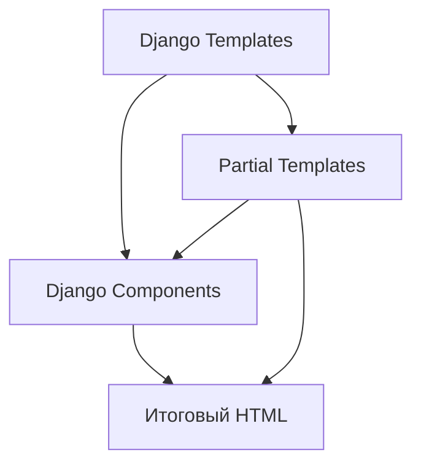
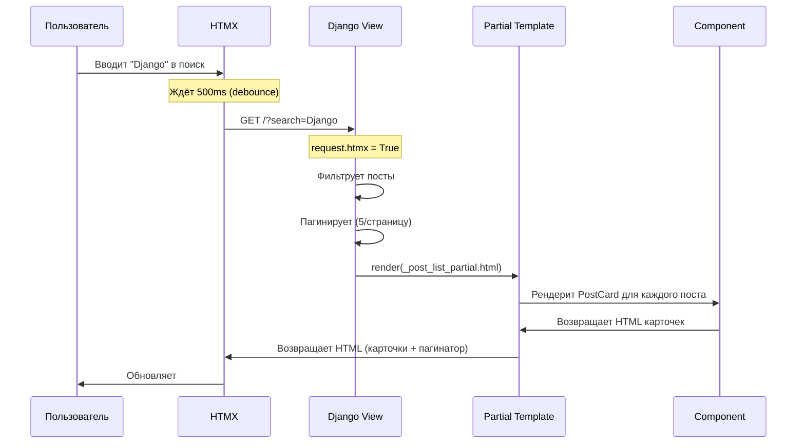
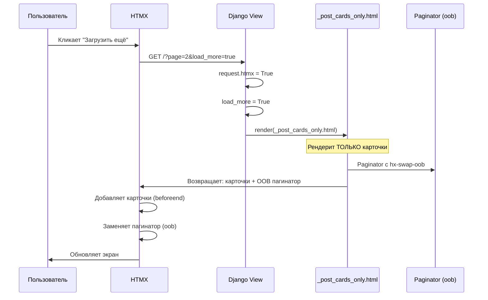

# 🧩 HTMX + Components + Partials: Архитектура взаимодействия

> Как три технологии работают вместе без конфликтов

**Коммиты:**
- `9a138e5` - Создан Paginator компонент
- `f5575b5` - Добавлены partial шаблоны
- `fa048e6` - Реализованы пагинация и поиск

---

## 📌 Три слоя абстракции

В нашем проекте одновременно работают:

1. **Django Templates** — базовые шаблоны (base.html, post_list.html)
2. **Django Components** — переиспользуемые UI-блоки (Button, PostCard, Paginator)
3. **Partial Templates** — минимальные HTMX-ответы (_post_list_partial.html)



**Вопрос**: Где использовать что?

---

## 🎯 Когда использовать каждую технологию

### Django Templates (Полные страницы)

**Когда**: Страницы, которые загружаются полностью при переходе.

**Примеры**:
- `base.html` — каркас сайта
- `post_list.html` — главная страница
- `post_detail.html` — детальный просмотр

**Характеристики**:
- Содержат ``
- Имеют ``
- Включают навигацию, footer
- SEO-оптимизированы

---

### Django Components (Переиспользуемые блоки)

**Когда**: UI-элементы, которые используются в разных местах.

**Примеры**:
- `Button` — кнопки навигации
- `PostCard` — карточка поста
- `Alert` — уведомления
- `Paginator` — пагинация

**Характеристики**:
- Имеют свой Python класс (логика)
- Имеют свой HTML шаблон
- Имеют свой CSS файл
- Параметризуются через kwargs

---

### Partial Templates (HTMX-ответы)

**Когда**: Динамические обновления части страницы.

**Примеры**:
- `_post_list_partial.html` — список постов
- `_post_cards_only.html` — только карточки

**Характеристики**:
- НЕ наследуют `base.html`
- Содержат МИНИМУМ HTML
- Используют компоненты внутри
- Имеют префикс `_`

---

## 🗂️ Файловая структура (Где что лежит?)

```text
📁 ПРОЕКТ
│
├── 📁 components/             🔴 КОМПОНЕНТЫ (Отдельные папки)
│   │                          (У них свои .py, .html, .css)
│   ├── 📁 navbar/
│   ├── 📁 post_card/
│   └── 📁 paginator/
│       ├── paginator.py       ← Python логика
│       ├── paginator.html     ← Шаблон компонента
│       └── paginator.css      ← Стили
│
└── 📁 templates/              🟢 ШАБЛОНЫ СТРАНИЦ
    ├── base.html              ← Базовый шаблон
    └── blog/
        ├── post_list.html          ← 🟦 Полная страница
        ├── _post_list_partial.html ← 🟨 Partial для HTMX
        └── _post_cards_only.html   ← 🟨 Partial для Load More
```

---

## 🔄 Поток данных при HTMX-запросе

### Сценарий 1: Пользователь вводит поисковый запрос



---

### Сценарий 2: Пользователь нажимает "Загрузить ещё"



**Магия Out-of-Band (OOB)**:

```django-html
{# _post_cards_only.html #}

{# 1. Карточки добавятся в конец #post-container #}

    


{# 2. Пагинатор ЗАМЕНИТСЯ автоматически (hx-swap-oob) #}

```

В компоненте `paginator.html`:

```django-html
<nav id="paginator-nav" hx-swap-oob="true">
    {# HTMX найдёт элемент с id="paginator-nav" #}
    {# и ЗАМЕНИТ его, даже если он не в hx-target #}
</nav>
```

---

## 🧪 Три режима рендеринга в одном view

```python
def post_list(request):
    posts = Post.objects.filter(is_published=True)
    
    # Поиск
    search = request.GET.get('search', '').strip()
    if search:
        posts = posts.filter(Q(title__icontains=search) | Q(content__icontains=search))
    
    # Пагинация
    page_obj = Paginator(posts, 5).get_page(request.GET.get('page', 1))
    
    # Параметр load_more
    load_more = request.GET.get('load_more') == 'true'
    
    context = {
        'posts': page_obj,
        'page_obj': page_obj,
        'search_query': search,
    }
    
    # 🎯 Режим 1: "Загрузить ещё" (только карточки + OOB пагинатор)
    if request.htmx and load_more:
        return render(request, 'blog/_post_cards_only.html', context)
    
    # 🎯 Режим 2: Обычный HTMX (карточки + пагинатор внутри target)
    if request.htmx:
        return render(request, 'blog/_post_list_partial.html', context)
    
    # 🎯 Режим 3: Полная страница (для обычных браузерных запросов)
    return render(request, 'blog/post_list.html', context)
```

**Таблица режимов:**

| Условие | Шаблон | Что возвращает | Куда вставляется |
|---------|--------|----------------|------------------|
| `htmx + load_more` | `_post_cards_only.html` | Карточки + OOB | `beforeend` (#post-container) |
| `htmx` | `_post_list_partial.html` | Карточки + пагинатор | `innerHTML` (#post-container) |
| Обычный запрос | `post_list.html` | Полная страница | Вся страница |

---

## 🎭 Где живут компоненты внутри файлов?

### Внутри `post_list.html` (Полная страница)

```django-html



<div class="container">
    <h1>Последние посты</h1>

    {# 🔍 Поле поиска #}
    <input 
        hx-get=""
        hx-target="#post-container"
        hx-swap="innerHTML">

    {# 📦 Контейнер для постов #}
    <div id="post-container">
        
            
        
    </div>
    
    {# 📄 Пагинатор #}
    
</div>

```

---

### Внутри `_post_list_partial.html` (HTMX - полная замена)

```django-html
{# НЕТ extends, НЕТ base.html #}


{# Только карточки #}

    

    


{# OOB пагинатор (заменится автоматически) #}

```

**Что происходит:**
1. HTMX получает этот HTML
2. Заменяет содержимое `#post-container` карточками
3. Видит `hx-swap-oob="true"` в пагинаторе
4. Находит `<nav id="paginator-nav">` на странице
5. Заменяет его новым пагинатором

---

### Внутри `_post_cards_only.html` (HTMX - добавление)

```django-html


{# Только карточки (без обёртки!) #}

    


{# OOB пагинатор (кнопки 2, 3 вместо 1, 2) #}

```

**Почему нет `<div class="row">`?**

Потому что `hx-swap="beforeend"` добавляет HTML **В КОНЕЦ** существующего контейнера:

```html
<div id="post-container" class="row">
    <!-- Были посты 1-5 -->
    <div class="col">...</div>
    <div class="col">...</div>
    
    <!-- HTMX добавит посты 6-10 сюда -->
    <div class="col">...</div>  ← Новая карточка #6
    <div class="col">...</div>  ← Новая карточка #7
</div>
```

---

## ⚙️ Как компонент Paginator работает с HTMX?

### Python логика (`paginator.py`)

```python
@register("paginator")
class Paginator(Component):
    template_name = "paginator/paginator.html"
    
    def get_template_data(self, args, kwargs, slots, context):
        page_obj = kwargs.get("page_obj")
        search_query = kwargs.get("search_query", "")
        
        # Формируем URL параметры
        search_param = f"&search={search_query}" if search_query else ""
        
        return {
            "current_page": page_obj.number,
            "total_pages": page_obj.paginator.num_pages,
            "page_range": [1, 2, 3],  # Упрощено
            "search_param": search_param,
            "has_next": page_obj.has_next(),
            "next_page": page_obj.next_page_number() if page_obj.has_next() else None,
        }
```

### HTML шаблон с HTMX (`paginator.html`)

```django-html
{# Корневой элемент с OOB для автозамены #}
<nav id="paginator-nav" hx-swap-oob="true">
    <ul class="pagination">
        {# Кнопки страниц #}
        
            <li class="active">
                <a href="?page={{ page_num }}{{ search_param }}"
                   hx-get="?page={{ page_num }}{{ search_param }}"
                   hx-target="#post-container"
                   hx-swap="innerHTML"
                   hx-push-url="true">
                    {{ page_num }}
                </a>
            </li>
        
    </ul>
    
    {# Кнопка "Загрузить ещё" #}
    
        <button 
            hx-get="?page={{ next_page }}{{ search_param }}&load_more=true"
            hx-target="#post-container"
            hx-swap="beforeend">
            Загрузить ещё
        </button>
    
</nav>
```

**Магия двух режимов:**

| Кнопка | URL | hx-swap | Режим |
|--------|-----|---------|-------|
| 1, 2, 3 | `?page=2` | `innerHTML` | Замена всех постов |
| Загрузить ещё | `?page=2&load_more=true` | `beforeend` | Добавление постов |

---

## 🐛 Важные нюансы и грабли

### 1. Out-of-Band требует уникальный id

```django-html
{# ❌ ПЛОХО - id не уникален #}
<div id="paginator" hx-swap-oob="true">...</div>
<div id="paginator" hx-swap-oob="true">...</div>

{# ✅ ХОРОШО - один элемент с этим id #}
<nav id="paginator-nav" hx-swap-oob="true">...</nav>
```

### 2. Компоненты должны быть в обоих шаблонах

```text
post_list.html:
    <div id="post-container">...</div>
      ← Есть на странице

_post_cards_only.html:
      ← OOB заменит существующий
```

Если `paginator` НЕ был на странице изначально, OOB НЕ сработает!

### 3. load_more должен быть строкой 'true'

```python
# ❌ ПЛОХО
load_more = request.GET.get('load_more', False)
# Вернёт строку 'true' или None, всегда True в условии!

# ✅ ХОРОШО
load_more = request.GET.get('load_more') == 'true'
# Явное сравнение со строкой
```

---

## 📊 Сравнение подходов

| Аспект | Без HTMX | С HTMX + Components |
|--------|----------|---------------------|
| JavaScript | 50-100 строк | 0 строк |
| Дублирование шаблонов | Фронт + Бэк | Только Бэк |
| SEO | Проблемы (SPA) | Отлично (SSR) |
| Переиспользование | Сложно | Компоненты |
| Поддержка | 2 кодовые базы | 1 кодовая база |

---

## 🔗 Следующий шаг

Теперь детально разберём **Paginator компонент** →

**Следующая статья**: [13_paginator_component.md](13_paginator_component.md)

---

**Последнее обновление**: 13 декабря 2025
