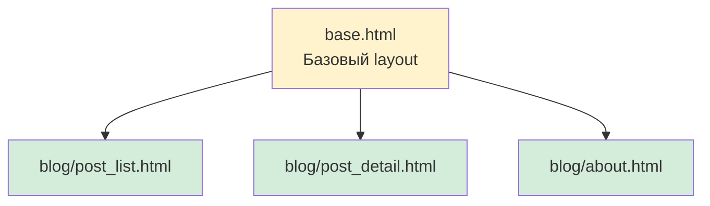
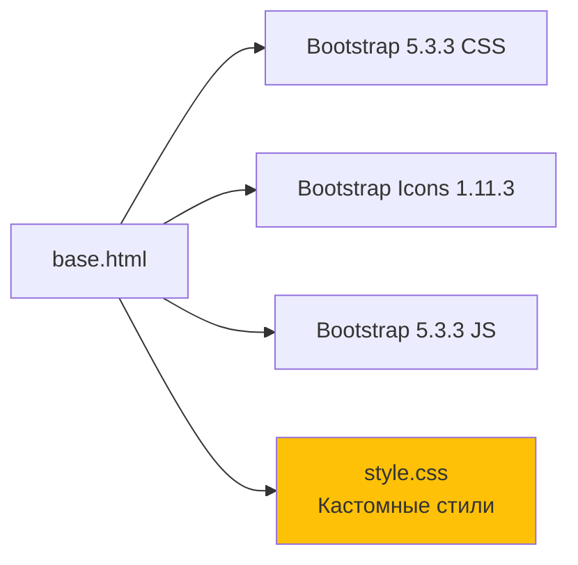
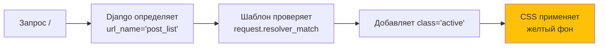
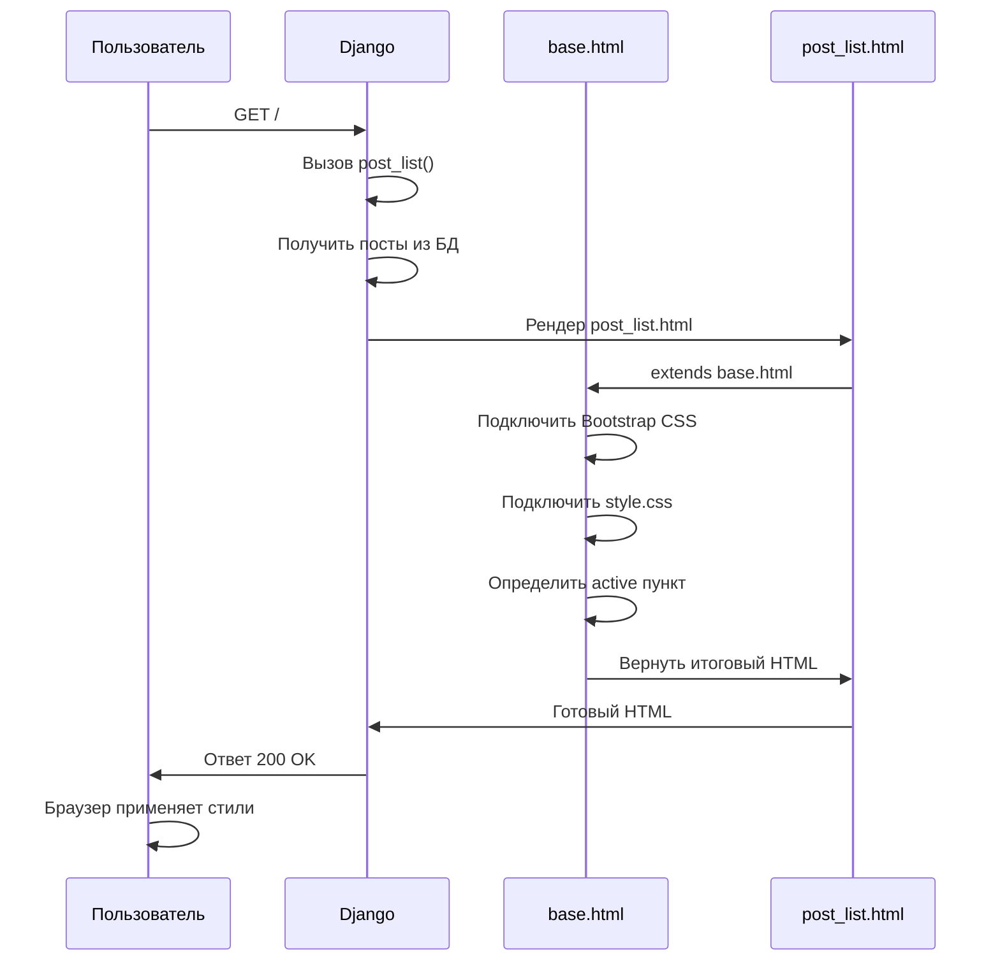
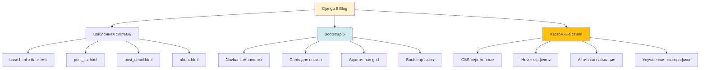

# 🎨 Серия 03: Шаблоны и стилизация

> Bootstrap 5, кастомный CSS и активная навигация

**Коммиты этой серии:**

```
8f775d3 - phase 1.4 feat: Созданы шаблоны и представления с Bootstrap 5
073a6fd - phase 1.5 feat: Добавлена кастомная стилизация и улучшен UX
```

---

## 📌 Что мы построили?

В этой серии мы создали полноценный UI блога:
1. **Систему шаблонов** — базовый layout и страницы
2. **Bootstrap 5 интеграцию** — современный UI framework
3. **Кастомные стили** — реализация дизайн-концепции
4. **Активную навигацию** — желтые акценты для текущей страницы

---

## 🏗️ Архитектура шаблонов Django

### Иерархия наследования



### Концепция base.html

**Зачем нужен базовый шаблон?**
- **DRY**: навигация, footer, подключение Bootstrap — один раз
- **Консистентность**: все страницы выглядят единообразно
- **Блоки**: `` позволяют дочерним шаблонам переопределять части

### Структура блоков

| Блок          | Назначение                      | Обязательный? |
| ------------- | ------------------------------- | ------------- |
| `title`       | Заголовок страницы в `<title>`  | ✅ Да         |
| `content`     | Основной контент страницы       | ✅ Да         |
| `extra_css`   | Дополнительные стили            | ❌ Опционально |
| `extra_js`    | Дополнительный JavaScript       | ❌ Опционально |

**Пример использования:**

```django


Главная — Django 6 Blog


    <h1>Список постов</h1>
    {# ... контент ... #}

```

---

## 🎨 Bootstrap 5: Подключение через CDN

### Зачем CDN, а не локальные файлы?

| Критерий       | CDN                  | Локально         |
| -------------- | -------------------- | ---------------- |
| **Скорость**   | ✅ Кэш браузера      | ⚠️ Наш сервер    |
| **Обновления** | ✅ Автоматические    | ❌ Вручную       |
| **Размер**     | ✅ Не хранится у нас | ❌ В репозитории |
| **Оффлайн**    | ❌ Нужен интернет    | ✅ Работает      |

**Решение**: CDN для MVP, потом можно локально для production.

### Что подключили?



**CDN-ссылки с integrity:**
- Защита от подмены файлов (MITM-атаки)
- Браузер проверяет хеш файла

---

## 🎯 Реализация дизайн-концепции

### Цветовая схема: "Контраст и Фокус"

| Элемент      | Цвет                 | Зачем                          |
| ------------ | -------------------- | ------------------------------ |
| **Фон**      | Белый (#ffffff)      | Максимальная читаемость        |
| **Кнопки**   | Черный (Bootstrap dark) | Строгий профессиональный вид |
| **Акценты**  | Желтый (#ffc107)     | "Где я нахожусь?" в навигации  |

### CSS-переменные

**Концепция**: управляем цветами проекта из одного места.

```css
:root {
    --accent-yellow: #ffc107;
    --accent-yellow-hover: #ffcd39;
    --text-dark: #212529;
    --text-muted: #6c757d;
}
```

**Преимущества:**
- Изменил переменную → обновился весь сайт
- Темная тема = один `@media (prefers-color-scheme: dark)`

---

## 🔄 Активное состояние навигации

### Проблема

**Как пользователь понимает, на какой он странице?**

Традиционно:
```html
<a href="/" class="active">Главная</a>  <!-- Жестко прописано 😞 -->
```

**Проблема**: нужно вручную добавлять `class="active"` в каждом шаблоне.

### Решение через Django context

```django
<a class="nav-link active" 
   href="">
    Главная
</a>
```

**Как работает:**



### Стили активного пункта

```css
.nav-link.active {
    background-color: var(--accent-yellow);
    color: var(--text-dark);
    border-radius: 0.25rem;
    font-weight: 600;
}
```

**Результат**: желтый фон = "Вы здесь!"

---

## 🃏 Стилизация карточек постов

### Hover-эффекты

**Концепция**: карточка "поднимается" при наведении.

```css
.card:hover {
    transform: translateY(-4px);  /* Подъем на 4px */
    box-shadow: 0 4px 12px rgba(0, 0, 0, 0.1);  /* Тень */
}
```

**Зачем?**
- **UX**: показываем, что элемент кликабельный
- **Плавность**: `transition: all 0.2s ease` делает анимацию

### Структура карточки

```
┌─────────────────────────────────────┐
│ CARD                    shadow-sm   │
├─────────────────────────────────────┤
│ <h2> Заголовок поста                │
│ (ссылка с hover → желтый цвет)      │
│                                     │
│ 📅 12.12.2025 15:30  text-muted     │
│                                     │
│ Отрывок поста (truncatewords:50)... │
│                                     │
│ [ Читать далее → ]  btn-dark        │
└─────────────────────────────────────┘
        ↓ hover
┌─────────────────────────────────────┐
│ CARD (поднялась на 4px) ⬆           │
│ Тень стала сильнее                  │
└─────────────────────────────────────┘
```

---

## 📖 Детальный просмотр: Читаемость

### Проблема широких экранов

**На 1920px текст растягивается:**
```
Lorem ipsum dolor sit amet consectetur adipiscing elit sed do eiusmod tempor ...
└────────────────────── 1920px ──────────────────────────────────────────────┘
```

**Проблема**: строка > 80 символов → трудно читать (глаза устают).

### Решение: col-lg-8

```html
<div class="row justify-content-center">
    <div class="col-lg-8">
        <!-- Контент здесь -->
    </div>
</div>
```

**Что происходит:**

| Экран      | col-lg-8            | Зачем                   |
| ---------- | ------------------- | ----------------------- |
| < 992px    | 100% ширины         | Мобильные: полный экран |
| ≥ 992px    | 66% ширины (8 из 12) | Читаемая колонка        |

**+ Центрирование через `justify-content-center`.**

### Улучшенная типографика

```css
.post-content {
    font-size: 1.1rem;      /* Крупнее обычного текста */
    line-height: 1.8;       /* Межстрочный интервал */
    color: var(--text-dark);
}
```

**Золотое правило**: `line-height` = 1.5–1.8 для комфортного чтения.

---

## 🧩 Структура статики

### Организация CSS

```
static/
└── css/
    └── style.css  ← Кастомные стили
```

**Подключение в base.html:**

```django

<link rel="stylesheet" href="">
```

**Что делает ``?**
1. Django ищет файл в `STATICFILES_DIRS` или в приложениях
2. Добавляет `/static/` в путь
3. В production: `collectstatic` соберет всё в `STATIC_ROOT`

### Что в style.css?

| Категория         | Примеры                              |
| ----------------- | ------------------------------------ |
| **Переменные**    | `:root { --accent-yellow }`          |
| **Layout**        | `body { min-height: 100vh }`         |
| **Навигация**     | `.nav-link.active`, `.nav-link:hover` |
| **Карточки**      | `.card:hover`, `.card-title a:hover` |
| **Кнопки**        | `.btn-dark:hover`                    |
| **Типографика**   | `.post-content`                      |
| **Адаптивность**  | `@media (max-width: 768px)`          |

---

## 🔧 Технические детали

### Flexbox для footer

**Проблема**: footer не прижимается к низу на коротких страницах.

**Решение:**

```css
body {
    min-height: 100vh;
    display: flex;
    flex-direction: column;
}

main {
    flex: 1;  /* Занимает всё свободное место */
}

footer {
    margin-top: auto;  /* Прижимается к низу */
}
```

**Визуализация:**

```
┌───────────────┐
│  Header       │
├───────────────┤
│               │
│  Main         │ ← flex: 1 (растягивается)
│  (контент)    │
│               │
├───────────────┤
│  Footer       │ ← прижат к низу
└───────────────┘
```

### Плавная прокрутка

```css
html {
    scroll-behavior: smooth;
}
```

**Эффект**: клик по якорю → плавная анимация, а не мгновенный прыжок.

---

## 🎬 Как это работает вместе?

### Поток рендеринга страницы



### Пример итогового HTML

```html
<!DOCTYPE html>
<html lang="ru">
<head>
    <link href="bootstrap.min.css" rel="stylesheet">
    <link href="/static/css/style.css" rel="stylesheet">
</head>
<body>
    <nav class="navbar">
        <a class="nav-link active">Главная</a>  ← желтый фон
    </nav>
    
    <main>
        <div class="card">
            <!-- Пост с hover-эффектом -->
        </div>
    </main>
    
    <footer class="bg-dark">...</footer>
</body>
</html>
```

---

## 📊 Итоги фаз 1.4 + 1.5

### Что реализовано?



### Статистика

| Метрика                | Значение |
| ---------------------- | -------- |
| **Шаблонов**           | 4        |
| **Строк CSS**          | ~140     |
| **Bootstrap классов**  | 30+      |
| **Hover-эффектов**     | 3        |
| **CSS-переменных**     | 4        |

### Ключевые решения

1. **Bootstrap через CDN** — быстрый старт, обновления из коробки
2. **CSS-переменные** — управление цветами из одного места
3. **Активная навигация** — через `request.resolver_match.url_name`
4. **Flexbox для footer** — прижимается к низу
5. **col-lg-8** — читаемая ширина на больших экранах

---

## 🔗 Следующая серия

**Серия 04**: HTMX и динамические взаимодействия

В следующей серии:
- Подключим HTMX для SPA-эффектов
- Реализуем подгрузку постов без перезагрузки
- Настроим Django 6 Template Partials
- Добавим live search

→ [04_htmx_and_partials.md](04_htmx_and_partials.md)

---

**Последнее обновление**: 12 декабря 2025
