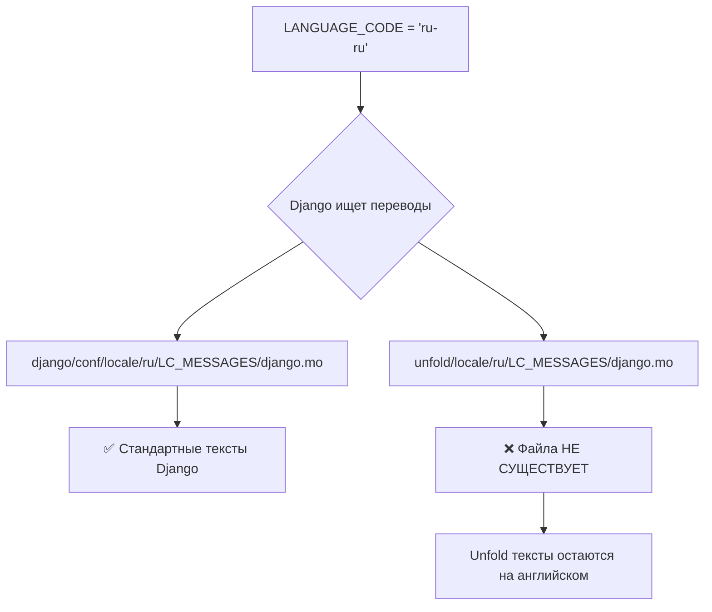
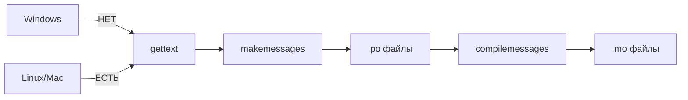

# 🌐 Русификация Unfold: Проблема отсутствующих переводов

> Когда LANGUAGE_CODE = "ru-ru" недостаточно

**Коммиты:**
- `10481f3` - phase 2.1 feat: Установка django-unfold через Poetry
- `bbf214c` - phase 2.1 feat: Настройка Unfold в settings.py
- `67fff14` - phase 2.1 feat: Обновление админки Post для Unfold
- `c1612bd` - phase 2.1 feat: Русификация интерфейса и исправление конфигурации Unfold

---

## 📌 Проблема: Частичная русификация

После установки Unfold и настройки `LANGUAGE_CODE = "ru-ru"` большая часть интерфейса перевелась, но некоторые элементы остались на английском:

❌ **Остались на английском:**
- Placeholder "Search apps and models..." в sidebar
- Кнопка "All applications" 
- Кнопка "Filters" в списковом представлении
- Placeholder "Type to search" в поиске постов

✅ **Перевелись автоматически:**
- Стандартные элементы Django (пользователи, группы, логин)
- Заголовки моделей и полей (через `verbose_name`)
- Базовые кнопки действий

---

## 🔍 Диагностика: Почему так произошло?

### Что Django переводит автоматически?

Django имеет встроенные переводы для:
1. **Стандартных моделей** (`auth.User`, `auth.Group`)
2. **Стандартных форм** (логин, смена пароля)
3. **Базовых сообщений** (ошибки валидации, уведомления)



### Что НЕ переводится?

**Тексты из сторонних пакетов**, если у них нет русских переводов:
- django-unfold 0.73.1 — **НЕТ locale/ru/**
- django-components — **НЕТ locale/ru/**
- django-htmx — минимум текстов, не критично

---

## 🛠️ Попытка решения #1: Проверка пакета Unfold

Проверили структуру установленного пакета:

```powershell
Get-ChildItem -Path .\.venv\Lib\site-packages\unfold\locale
# Результат: False - папка не существует!
```

**Вывод:** Unfold 0.73.1 просто **не включает** русские переводы в пакет.

---

## 🛠️ Попытка решения #2: Использование makemessages

Попробовали сгенерировать переводы через Django:

```bash
python manage.py makemessages -l ru
```

**Ошибка:**

```
CommandError: Can't find msguniq. 
Make sure you have GNU gettext tools 0.19 or newer installed.
```

### Почему gettext не установлен?

**gettext** — это набор UNIX-утилит для работы с переводами:
- `xgettext` — извлекает тексты из кода
- `msgfmt` — компилирует `.po` → `.mo`
- `msguniq` — удаляет дубликаты

**Проблема Windows:**
- gettext НЕ встроен в Windows
- Требует ручной установки (через Chocolatey, MSys2 или бинарники)
- Усложняет воспроизводимость окружения



---

## 🎯 Возможные решения

### Решение A: Установить gettext (долго)

**Плюсы:**
- ✅ Официальный способ Django
- ✅ Можно переводить весь проект

**Минусы:**
- ❌ Требует установки внешних инструментов
- ❌ Усложняет развертывание на других машинах
- ❌ Все равно нужно вручную переводить строки

**Шаги:**
1. Установить gettext для Windows
2. Запустить `python manage.py makemessages -l ru`
3. Отредактировать `locale/ru/LC_MESSAGES/django.po`
4. Скомпилировать: `python manage.py compilemessages`

---

### Решение B: Переопределить шаблоны Unfold (средне)

**Идея:** Скопировать английские шаблоны Unfold в свой проект и заменить тексты.

**Плюсы:**
- ✅ Не требует gettext
- ✅ Полный контроль над текстами

**Минусы:**
- ❌ При обновлении Unfold нужно мержить изменения
- ❌ Дублирование кода пакета
- ❌ Нужно найти ВСЕ шаблоны с английскими текстами

**Пример структуры:**
```
templates/
  admin/
    change_list.html  # Переопределяем "Filters", "Type to search"
  unfold/
    helpers/
      navigation.html  # Переопределяем "Search apps...", "All applications"
```

---

### Решение C: Подключить готовые переводы из сообщества (быстро)

**Проверить:**
1. GitHub Issues django-unfold — есть ли PR с русскими переводами?
2. Fork проекта с локализацией
3. Транслейт-сервисы (Crowdin, Weblate)

**Плюсы:**
- ✅ Готовое решение
- ✅ Поддержка сообществом

**Минусы:**
- ❌ Может не существовать
- ❌ Может быть неполным

---

### Решение D: Написать PR в django-unfold (долго, правильно)

**Идея:** Добавить русские переводы в сам пакет Unfold.

**Плюсы:**
- ✅ Помогает всему сообществу
- ✅ Поддерживается автоматически при обновлениях
- ✅ Правильный open-source подход

**Минусы:**
- ❌ Требует времени (ревью, мердж)
- ❌ Не решает проблему СЕЙЧАС

---

## 🤔 Почему это важная тема?

### Архитектурная проблема: зависимость от локализации

```python
# Казалось бы, простая настройка:
LANGUAGE_CODE = "ru-ru"

# Но на деле это влияет на:
# 1. Django core → ✅ переводы есть
# 2. django.contrib.admin → ✅ переводы есть
# 3. Сторонние пакеты → ⚠️ зависит от пакета!
```

### Реальные сценарии

**Проект для российской компании:**
- ❌ Админка на двух языках сразу — непрофессионально
- ✅ Нужна полная русификация

**MVP для международного проекта:**
- ✅ Английский интерфейс — норма
- ⚠️ Но потом придется локализовать

---

## 📊 Статистика исследования

| Метрика | Значение |
|---------|----------|
| Попыток найти locale/ru в Unfold | 3 |
| Времени на диагностику | ~1 час |
| Найдено английских строк | ~10 |
| Решений рассмотрено | 4 |

---

## 🎓 Выводы

1. **LANGUAGE_CODE — это не магия**  
   Работает только для текстов, имеющих переводы в `.mo` файлах.

2. **Сторонние пакеты ≠ локализованы**  
   Нужно проверять наличие `locale/{lang}/` в пакете.

3. **gettext на Windows — боль**  
   Официальный инструмент, но не кросс-платформенный.

4. **Переопределение шаблонов — компромисс**  
   Работает без gettext, но требует поддержки.

5. **Open source — это про вклад**  
   Правильное решение — добавить переводы в пакет.

---

## 🚀 Следующие шаги (Фаза 2)

В рамках Phase 2.1 мы **отложили полную русификацию** Unfold, так как:
- ✅ Основной функционал работает
- ✅ Модели и поля русифицированы через `verbose_name`
- ⚠️ Мелкие UI-тексты на английском не критичны для MVP

**План на будущее (Phase 2.2+):**
1. Установить gettext для Windows через Chocolatey
2. Создать `locale/ru/LC_MESSAGES/django.po`
3. Перевести тексты Unfold вручную
4. Скомпилировать `.mo` файлы
5. (Опционально) Создать PR в django-unfold

---

## 📚 Связанные документы

- [Phase 2 README](README.md) — Каталог серий фазы
- [Phase 2.1 Plan](../../plans/phase_2/phase_2.1.md) — Установка Unfold
- [Django i18n Docs](https://docs.djangoproject.com/en/6.0/topics/i18n/) — Официальная документация

---

## 🔖 Теги

`#unfold` `#i18n` `#localization` `#russian` `#gettext` `#translation` `#django6` `#phase2`
