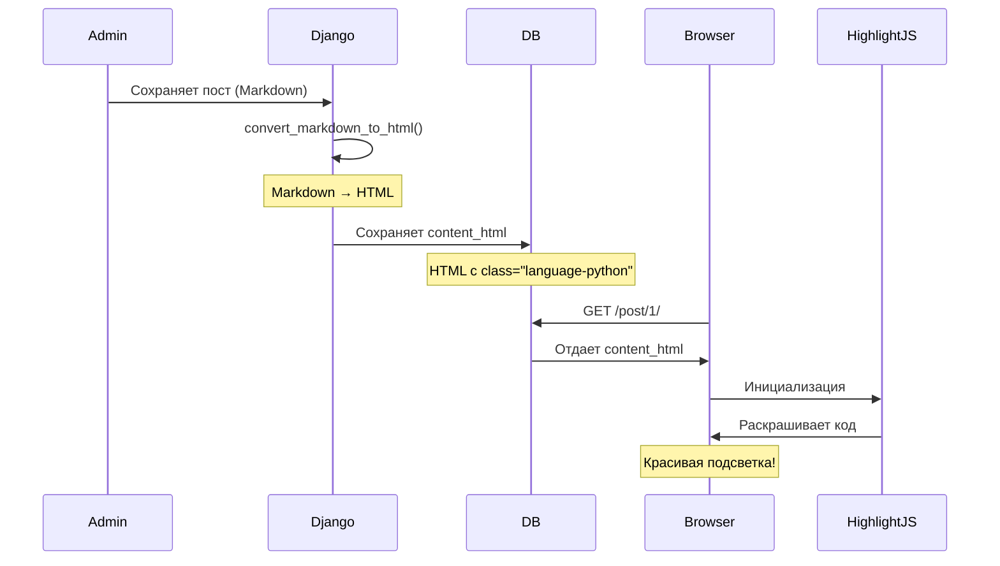
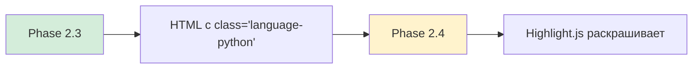

# Серия 11: Markdown → HTML автоконвертация при сохранении

> **Коммиты:** `9d24a30`, `06cab36`, `9d3bc79`, `06f9dbe`, `96accdc`  
> **Фаза:** 2.3 — Markdown конвертация с модульной архитектурой

---

## 🎯 Что было сделано

Реализована система автоматической конвертации Markdown в HTML при сохранении постов. Backend генерирует чистый HTML с Bootstrap-совместимой структурой, фронтенд добавляет подсветку синтаксиса (Highlight.js — Phase 2.4).

**Итог:** Админ пишет Markdown, пользователь видит красивый HTML с таблицами, кодом, списками. Конвертация один раз (при сохранении), рендеринг мгновенный.

---

## 🤔 Зачем нужна Markdown конвертация?

### Проблема: Plain Text скучен

До Phase 2.3 посты выглядели так:

```text
Заголовок просто текстом
Списки без маркеров
  - Элемент 1
  - Элемент 2
Код без подсветки:
  def hello():
      print("world")
```

**Грустно** 😢. Для YouTube-контента нужно **эффектно**.

### Решение: Markdown + автоконвертация

```markdown
# Заголовок H1
## Заголовок H2

**Жирный текст**, *курсив*, `inline-код`

- Список с маркерами
- Автоматически
  
\`\`\`python
def hello():
    print("world")  # Подсветка синтаксиса!
\`\`\`

| Таблица | Работает |
|---------|----------|
| Строка 1| Значение |
```

**Красиво** 🎉. HTML генерируется автоматически.

---

## 🏗️ Архитектура решения

### Гибридный подход: Backend + Frontend



**Ключевая идея:**
- **Backend**: Конвертирует структуру (заголовки, списки, таблицы)
- **Frontend**: Добавляет визуал (подсветка кода, стили)

### Почему не Pygments?

```python
# ❌ Pygments генерирует HTML со встроенными стилями:
<div class="highlight">
  <span style="color: #008000;">def</span> 
  <span style="color: #0000FF;">hello</span>...
</div>

# ✅ Highlight.js использует CSS классы:
<pre><code class="language-python">
def hello():
    print("world")
</code></pre>
```

**Преимущества Highlight.js:**
- Легкая БД (нет inline-стилей)
- Гибкие темы (меняются CSS, не перегенерация HTML)
- Интерактивность (copy-button, line numbers)

---

## 📦 Компоненты системы

### 1. Модель Post с двумя полями

**Изменения в `blog/models.py`:**

```python
class Post(models.Model):
    content = models.TextField(
        verbose_name="Содержимое (Markdown)"
    )
    content_html = models.TextField(
        blank=True, 
        editable=False,  # Не редактируется вручную
        verbose_name="HTML контент"
    )
```

**Почему два поля?**

| Поле | Содержимое | Когда обновляется | Для чего |
|------|------------|-------------------|----------|
| `content` | Markdown | Админ редактирует | Исходник для редактирования |
| `content_html` | HTML | При `save()` | Быстрый вывод на фронте |

### 2. Сервис конвертации

**Файл:** `blog/services.py`

```python
import markdown

def convert_markdown_to_html(markdown_text: str) -> str:
    """Конвертирует Markdown в HTML с расширениями."""
    
    extensions = [
        'extra',           # Таблицы, footnotes
        'fenced_code',     # ```python блоки
        'codehilite',      # Классы для Highlight.js
        'pymdownx.superfences',  # Mermaid диаграммы
    ]
    
    extension_configs = {
        'codehilite': {
            'use_pygments': False,  # НЕ Pygments!
            'lang_prefix': 'language-',  # Highlight.js формат
        }
    }
    
    return markdown.markdown(
        markdown_text,
        extensions=extensions,
        extension_configs=extension_configs
    )
```

**Ключевые настройки:**
- `use_pygments: False` — генерируем `class="language-X"`, не inline-стили
- `lang_prefix: "language-"` — формат для Highlight.js
- `pymdownx.superfences` — Mermaid диаграммы (Phase 2.4)

### 3. Автоконвертация в save()

**Переопределение метода `save()` в `Post`:**

```python
def save(self, *args, **kwargs):
    """Генерирует slug и HTML при сохранении."""
    
    # 1. Slug из заголовка
    if not self.slug:
        self.slug = slugify(self.title)
    
    # 2. Markdown → HTML (всегда, даже при update)
    if self.content:
        self.content_html = convert_markdown_to_html(self.content)
    
    super().save(*args, **kwargs)
```

**Важно:** Конвертация происходит при **каждом** сохранении (create и update).

### 4. Шаблон с выводом HTML

**Было (`post_detail.html`):**

```django-html
<div class="post-content">
    {{ post.content|linebreaks }}  ❌ Plain text
</div>
```

**Стало:**

```django-html
<div class="post-content markdown-content">
    {{ post.content_html|safe }}  ✅ HTML
</div>
```

**Фильтр `|safe`:**
- Без него: Django экранирует HTML → видим теги как текст
- С ним: HTML рендерится корректно
- Безопасно, т.к. посты создают только админы

### 5. Админка с HTML предпросмотром

**Изменения в `blog/admin.py`:**

```python
from django.utils.html import format_html

class PostAdmin(ModelAdmin):
    fieldsets = (
        ("Основная информация", {
            "fields": ("title", "slug", "content")
        }),
        ("HTML предпросмотр", {
            "fields": ("display_html_preview",),
            "classes": ("collapse",)  # Свернут по умолчанию
        }),
    )
    
    readonly_fields = ("display_html_preview",)
    
    @display(description="HTML контент")
    def display_html_preview(self, obj):
        """Показывает сгенерированный HTML."""
        if obj.content_html:
            return format_html(
                '<div style="max-height: 400px; overflow: auto; '
                'padding: 15px; background: #f8f9fa; '
                'border: 1px solid #dee2e6;">{}</div>',
                obj.content_html
            )
        return "—"
```

**Что видит админ:**
1. Пишет Markdown в поле `content`
2. Нажимает "Сохранить"
3. Открывает fieldset "HTML предпросмотр"
4. Видит готовый HTML с таблицами, списками, кодом

---

## 🎨 Примеры конвертации

### Пример 1: Таблица

**Markdown:**

```markdown
| Критерий | FTS5 | Векторный |
|----------|------|-----------|
| Скорость | 🚀 5ms | 🐢 50ms |
| Синонимы | ❌ Нет | ✅ Да |
```

**HTML (сгенерированный):**

```html
<table>
<thead>
<tr>
<th>Критерий</th>
<th>FTS5</th>
<th>Векторный</th>
</tr>
</thead>
<tbody>
<tr>
<td>Скорость</td>
<td>🚀 5ms</td>
<td>🐢 50ms</td>
</tr>
<tr>
<td>Синонимы</td>
<td>❌ Нет</td>
<td>✅ Да</td>
</tr>
</tbody>
</table>
```

**На фронте (Phase 2.5):** Bootstrap классы добавятся HTML-процессорами.

### Пример 2: Code block с подсветкой

**Markdown:**

````markdown
```python
def convert_markdown_to_html(text):
    return markdown.markdown(text)
```
````

**HTML (сгенерированный):**

```html
<pre><code class="language-python">def convert_markdown_to_html(text):
    return markdown.markdown(text)
</code></pre>
```

**На фронте (Phase 2.4):** Highlight.js раскрашивает код по классу `language-python`.

### Пример 3: Списки и ссылки

**Markdown:**

```markdown
## Возможности

- **Жирный** и *курсив*
- [Ссылка](https://example.com)
- `Inline код`

1. Нумерованный список
2. Второй элемент
```

**HTML (сгенерированный):**

```html
<h2>Возможности</h2>
<ul>
<li><strong>Жирный</strong> и <em>курсив</em></li>
<li><a href="https://example.com">Ссылка</a></li>
<li><code>Inline код</code></li>
</ul>
<ol>
<li>Нумерованный список</li>
<li>Второй элемент</li>
</ol>
```

---

## 🗂️ Миграции и данные

### Миграция schema: 0002_post_content_html

**Создана автоматически:**

```bash
python manage.py makemigrations
```

**Содержимое:**

```python
operations = [
    migrations.AddField(
        model_name='post',
        name='content_html',
        field=models.TextField(
            blank=True, 
            editable=False, 
            verbose_name='HTML контент'
        ),
    ),
    migrations.AlterField(
        model_name='post',
        name='content',
        field=models.TextField(
            verbose_name='Содержимое (Markdown)'
        ),
    ),
]
```

### Data migration: 0003_convert_existing_posts

**Создана вручную:**

```bash
python manage.py makemigrations --empty blog --name convert_existing_posts
```

**Зачем?** На момент внедрения у нас было 15 тестовых постов без `content_html`.

**Решение:** Data migration перегенерирует HTML для всех постов.

**Альтернатива:** Пересоздать базу данных и загрузить архитектурные документы.

---

## 📚 Загрузка архитектурных документов

### Модификация команды create_posts

**Было:** Генерировала 15 фейковых постов с Lorem Ipsum.

**Стало:** Загружает реальные Markdown документы из `doc/architecture/phase_1/`.

**Изменения в `blog/management/commands/create_posts.py`:**

```python
from django.conf import settings
from pathlib import Path

class Command(BaseCommand):
    def handle(self, *args, **options):
        # Путь к архитектурным документам
        docs_dir = Path(settings.BASE_DIR) / 'doc' / 'architecture' / 'phase_1'
        
        # Получаем .md файлы (кроме README)
        md_files = sorted([
            f for f in docs_dir.glob('*.md')
            if f.name != 'README.md'
        ])
        
        for md_file in md_files:
            # Читаем Markdown
            content = md_file.read_text(encoding='utf-8')
            
            # Извлекаем заголовок (первый # H1)
            title = self.extract_title(content)
            
            # Slug из имени файла
            slug = md_file.stem  # 01_project_foundation
            
            # Создаем пост
            Post.objects.create(
                title=title,
                slug=slug,
                content=content,  # Markdown
                is_published=True
            )
            # content_html генерируется автоматически в save()
```

**Результат:** 9 архитектурных постов с реальным Markdown контентом:
- Таблицы
- Блоки кода
- Mermaid диаграммы
- Списки
- Заголовки H1-H6

---

## ⚙️ Производительность

### Время конвертации

**Измерение:**

```python
import time
from blog.models import Post

post = Post.objects.first()
start = time.time()
post.save()  # Триггерит конвертацию
end = time.time()

print(f"Конвертация: {(end - start) * 1000:.2f}ms")
```

**Результат:** ~30-50ms для поста на 500 строк Markdown.

**Вывод:** Конвертация быстрая, происходит один раз при сохранении.

### Размер данных

**Сравнение:**

```python
post = Post.objects.first()
md_size = len(post.content)
html_size = len(post.content_html)

print(f"Markdown: {md_size} bytes")
print(f"HTML: {html_size} bytes")
print(f"Ratio: {html_size / md_size:.2f}x")
```

**Типичный результат:**
- Markdown: 15,000 bytes
- HTML: 35,000 bytes
- Ratio: ~2.3x

**Вывод:** HTML больше Markdown в 2-3 раза, но это приемлемо для быстрого рендеринга.

---

## 🔗 Интеграция с другими фазами

### Phase 2.4: Highlight.js (следующая)



**Что мы подготовили:**
- HTML уже содержит `<code class="language-python">`
- Highlight.js просто найдет эти блоки и раскрасит
- Никакой перегенерации HTML не нужно

### Phase 2.5: Beautiful Soup процессоры (будущее)

**Следующий шаг:** Добавление Bootstrap классов к HTML элементам.

**Пример:**

```python
# ❌ Сейчас (Phase 2.3):
<table>...</table>

# ✅ Phase 2.5 (с TableProcessor):
<table class="table table-striped table-hover">...</table>
```

**Архитектура:** Модульная система HTML-процессоров на Beautiful Soup 4.

---

## ⚠️ Важные нюансы

### 1. Фильтр |safe обязателен

```django-html
{# ❌ Без |safe - HTML экранируется #}
{{ post.content_html }}
→ Видим: &lt;h1&gt;Заголовок&lt;/h1&gt;

{# ✅ С |safe - HTML рендерится #}
{{ post.content_html|safe }}
→ Видим: большой красивый заголовок
```

### 2. Конвертация при каждом save()

```python
# Даже если Markdown не изменился, HTML перегенерируется
post = Post.objects.get(pk=1)
post.is_published = False
post.save()  # content_html пересоздается
```

**Оптимизация (Phase 3):** Проверять `if 'content' in self.get_dirty_fields()`.

### 3. Безопасность HTML

**Вопрос:** А если админ вставит `<script>alert('XSS')</script>`?

**Ответ:** Админы — доверенные лица. В Phase 3 при добавлении пользовательских комментариев используем `bleach` для санитизации.

---

## 📊 Итоги Phase 2.3

✅ **Что получили:**
- Автоматическая конвертация Markdown → HTML при сохранении
- Два поля: `content` (Markdown) + `content_html` (HTML)
- Сервис `convert_markdown_to_html()` с расширениями
- Админка с HTML предпросмотром
- Команда `create_posts` загружает архитектурные документы
- 9 постов с реальным Markdown контентом (таблицы, код, диаграммы)

✅ **Производительность:**
- Конвертация: 30-50ms на пост
- HTML в 2-3x больше Markdown (приемлемо)
- Рендеринг страницы: мгновенный (HTML готов)

✅ **Готовность к Phase 2.4:**
- HTML с `class="language-X"` → Highlight.js подключим
- Mermaid блоки готовы → Mermaid.js подключим

---

## 🚀 Следующая серия

**Серия 12:** Phase 2.4 — Подсветка синтаксиса кода (Highlight.js) и диаграммы (Mermaid.js) через CDN.

**Что будет:**
- Подключение Highlight.js и темы
- Автоматическая инициализация для `<code class="language-X">`
- Mermaid.js для диаграмм
- Выбор темы подсветки (light/dark)

---

**Последнее обновление:** 14 декабря 2025
