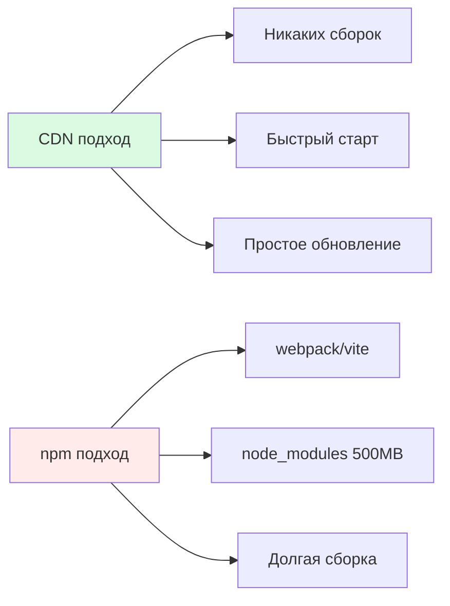
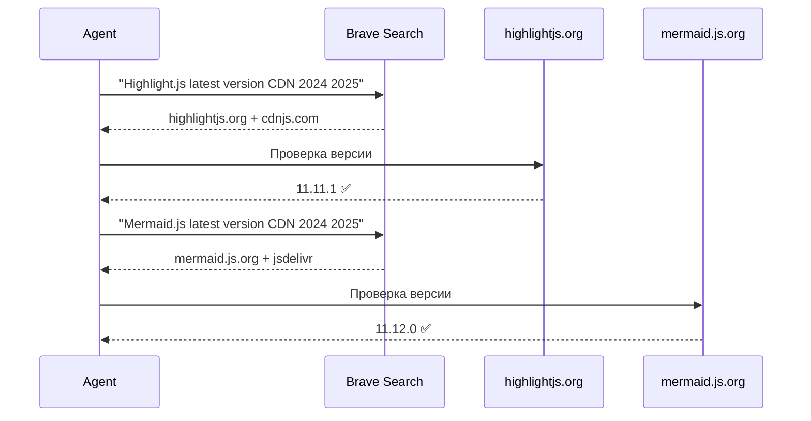
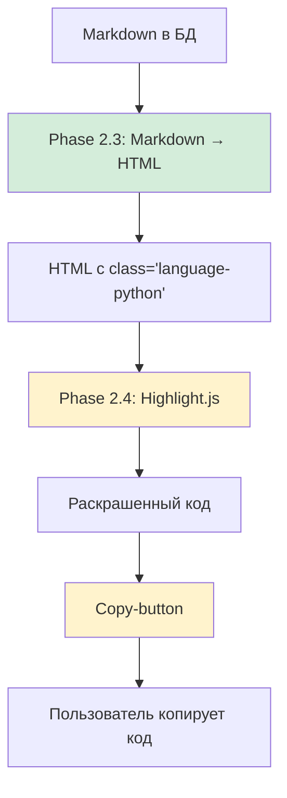
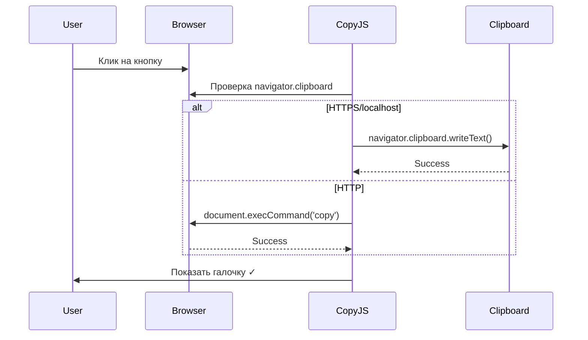
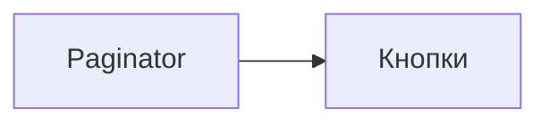
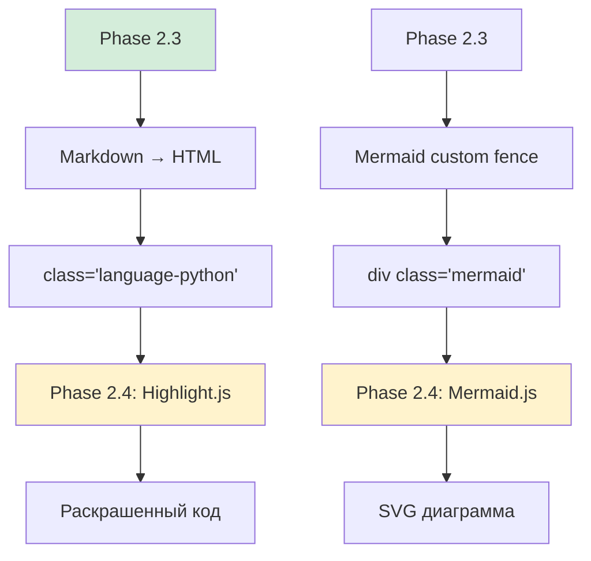

# Серия 12: Highlight.js + Mermaid.js — Визуальная магия code blocks

> **Коммиты:** `88e20d0`  
> **Фаза:** 2.4 — Подсветка синтаксиса и диаграммы

---

## 🎯 Что было сделано

Подключены две библиотеки через CDN для визуализации кода и диаграмм:

- **Highlight.js 11.11.1** — автоматическая подсветка синтаксиса кода
- **Mermaid.js 11.12.0** — рендеринг UML-диаграмм из Markdown
- **Copy-button** — кнопка копирования для каждого code block
- **HTMX совместимость** — подсветка работает с динамически подгруженным контентом

**Результат:** Посты с архитектурными документами теперь выглядят как в VSCode — с цветным синтаксисом и интерактивными диаграммами.

---

## 🤔 Почему CDN, а не npm?

### Философия проекта: Zero Build Step



**Преимущества CDN:**
- Нет `npm install` (экономия 500MB)
- Нет сборки (экономия времени)
- Браузерный кэш (CDN файлы кэшируются между сайтами)
- Обновление = замена версии в URL

**Недостатки CDN:**
- Зависимость от интернета (для production можно локальный fallback)
- Нет tree-shaking (загружаем всю библиотеку)

Для блога выбор очевиден: **CDN** 🚀

---

## 🔍 Поиск актуальных версий

### Проблема: Версия в плане устарела

План phase_2.4.md указывал Highlight.js 11.9.0 (декабрь 2024).  
Реальность: Уже вышла **11.11.1** (декабрь 2025).

**Как искали свежие версии:**



**Результат:**
- Highlight.js: `11.11.1` (свежее чем в плане)
- Mermaid.js: `11.12.0` (новейшая стабильная)

---

## 🏗️ Архитектура решения

### Три уровня обработки кода



**Ключевая идея:** Backend генерирует семантику (`class="language-X"`), frontend добавляет визуал.

### Почему не Pygments?

| Критерий | Pygments | Highlight.js |
|----------|----------|--------------|
| **Где работает** | Backend (Python) | Frontend (JS) |
| **HTML размер** | +300% (inline styles) | +0% (только классы) |
| **Гибкость тем** | Перегенерация HTML | Смена CSS на лету |
| **Copy-button** | Сложно | Легко |
| **Производительность** | Нагрузка на Django | Нагрузка на браузер |

**Вывод:** Для блога с 9 постами Highlight.js идеален.

---

## 📦 Подключение библиотек

### 1. Highlight.js в templates/base.html

**CSS в `<head>`:**

```django-html
{# Highlight.js для подсветки синтаксиса кода #}
<link rel="stylesheet" href="https://cdnjs.cloudflare.com/ajax/libs/highlight.js/11.11.1/styles/github.min.css">
```

**Выбор темы: `github`**

Почему именно `github`:
- Светлая тема (соответствует дизайну проекта)
- Отличная читаемость
- Привычна разработчикам
- Хорошо сочетается с желтыми акцентами

**Альтернативы** (для будущего):
- `atom-one-light` — мягче
- `stackoverflow-light` — минималистичнее
- `github-dark` — для темной темы

**JS перед `</body>`:**

```django-html
{# Highlight.js для подсветки синтаксиса кода #}
<script src="https://cdnjs.cloudflare.com/ajax/libs/highlight.js/11.11.1/highlight.min.js"></script>
```

**Инициализация:**

```javascript
document.addEventListener('DOMContentLoaded', function() {
    hljs.highlightAll();
});
```

---

### 2. Mermaid.js в templates/base.html

**JS подключение:**

```django-html
{# Mermaid.js для диаграмм #}
<script src="https://cdn.jsdelivr.net/npm/mermaid@11.12.0/dist/mermaid.min.js"></script>
```

**Инициализация:**

```javascript
mermaid.initialize({
    startOnLoad: true,
    theme: 'default',
    securityLevel: 'loose'
});
```

**Параметры:**
- `startOnLoad: true` — автоматический рендеринг при загрузке
- `theme: 'default'` — светлая тема (есть `dark`, `neutral`)
- `securityLevel: 'loose'` — безопасно для админских постов

---

## 🐛 Проблема: Mermaid не рендерился

### Первая попытка: `<p><code>` обертка

**Что увидели в DevTools:**

```html
<p><code>mermaid
graph LR
    A[Paginator] --> B[Кнопки]
</code></p>
```

**Проблема:** Markdown оборачивал custom fence в `<p><code>`, а Mermaid ищет `.mermaid` класс.

### Решение: Правильная сигнатура lambda

**Было (Phase 2.3):**

```python
"format": lambda source: f'<div class="mermaid">{source}</div>',
```

**Проблема:** `pymdownx.superfences` передает больше параметров, чем `source`.

**Стало (Phase 2.4):**

```python
"format": lambda source, language, css_class, options, md, **kwargs: f'<div class="mermaid">{source}</div>',
```

**Почему работает:**
- Lambda принимает все параметры `pymdownx.superfences`
- `**kwargs` ловит неизвестные аргументы (forward compatibility)
- Возвращаем чистый HTML без Markdown обработки

### Проверка в DevTools после fix:

```html
<div class="mermaid">
graph LR
    A[Paginator] --> B[Кнопки]
</div>
```

**Mermaid.js** находит `.mermaid` и рендерит SVG диаграмму ✅

---

## 🎨 Copy-button для code blocks

### Архитектура



### Реализация: static/js/copy-code.js

**Ключевые функции:**

1. **createCopyButton()** — создает кнопку с иконкой

```javascript
function createCopyButton(codeBlock) {
    const button = document.createElement('button');
    button.className = 'copy-button';
    button.innerHTML = '<i class="bi bi-clipboard"></i>';
    return button;
}
```

2. **copyCode()** — копирует с fallback

```javascript
if (navigator.clipboard && window.isSecureContext) {
    // Современный API
    navigator.clipboard.writeText(code).then(showSuccess);
} else {
    // Fallback для HTTP
    fallbackCopy(code, button);
}
```

3. **fallbackCopy()** — старый метод через `<textarea>`

```javascript
const textArea = document.createElement('textarea');
textArea.value = text;
document.body.appendChild(textArea);
textArea.select();
document.execCommand('copy');
document.body.removeChild(textArea);
```

4. **showSuccess()** — визуальный feedback

```javascript
button.innerHTML = '<i class="bi bi-check2"></i>';  // Галочка
button.classList.add('copied');  // Зеленый фон
setTimeout(() => { /* вернуть иконку */ }, 2000);
```

### Исключение Mermaid блоков

```javascript
if (pre.classList.contains('mermaid') || 
    pre.parentElement.classList.contains('mermaid')) {
    return;  // Не добавляем кнопку к диаграммам
}
```

---

## 🎨 Стили в static/css/style.css

### Code blocks GitHub-style

```css
.post-content pre {
    background-color: #f6f8fa;  /* GitHub серый */
    border: 1px solid #d0d7de;
    border-radius: 6px;
    padding: 16px;
    overflow-x: auto;  /* Горизонтальный скролл */
    font-family: 'Consolas', 'Monaco', 'Courier New', monospace;
}
```

### Inline код

```css
.post-content code:not(pre code) {
    background-color: rgba(175, 184, 193, 0.2);
    padding: 0.2em 0.4em;
    border-radius: 6px;
    font-size: 0.9em;
    color: #24292f;
}
```

### Copy-button

```css
.copy-button {
    position: absolute;
    top: 8px;
    right: 8px;
    background-color: rgba(255, 255, 255, 0.8);
    border-radius: 6px;
    backdrop-filter: blur(4px);  /* Полупрозрачность */
    transition: all 0.2s ease;
}

.copy-button.copied {
    background-color: #dafbe1;  /* Зеленый */
    color: #1a7f37;
}
```

### Mermaid диаграммы

```css
.post-content .mermaid {
    text-align: center;
    margin: 2rem 0;
    background-color: #f6f8fa;
    border: 1px solid #d0d7de;
    border-radius: 6px;
}
```

---

## 🔄 HTMX совместимость

### Проблема: HTMX подгружает посты динамически

При клике "Загрузить еще" HTMX вставляет новые карточки постов.  
Но Highlight.js и Mermaid уже отработали при первой загрузке!

### Решение: Повторная инициализация

```javascript
document.body.addEventListener('htmx:afterSwap', function(event) {
    // 1. Подсветка новых code blocks
    event.detail.elt.querySelectorAll('pre code').forEach((block) => {
        hljs.highlightElement(block);
    });
    
    // 2. Рендер новых Mermaid диаграмм
    const mermaidBlocks = event.detail.elt.querySelectorAll('.mermaid');
    if (mermaidBlocks.length > 0) {
        mermaid.run({ querySelector: '.mermaid' });
    }
    
    // 3. Добавляем copy-button к новым блокам
    if (window.initCopyButtons) {
        window.initCopyButtons();
    }
});
```

**`event.detail.elt`** — элемент, который HTMX только что вставил.  
Мы ищем code blocks **только внутри него**, а не по всей странице (оптимизация).

---

## 📊 Производительность

### Размер библиотек

| Библиотека | Размер (gzip) | Загрузка |
|------------|---------------|----------|
| Highlight.js | ~50KB | ~100ms (CDN) |
| Mermaid.js | ~150KB | ~200ms (CDN) |
| copy-code.js | ~5KB | Мгновенно |
| **Итого** | **~205KB** | **~300ms** |

**Для сравнения:**
- Bootstrap CSS: 60KB
- Bootstrap JS: 50KB
- HTMX: 40KB

**Вывод:** Highlight.js и Mermaid добавляют ~200KB, но это приемлемо для технического блога.

### Оптимизации (будущее)

1. **Lazy loading Mermaid:**
   ```javascript
   if (document.querySelector('.mermaid')) {
       // Загружаем Mermaid только если есть диаграммы
   }
   ```

2. **Custom build Highlight.js:**
   - Только Python, JavaScript, HTML, CSS
   - ~20KB вместо 50KB

---

## ⚙️ Адаптивность

### Мобильные устройства

```css
@media (max-width: 768px) {
    .post-content pre {
        font-size: 0.8rem;  /* Меньше шрифт */
        padding: 12px;
    }
    
    .copy-button {
        padding: 4px 8px;
        font-size: 0.75rem;
    }
}
```

### Scrollbar для длинных строк

```css
.post-content pre::-webkit-scrollbar {
    height: 8px;
}

.post-content pre::-webkit-scrollbar-thumb {
    background: #888;
    border-radius: 4px;
}
```

---

## 🧪 Тестирование

### Проверка подсветки

**До Highlight.js:**

```
def hello():
    print("world")
```

**После Highlight.js:**

```python
def hello():
    print("world")
```

Ключевые слова `def`, `print` раскрашены ✅

### Проверка Mermaid

**Markdown:**

````markdown

````

**Браузер:** Отображается SVG диаграмма с блоками и стрелками ✅

### Проверка copy-button

1. Клик на кнопку
2. Иконка меняется на ✓
3. Код в буфере обмена
4. Через 2 секунды иконка возвращается

---

## 🔗 Интеграция с Phase 2.3

### Как это связано



**Phase 2.3** готовит HTML, **Phase 2.4** добавляет визуал.

---

## 🎯 Итоги Phase 2.4

✅ **Что получили:**
- Подсветка синтаксиса 190+ языков (Highlight.js)
- Рендеринг UML-диаграмм (Mermaid.js)
- Copy-button для удобства разработчиков
- HTMX совместимость (подсветка в динамическом контенте)
- GitHub-style оформление code blocks
- Адаптивный дизайн для мобильных

✅ **Производительность:**
- Загрузка библиотек: ~300ms (CDN)
- Рендеринг Mermaid: ~50ms на диаграмму
- Копирование кода: мгновенно

✅ **Проблемы решены:**
- Mermaid оборачивался в `<p><code>` → исправлена lambda сигнатура
- Copy-button не работал на HTTP → добавлен fallback через execCommand
- HTMX динамический контент не подсвечивался → добавлен htmx:afterSwap

---

## 🚀 Следующая серия

**Серия 13:** Phase 2.5 — Beautiful Soup процессоры для добавления Bootstrap классов к HTML элементам.

**Что будет:**
- Модульная система HTMLProcessor
- TableProcessor: Bootstrap классы для таблиц
- ImageProcessor: Responsive изображения
- CodeProcessor: Дополнительные стили для code blocks

---

**Последнее обновление:** 14 декабря 2025
