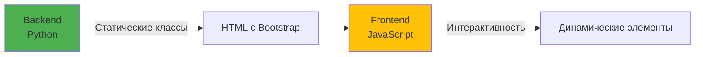
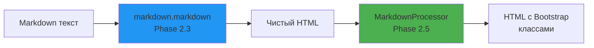
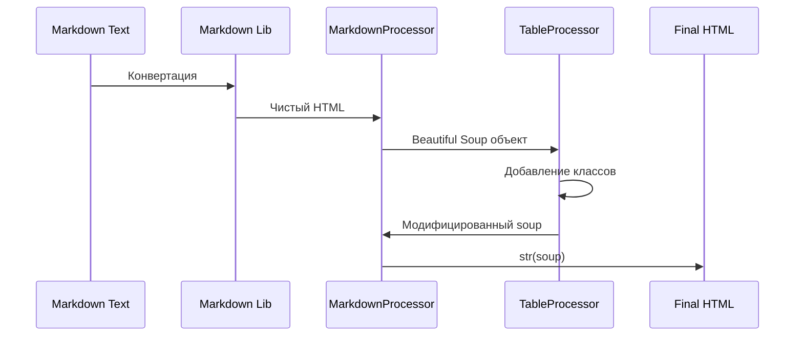

# 🏗️ Серия 13: Архитектура HTML-процессоров — Beautiful Soup 4 и модульная система

> Phase 2.5: Создание масштабируемой архитектуры для обработки HTML

**Коммиты**: `2b74167`

---

## 🎯 Цель фазы

Создать модульную архитектуру для пост-обработки HTML после Markdown конвертации. Добавить Bootstrap классы к элементам через систему процессоров на базе Beautiful Soup 4.

**Результат**: Расширяемая система обработчиков, где каждый процессор отвечает за свой тип элементов (таблицы, изображения, цитаты, код).

---

## 🤔 Проблема: Почему нужны процессоры?

### Ситуация после Phase 2.3-2.4

После конвертации Markdown → HTML элементы **не имеют** Bootstrap классов:

```html
<!-- ❌ Markdown генерирует чистый HTML -->
<table>
  <tr><td>Данные</td></tr>
</table>


<blockquote>
  <p>Цитата</p>
</blockquote>
```

**Проблемы**:
- `<table>` без `.table`, `.table-striped` → таблицы выглядят некрасиво
- `` без `.img-fluid` → изображения не адаптивные
- `<blockquote>` без Bootstrap классов → цитаты не стилизованы
- Нет поддержки Obsidian Callouts (`[!info]`, `[!warning]`)

### Почему не markdown библиотека?

**Markdown библиотеки** (python-markdown, pymdown-extensions) генерируют **семантический HTML**:

```python
html = markdown.markdown("## Hello")
# Результат: <h2>Hello</h2>
```

Они **не знают** про Bootstrap, Tailwind, Material UI и другие CSS-фреймворки.

**Решение**: Пост-обработка HTML через Beautiful Soup 4.

---

## 🏛️ Философия архитектуры

### Разделение ответственности



**Backend (процессоры)**:
- ✅ Добавляют статические Bootstrap классы
- ✅ Модифицируют структуру HTML (оборачивают элементы)
- ✅ Обрабатывают Obsidian Callouts
- ❌ НЕ добавляют JavaScript

**Frontend (JS)**:
- ✅ Добавляет кнопки (copy-code)
- ✅ Инициализирует плееры (Plyr для видео/аудио)
- ✅ Реализует фуллскрин для изображений
- ❌ НЕ модифицирует семантику HTML

**Пример из samples**: `doc/samples/assets/js/main.js`

```javascript
// Frontend добавляет классы через JS
const elementsToCenter = {
    img: ["img-fluid", "d-block", "mx-auto"],
    table: ["table", "table-striped"],
};
```

**Наш подход**: Backend делает это **до** отправки HTML клиенту.

---

## 🔧 Архитектура системы процессоров

### Двухэтапная обработка



**Этап 1**: Markdown → HTML (библиотека `markdown`)
```python
html = markdown.markdown(
    markdown_text,
    extensions=["extra", "tables", "fenced_code"],
    output_format="html"
)
# <table><tr><td>Data</td></tr></table>
```

**Этап 2**: HTML → HTML с классами (Beautiful Soup процессоры)
```python
processor = MarkdownProcessor([TableProcessor()])
html = processor.process_html(html)
# <table class="table table-striped"><tr><td>Data</td></tr></table>
```

---

## 📦 Структура пакета blog/services/

### До Phase 2.5 (монолитный файл)

```
blog/
  ├── services.py  # ❌ Один большой файл
```

### После Phase 2.5 (модульная структура)

```
blog/
  └── services/                    # 📁 Пакет
      ├── __init__.py              # Экспорт главной функции
      ├── markdown_converter.py    # Главная функция конвертации
      ├── html_processor.py        # Базовый абстрактный класс
      ├── markdown_processor.py    # Координатор процессоров
      └── processors/              # 📁 Пакет процессоров
          ├── __init__.py          # Экспорт всех процессоров
          └── table_processor.py   # Процессор для таблиц
```

**Преимущества**:
- ✅ Каждый процессор в отдельном модуле
- ✅ Легко добавлять новые процессоры
- ✅ Чистая структура импортов
- ✅ Простое тестирование

---

## 🎨 Базовый класс HTMLProcessor

### Абстрактный интерфейс

```python
from abc import ABC, abstractmethod
from bs4 import BeautifulSoup

class HTMLProcessor(ABC):
    """Базовый класс для обработчиков HTML элементов."""
    
    @abstractmethod
    def process(self, soup: BeautifulSoup) -> None:
        """Обрабатывает HTML, модифицируя soup in-place."""
        pass
    
    @abstractmethod
    def get_name(self) -> str:
        """Возвращает имя процессора для логирования."""
        pass
```

### Ключевые принципы

**1. In-place модификация**

Процессоры **не возвращают** новый HTML, а **модифицируют** объект `soup`:

```python
def process(self, soup: BeautifulSoup) -> None:
    for table in soup.find_all('table'):
        table['class'] = table.get('class', []) + ['table']
        # Модификация напрямую, без return
```

**Почему in-place**:
- ✅ Эффективно (нет копирования)
- ✅ Beautiful Soup так работает (DOM-подобная модель)
- ✅ Процессоры не зависят друг от друга

**2. Идемпотентность**

Процессор должен быть **идемпотентным** — повторный запуск не должен ломать результат:

```python
# ✅ Правильно: проверяем наличие класса
if 'table' not in table.get('class', []):
    table['class'] = table.get('class', []) + ['table']

# ❌ Неправильно: добавляем каждый раз
table['class'] = table.get('class', []) + ['table']
```

**3. Независимость процессоров**

Процессоры **не должны** зависеть друг от друга:

```python
# ✅ Правильно: каждый процессор работает автономно
class TableProcessor(HTMLProcessor):
    def process(self, soup):
        for table in soup.find_all('table'):
            # Обрабатываем только таблицы

# ❌ Неправильно: зависимость от другого процессора
class ImageProcessor(HTMLProcessor):
    def process(self, soup):
        # Ищем элементы, созданные TableProcessor
        for wrapper in soup.find_all(class_='table-wrapper'):
            # НЕТ! Это создает зависимость
```

---

## 🎛️ Главный класс MarkdownProcessor

### Координатор процессоров

```python
from typing import Sequence
from bs4 import BeautifulSoup

class MarkdownProcessor:
    """Координирует выполнение всех HTML-процессоров."""
    
    def __init__(self, processors: Sequence[HTMLProcessor]) -> None:
        self.processors = processors
    
    def process_html(self, html: str) -> str:
        """Обрабатывает HTML всеми процессорами."""
        soup = BeautifulSoup(html, 'html.parser')
        
        for processor in self.processors:
            try:
                processor.process(soup)
            except Exception as e:
                print(f"⚠️ Ошибка в {processor.get_name()}: {e}")
                continue  # Продолжаем работу
        
        return str(soup)
```

### Ключевые особенности

**1. Sequence вместо List**

```python
# ✅ Правильно: Sequence (ковариантный)
def __init__(self, processors: Sequence[HTMLProcessor]):
    pass

# ❌ Неправильно: List (инвариантный)
def __init__(self, processors: List[HTMLProcessor]):
    pass
```

**Почему Sequence**:
- Поддерживает любые последовательности (list, tuple)
- Ковариантный тип (разрешает подклассы)
- Правильная типизация для чтения

**2. Обработка ошибок с fallback**

```python
try:
    processor.process(soup)
except Exception as e:
    print(f"⚠️ Ошибка в {processor.get_name()}: {e}")
    continue  # НЕ прерываем работу других процессоров
```

**Философия**: Один сломанный процессор **не должен** ломать весь пайплайн.

**3. Парсер Beautiful Soup**

```python
soup = BeautifulSoup(html, 'html.parser')
```

**Почему `html.parser`**:
- ✅ Встроенный в Python (не требует зависимостей)
- ✅ Быстрый для наших задач
- ✅ Достаточно для Bootstrap классов
- ❌ Не нужны lxml или html5lib (избыточно)

---

## 🔗 Интеграция в convert_markdown_to_html()

### Двухэтапный процесс

```python
def convert_markdown_to_html(markdown_text: str) -> str:
    """Конвертирует Markdown в HTML с обработкой процессорами."""
    
    if not markdown_text:
        return ""
    
    # ============= ЭТАП 1: Markdown → HTML =============
    html = markdown.markdown(
        markdown_text,
        extensions=[
            "extra",
            "fenced_code",
            "tables",
            "codehilite",
            "pymdownx.superfences",
        ],
        extension_configs={...},
        output_format="html"
    )
    
    # ============= ЭТАП 2: HTML → HTML с классами =============
    processors = [
        TableProcessor(),
        # ImageProcessor(),      # TODO: Phase 2.6
        # BlockquoteProcessor(), # TODO: Phase 2.6
        # CodeProcessor(),       # TODO: Phase 2.6
    ]
    
    processor = MarkdownProcessor(processors)
    html = processor.process_html(html)
    
    return html
```

### Порядок обработки



**Важно**: Процессоры выполняются **последовательно** в порядке регистрации.

---

## 🛠️ Установка Beautiful Soup 4

### Poetry команда

```bash
poetry add beautifulsoup4
```

**Результат**:
```toml
# pyproject.toml
[project]
dependencies = [
    "beautifulsoup4 (>=4.14.3,<5.0.0)"
]
```

**Зависимости Beautiful Soup**:
- `soupsieve` (>=1.6.1) — CSS селекторы
- `typing-extensions` (>=4.0.0) — типизация

### Версия 4.14.3

**Почему эта версия**:
- ✅ Последняя стабильная (декабрь 2024)
- ✅ Поддержка Python 3.7+
- ✅ Совместима с Django 6
- ✅ Все нужные фичи для парсинга HTML

---

## 📊 Сравнение подходов

### До Phase 2.5 (без процессоров)

| Аспект | Состояние |
|--------|-----------|
| Таблицы | `<table>` без классов |
| Изображения | `` не адаптивные |
| Цитаты | `<blockquote>` без стилей |
| Расширяемость | ❌ Нужно править код |
| Модульность | ❌ Все в одном файле |

### После Phase 2.5 (с процессорами)

| Аспект | Состояние |
|--------|-----------|
| Таблицы | ✅ `<table class="table table-striped">` |
| Изображения | ⏸️ TODO Phase 2.6 |
| Цитаты | ⏸️ TODO Phase 2.6 |
| Расширяемость | ✅ Новый файл = новый процессор |
| Модульность | ✅ Каждый процессор отдельно |

---

## 🎓 Ключевые решения

### 1. Beautiful Soup 4 vs другие парсеры

**Альтернативы**:
- **lxml** — быстрее, но сложнее в установке (C зависимости)
- **html5lib** — строгий HTML5, но медленный
- **regex** — хрупко и опасно

**Почему Beautiful Soup**:
- ✅ Простой API для DOM-манипуляций
- ✅ Толерантен к невалидному HTML
- ✅ Питоничный код
- ✅ Отличная документация

### 2. In-place vs иммутабельность

**In-place (наш выбор)**:
```python
def process(self, soup: BeautifulSoup) -> None:
    soup.find('table')['class'] = ['table']
    # Модифицируем напрямую
```

**Иммутабельность (альтернатива)**:
```python
def process(self, soup: BeautifulSoup) -> BeautifulSoup:
    new_soup = copy.deepcopy(soup)
    new_soup.find('table')['class'] = ['table']
    return new_soup
```

**Почему in-place**:
- ✅ Эффективно (нет копирования)
- ✅ Beautiful Soup так работает
- ✅ Процессоры независимы

### 3. Пакетная структура vs монолит

**Пакетная структура (наш выбор)**:
```
services/
  ├── processors/
  │   ├── table_processor.py
  │   ├── image_processor.py
  │   └── code_processor.py
```

**Монолит (альтернатива)**:
```python
# services.py
class TableProcessor: pass
class ImageProcessor: pass
class CodeProcessor: pass
```

**Почему пакеты**:
- ✅ Легко найти код
- ✅ Изоляция изменений
- ✅ Простое тестирование

---

## 🚀 Расширяемость

### Как добавить новый процессор

**Шаг 1**: Создать файл `blog/services/processors/video_processor.py`

```python
from bs4 import BeautifulSoup
from blog.services.html_processor import HTMLProcessor

class VideoProcessor(HTMLProcessor):
    def process(self, soup: BeautifulSoup) -> None:
        for video in soup.find_all('video'):
            video['class'] = video.get('class', []) + ['plyr-video']
            video['controls'] = ''
    
    def get_name(self) -> str:
        return "VideoProcessor"
```

**Шаг 2**: Экспортировать в `blog/services/processors/__init__.py`

```python
from blog.services.processors.video_processor import VideoProcessor

__all__ = [
    "TableProcessor",
    "VideoProcessor",  # Добавили
]
```

**Шаг 3**: Зарегистрировать в `markdown_converter.py`

```python
processors = [
    TableProcessor(),
    VideoProcessor(),  # Добавили
]
```

**Готово**! Новый процессор интегрирован.

---

## 🧪 Следующие шаги

### Phase 2.6: Реализация остальных процессоров

**ImageProcessor**:
- Добавление `.img-fluid` для адаптивности
- Центрирование через `.d-block`, `.mx-auto`
- Обертка для фуллскрин-режима

**BlockquoteProcessor**:
- Bootstrap классы для цитат
- Obsidian Callouts (`[!info]`, `[!warning]`)
- Кастомные иконки

**CodeProcessor**:
- Стилизация inline кода (`<code>`)
- Обертка для copy-button зон
- Дополнительные классы

---

## 📝 Резюме

**Что сделано в Phase 2.5**:
- ✅ Установлен Beautiful Soup 4.14.3
- ✅ Реорганизован `blog/services.py` в пакет `blog/services/`
- ✅ Создан базовый класс `HTMLProcessor` (абстрактный)
- ✅ Создан главный класс `MarkdownProcessor` (координатор)
- ✅ Создан пакет `blog/services/processors/`
- ✅ Реализован `TableProcessor` (референс)
- ✅ Интегрирован двухэтапный процесс (Markdown → HTML → Beautiful Soup)

**Архитектурные принципы**:
- 🏛️ **Модульность**: каждый процессор в отдельном модуле
- 🔧 **Расширяемость**: легко добавлять новые процессоры
- 🎯 **In-place**: эффективная модификация без копирования
- 🛡️ **Надежность**: обработка ошибок без прерывания пайплайна
- 📦 **Независимость**: процессоры не зависят друг от друга

**Следующая серия**: [Серия 14 — TableProcessor: референсная реализация](14_table_processor_reference.md)

---

**Последнее обновление**: 14 декабря 2025
