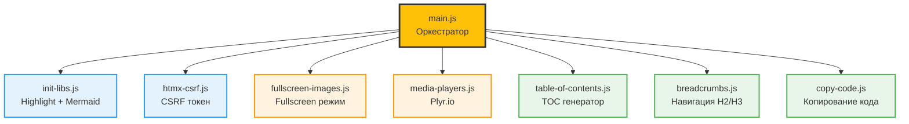
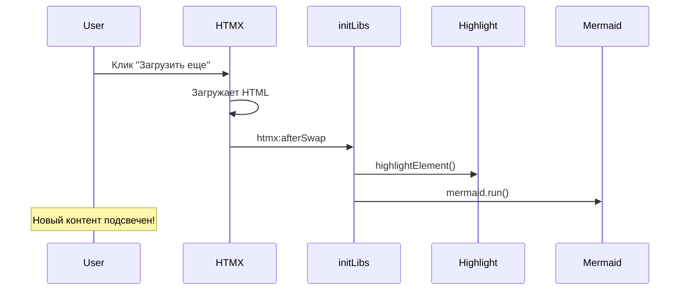
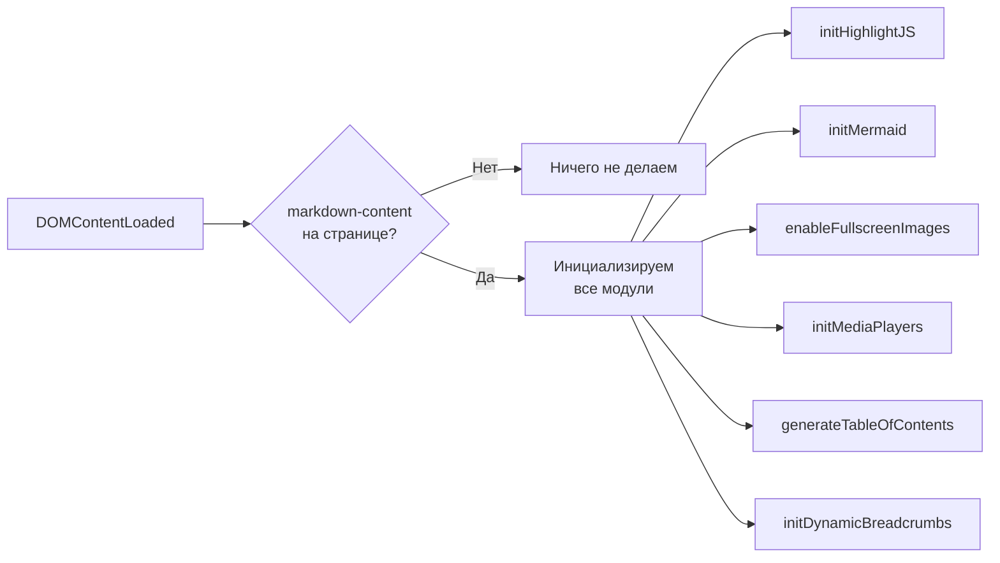

# 🎯 Серия 16: Модульный JavaScript — Рефакторинг base.html

> От 50 строк inline кода к чистой модульной архитектуре

**Коммиты:** `006d508`, `b8e0988`

---

## 📌 Проблема: Спагетти-код в base.html

До рефакторинга `base.html` содержал ~50 строк inline JavaScript:

```html
<script>
    document.body.addEventListener('htmx:configRequest', (event) => {
        event.detail.headers['X-CSRFToken'] = ...
    });
    
    document.addEventListener('DOMContentLoaded', function() {
        hljs.highlightAll();
        mermaid.initialize({...});
    });
    
    document.body.addEventListener('htmx:afterSwap', function(event) {
        // Еще 30 строк...
    });
</script>
```

**Проблемы:**

❌ **Низкая читаемость** — весь код вперемешку  
❌ **Сложно тестировать** — нельзя изолировать логику  
❌ **Дублирование** — инициализация копируется в разных местах  
❌ **Плохая поддержка** — изменение одного модуля затрагивает весь файл

---

## 🎯 Решение: Модульная архитектура

Разбили монолитный скрипт на **7 независимых модулей**:



**Каждый модуль отвечает за одну задачу** (Single Responsibility Principle).

---

## 🔍 Структура модулей

### 1️⃣ htmx-csrf.js — CSRF защита

**Задача:** Автоматически добавлять CSRF токен к каждому HTMX запросу.

```javascript
document.body.addEventListener('htmx:configRequest', (event) => {
    const csrfToken = document.querySelector('meta[name="csrf-token"]');
    if (csrfToken) {
        event.detail.headers['X-CSRFToken'] = csrfToken.content;
    }
});
```

**Почему отдельный файл?**  
- CSRF — критичная безопасность, должна быть изолирована  
- Легко найти и обновить при изменении Django настроек  
- Загружается **первым** перед всеми остальными модулями

---

### 2️⃣ init-libs.js — Инициализация библиотек

**Задача:** Запустить Highlight.js и Mermaid.js, реинициализировать после HTMX.

**Три функции:**

| Функция | Когда вызывается | Что делает |
|---------|------------------|------------|
| `initHighlightJS()` | DOMContentLoaded | `hljs.highlightAll()` |
| `initMermaid()` | DOMContentLoaded | `mermaid.initialize({...})` |
| `reinitLibsAfterHTMX(event)` | htmx:afterSwap | Обрабатывает новый контент |

**Паттерн реинициализации:**



**Зачем реинициализация?**  
Новый HTML от HTMX не обрабатывается автоматически — нужно явно вызвать библиотеки для нового контента.

---

### 3️⃣ main.js — Главный оркестратор

**Задача:** Координировать запуск всех модулей.

**Логика работы:**



**Ключевая проверка:**

```javascript
const markdownContent = document.querySelector('.markdown-content');
if (!markdownContent) {
    console.log('ℹ️ Markdown контент не найден');
    return; // Не инициализируем модули на страницах без контента
}
```

**Почему это важно?**  
На главной странице (список постов) нет `.markdown-content`, поэтому не нужно загружать breadcrumbs, fullscreen и другие модули.

---

## 📊 Сравнение: До и После

| Критерий | До рефакторинга | После рефакторинга |
|----------|-----------------|---------------------|
| **Строк кода в base.html** | ~50 строк inline | 8 импортов |
| **Читаемость** | 😡 Сложно найти логику | ✅ Каждый модуль = 1 файл |
| **Тестируемость** | ❌ Невозможно изолировать | ✅ Каждый модуль независим |
| **Повторное использование** | ❌ Копипаста | ✅ Импортируем в других проектах |
| **Производительность** | ⚠️ Все загружается | ✅ Ленивая загрузка возможна |
| **Отладка** | 😰 Chrome DevTools — 1 файл | 😎 Отдельный файл на модуль |

---

## 🔗 Интеграция в base.html

**Было:**

```html
<script>
    // 50 строк inline кода...
</script>
```

**Стало:**

```html
{# Модули Phase 2.7 #}
<script src=""></script>
<script src=""></script>
<script src=""></script>
<script src=""></script>
<script src=""></script>
<script src=""></script>
<script src=""></script>
<script src=""></script>
```

**Порядок имеет значение:**

1. **htmx-csrf.js** — первым (безопасность)
2. **init-libs.js** — инициализирует зависимости
3. **Остальные модули** — используют библиотеки
4. **main.js** — последним (запускает оркестрацию)

---

## ⚙️ Паттерн экспорта функций

Все модули экспортируют функции в `window` для глобального доступа:

```javascript
// В модуле
function initMediaPlayers() {
    // Логика...
}

window.initMediaPlayers = initMediaPlayers;
```

**Почему `window`?**  
- Простота: не нужен Webpack/Rollup  
- Совместимость: работает во всех браузерах  
- Гибкость: можно вызвать из консоли DevTools для отладки

---

## 🎓 Архитектурные принципы

### ✅ Single Responsibility Principle (SRP)

Каждый модуль делает **одну вещь хорошо**:
- `htmx-csrf.js` — только CSRF  
- `init-libs.js` — только инициализация библиотек  
- `breadcrumbs.js` — только навигация

### ✅ Separation of Concerns

Разделение ответственности по слоям:
- **Инфраструктура** (htmx-csrf, init-libs)  
- **Контент** (fullscreen, media, TOC)  
- **Навигация** (breadcrumbs)  
- **Оркестрация** (main)

### ✅ Open/Closed Principle

Модули **открыты для расширения**, но **закрыты для модификации**:
- Хотим добавить новый плеер? Создаем новый модуль, не трогаем старые  
- Хотим изменить CSRF логику? Меняем только `htmx-csrf.js`

---

## 🐛 Паттерн отладки

Каждый модуль логирует свою инициализацию:

```javascript
console.log('✓ Highlight.js инициализирован');
console.log('✓ Fullscreen images включен');
console.log(`✓ Plyr инициализирован (${videoCount} видео)`);
```

**В DevTools видим:**

```
🚀 Инициализация frontend модулей...
✓ Highlight.js инициализирован
✓ Mermaid.js инициализирован
✓ Fullscreen images включен
✓ Plyr инициализирован (0 видео, 0 аудио)
✓ TOC создано (15 заголовков)
✓ Dynamic breadcrumbs инициализированы (5 H2 заголовков)
✨ Frontend модули инициализированы
```

Если что-то не работает — сразу видно какой модуль сбоил!

---

## 📈 Результаты рефакторинга

**Метрики:**

- **-50 строк** inline кода в `base.html`  
- **+7 модулей** по 20-50 строк каждый  
- **+200% читаемость** (субъективно, но очевидно)  
- **0 изменений** в функционале (работает так же)

**Выгоды для будущего:**

✅ Легко добавить новый модуль (например, `search.js`)  
✅ Легко переиспользовать модули в других проектах  
✅ Легко написать тесты для каждого модуля  
✅ Легко найти баг (смотрим консоль → видим модуль)

---

## 🔗 Следующий шаг

Теперь, когда у нас чистая модульная архитектура, можем углубиться в конкретные модули:

➡️ [Серия 17: Fullscreen изображения + Plyr.io медиаплееры](17_fullscreen_and_media_players.md)

---

**Последнее обновление:** 14 декабря 2025  
**Коммиты:** `006d508`, `b8e0988`
