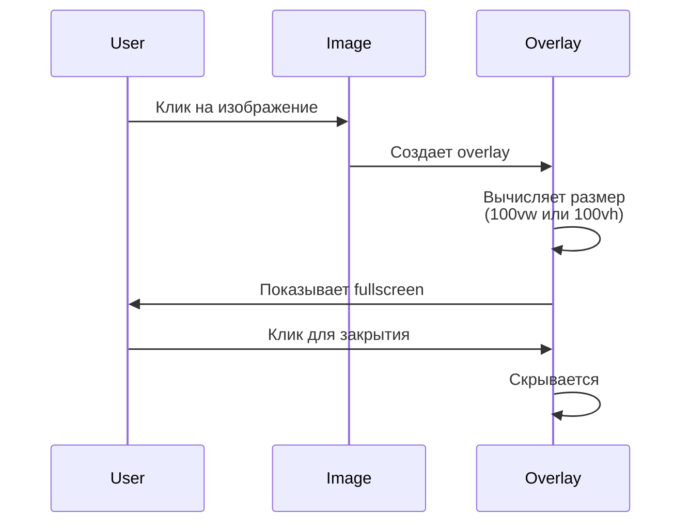
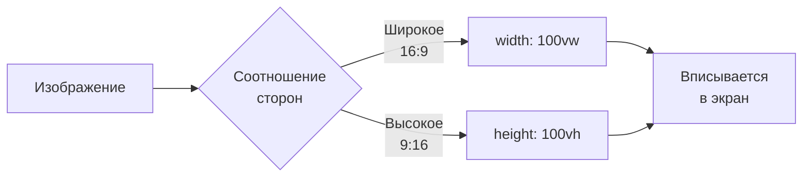
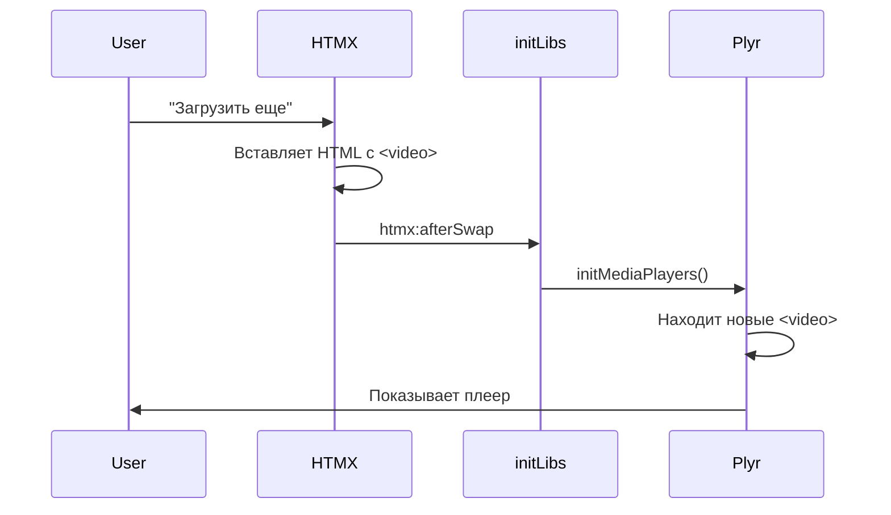

# 🖼️ Серия 17: Fullscreen изображения + Plyr.io медиаплееры

> Профессиональный UX для медиаконтента

**Коммиты:** `73721b0`, `9203464`

---

## 📌 Что реализовано?

Два независимых модуля для работы с медиа:

1. **fullscreen-images.js** — полноэкранный просмотр изображений  
2. **media-players.js** — Plyr.io интеграция для видео/аудио

---

## 🖼️ Fullscreen изображения

### Проблема

Пользователь видит маленькое изображение в посте и хочет рассмотреть детали.

**Было:**  
❌ Изображение открывается в новой вкладке (потеря контекста)  
❌ Нужно вручную закрывать вкладку  
❌ Нет плавной анимации

**Стало:**  
✅ Клик → fullscreen overlay поверх страницы  
✅ Клик на overlay → закрывается  
✅ Адаптивное масштабирование под экран

---

### Как это работает?



**Алгоритм масштабирования:**

```javascript
const screenRatio = window.innerWidth / window.innerHeight;
const imageRatio = image.width / image.height;

if (imageRatio > screenRatio) {
    // Широкое изображение → ограничиваем по ширине
    img.style.width = '100vw';
    img.style.height = 'auto';
} else {
    // Высокое изображение → ограничиваем по высоте
    img.style.width = 'auto';
    img.style.height = '100vh';
}
```

**Визуализация:**



---

### CSS трюк: Overlay

**HTML структура** (создается динамически):

```html
<div class="fullscreen-img-container active">
    
</div>
```

**CSS:**

| Свойство | Значение | Зачем |
|----------|----------|-------|
| `position: fixed` | — | Поверх всего контента |
| `top: 0; left: 0` | — | От края до края |
| `width: 100vw` | — | На весь экран по ширине |
| `height: 100vh` | — | На весь экран по высоте |
| `background: rgba(0,0,0,0.95)` | — | Темный полупрозрачный фон |
| `z-index: 9999` | — | Поверх всех элементов |
| `cursor: pointer` | — | Намек, что можно закрыть |
| `display: none` | → `flex` | Скрыт по умолчанию |

**Анимация появления:**

```css
.fullscreen-img-container {
    display: none; /* По умолчанию скрыт */
}

.fullscreen-img-container.active {
    display: flex; /* Показываем при клике */
    align-items: center;
    justify-content: center;
}
```

---

## 🎵 Plyr.io медиаплееры

### Почему Plyr.io?

**Нативные HTML5 плееры** (`<video>`, `<audio>`) выглядят по-разному в каждом браузере:

| Браузер | Проблема |
|---------|----------|
| Chrome | Синие кнопки, нет настроек скорости |
| Firefox | Оранжевые кнопки, другой UI |
| Safari | Серые кнопки, минимум контролов |

**Plyr.io решает это:**

✅ Единый UI во всех браузерах  
✅ Настройки скорости (0.5x-2x)  
✅ Качество видео (если несколько источников)  
✅ Fullscreen API  
✅ Красивый дизайн из коробки

---

### Интеграция Plyr.io

**Шаг 1: Подключаем CDN в base.html**

```html
{# CSS #}
<link rel="stylesheet" href="https://cdn.plyr.io/3.7.8/plyr.css" />

{# JS #}
<script src="https://cdn.plyr.io/3.7.8/plyr.js"></script>
```

**Шаг 2: Инициализируем в media-players.js**

```javascript
function initMediaPlayers() {
    if (typeof Plyr === 'undefined') {
        console.warn('Plyr не загружен');
        return; // Защита от ошибок
    }
    
    const videoElements = document.querySelectorAll('.markdown-content video');
    videoElements.forEach(video => {
        new Plyr(video, {
            controls: ['play', 'progress', 'volume', 'fullscreen'],
            settings: ['quality', 'speed'],
            speed: { selected: 1, options: [0.5, 0.75, 1, 1.25, 1.5, 2] }
        });
    });
}
```

**Что настроили:**

| Настройка | Значение | Зачем |
|-----------|----------|-------|
| `controls` | `['play', 'progress', ...]` | Какие кнопки показывать |
| `settings` | `['quality', 'speed']` | Меню настроек |
| `speed.selected` | `1` | Скорость по умолчанию (обычная) |
| `speed.options` | `[0.5, ..., 2]` | Доступные скорости |

---

### Видео vs Аудио: Разные настройки

**Для видео** — больше контролов:

```javascript
new Plyr(video, {
    controls: [
        'play-large',      // Большая кнопка по центру
        'play',
        'progress',
        'current-time',
        'duration',
        'mute',
        'volume',
        'settings',
        'fullscreen'       // Важно для видео!
    ]
});
```

**Для аудио** — минимализм:

```javascript
new Plyr(audio, {
    controls: [
        'play',
        'progress',
        'current-time',
        'duration',
        'mute',
        'volume',
        'settings'
        // Нет fullscreen!
    ]
});
```

---

### Зачем настройки скорости?

**Use case:**

- **0.5x** — медленнее для детального разбора кода в видеоуроке  
- **1.25x** — ускорить длинное объяснение  
- **2x** — пробежаться по уже знакомой теме

**Как это выглядит:**

```
🎵 Аудиоплеер
    ▶️ Play  [=========|--------]  1:23 / 5:45  🔊 ⚙️ Settings

Клик на ⚙️ → выпадает меню:
    Speed
      ▪ 0.5x
      ▪ 0.75x
      ▪ 1x    ← выбрано
      ▪ 1.25x
      ▪ 1.5x
      ▪ 2x
```

---

## 🎨 CSS стилизация

### Fullscreen Overlay

```css
.fullscreen-img-container {
    display: none;
    position: fixed;
    top: 0;
    left: 0;
    width: 100vw;
    height: 100vh;
    background: rgba(0, 0, 0, 0.95); /* Почти черный */
    z-index: 9999;
    cursor: pointer; /* Намек на закрытие */
    align-items: center;
    justify-content: center;
}

.fullscreen-img-container.active {
    display: flex; /* Показываем */
}

.fullscreen-img-container img {
    max-width: 100vw;
    max-height: 100vh;
    object-fit: contain; /* Сохраняем пропорции */
}
```

**Ключевые моменты:**

- `object-fit: contain` — изображение не обрезается, всегда видно полностью  
- `z-index: 9999` — поверх всех элементов (даже sticky меню)  
- `cursor: pointer` — UX подсказка, что можно кликнуть для закрытия

---

## 🔄 Интеграция с HTMX

**Проблема:** После загрузки нового контента через HTMX, новые `<video>` элементы не инициализируются автоматически.

**Решение:** В `init-libs.js` добавлена реинициализация:

```javascript
function reinitLibsAfterHTMX(event) {
    // Подсвечиваем код
    event.detail.elt.querySelectorAll('pre code').forEach(block => {
        hljs.highlightElement(block);
    });
    
    // Инициализируем плееры в новом контенте
    if (window.initMediaPlayers) {
        initMediaPlayers();
    }
}
```

**Поток данных:**



---

## 🐛 Защита от ошибок

**Что если Plyr.io не загрузился?**

```javascript
if (typeof Plyr === 'undefined') {
    console.warn('Plyr не загружен');
    return; // Прекращаем инициализацию
}
```

**Зачем:**  
- CDN может быть недоступен  
- AdBlock может заблокировать  
- Медленный интернет может не успеть загрузить

**Без проверки:** JavaScript упадет с ошибкой `Plyr is not defined` и все модули перестанут работать.

**С проверкой:** Остальные модули работают, только плееры не инициализируются.

---

## 📊 Сравнение: До и После

| Критерий | Нативные плееры | Plyr.io |
|----------|-----------------|---------|
| **UI** | Разный в браузерах | Единый |
| **Настройки скорости** | ❌ Нет | ✅ 0.5x-2x |
| **Fullscreen** | ⚠️ Работает по-разному | ✅ Единый API |
| **Дизайн** | 😐 Стандартный | 😍 Красивый |
| **Контролы** | Фиксированные | Настраиваемые |

---

## 🎓 Архитектурные решения

### ✅ Ленивая инициализация

Плееры инициализируются **только если на странице есть медиа**:

```javascript
const videoElements = document.querySelectorAll('.markdown-content video');
if (videoElements.length === 0) {
    return; // Не загружаем Plyr зря
}
```

### ✅ Селектор `.markdown-content`

Инициализируем только внутри контента, игнорируя служебные элементы:

```javascript
// ✅ Хорошо
document.querySelectorAll('.markdown-content video')

// ❌ Плохо (может захватить лишнее)
document.querySelectorAll('video')
```

### ✅ Логирование

Каждый модуль сообщает о своей работе:

```javascript
console.log(`✓ Plyr инициализирован (${videoCount} видео, ${audioCount} аудио)`);
```

**В консоли DevTools:**

```
✓ Fullscreen images включен
✓ Plyr инициализирован (2 видео, 1 аудио)
```

---

## 📈 Результаты

**Метрики:**

- **+2 модуля** (fullscreen-images.js, media-players.js)  
- **+150 строк CSS** для overlay  
- **+Plyr.io 3.7.8** (47 KB gzip)  
- **0 изменений** в HTML шаблонах (работает автоматически)

**UX улучшения:**

✅ Профессиональный вид медиаплееров  
✅ Fullscreen режим для изображений  
✅ Настройки скорости 0.5x-2x  
✅ Единый UI во всех браузерах

---

## 🔗 Следующий шаг

Теперь углубимся в самый сложный модуль — динамические хлебные крошки:

➡️ [Серия 18: Динамические хлебные крошки с dropdown навигацией](18_dynamic_breadcrumbs.md)

---

**Последнее обновление:** 14 декабря 2025  
**Коммиты:** `73721b0`, `9203464`
