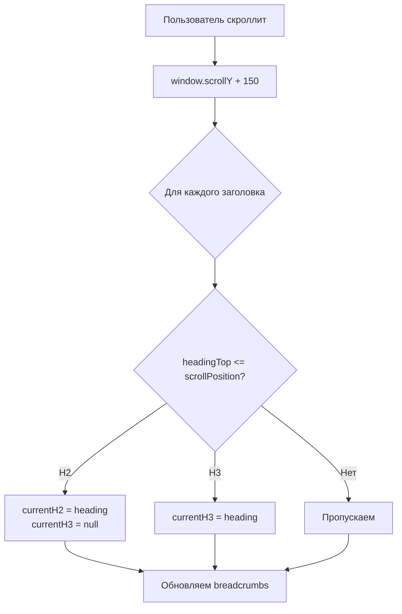
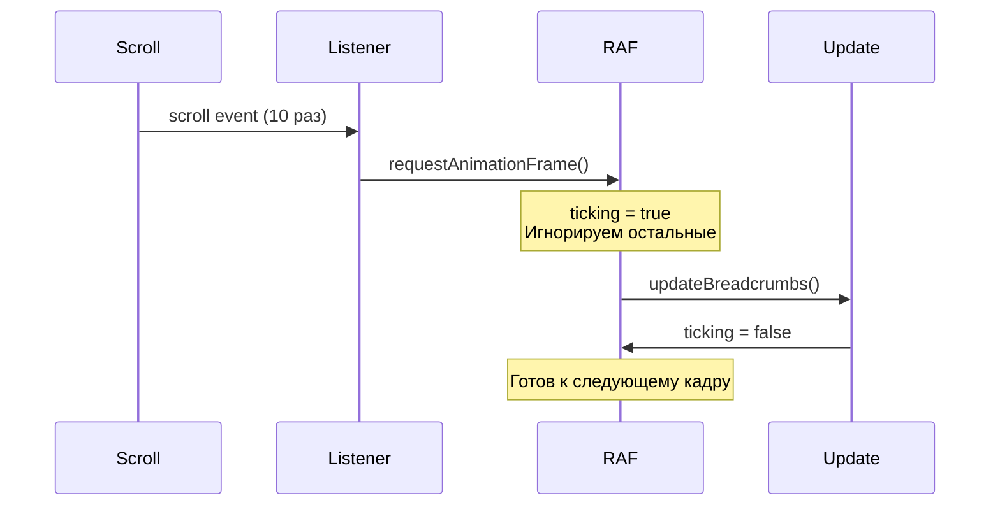

# 🧭 Серия 18: Динамические хлебные крошки с dropdown навигацией

> IntersectionObserver + dropdown меню для навигации по длинным статьям

**Коммиты:** `0d2d1d8`, `9203464`, `878d880`

---

## 📌 Проблема: Потеря контекста в длинных статьях

Представь статью на 10,000 слов с 15 разделами H2 и 40 подразделами H3.

**Пользователь прокручивает вниз и спрашивает себя:**  
❓ "В каком разделе я сейчас?"  
❓ "Как быстро перейти к другому разделу?"

**Стандартное оглавление** (Table of Contents) **не помогает:**  
- Находится вверху страницы или в sidebar  
- При прокрутке вниз — не видно  
- Нужно скроллить обратно к оглавлению

---

## 🎯 Решение: Sticky Breadcrumbs

**Хлебные крошки** (breadcrumbs) **приклеены к верху экрана** и показывают:

```
Текущий раздел H2  /  Текущий подраздел H3
```

**При наведении на H2** → выпадает dropdown со всеми H2 для быстрого перехода.

**Визуализация:**

```
┌────────────────────────────────────────────┐
│ 🧭 Модульный JavaScript  /  Интеграция     │ ← Sticky breadcrumbs
└────────────────────────────────────────────┘
    │
    └─ При hover на "Модульный JavaScript":
       
       ┌───────────────────────────────┐
       │ ✅ Модульный JavaScript       │ ← Текущий раздел
       │   Fullscreen изображения      │
       │   Динамические breadcrumbs    │
       │   Мобильная адаптивность      │
       └───────────────────────────────┘
```

---

## 🔍 Как это работает?

### 1️⃣ Сбор заголовков

```javascript
const headings = Array.from(
    document.querySelectorAll('.markdown-content h2, .markdown-content h3')
);
```

**Получаем массив:**

```javascript
[
    <h2 id="intro">Введение</h2>,
    <h3 id="problem">Проблема</h3>,
    <h3 id="solution">Решение</h3>,
    <h2 id="architecture">Архитектура</h2>,
    <h3 id="modules">Модули</h3>,
    // ...
]
```

---

### 2️⃣ Генерация якорных ссылок

**Проблема:** Не у всех заголовков есть `id` атрибут.

**Решение:** Автоматически генерируем slug из текста:

```javascript
headings.forEach((heading, index) => {
    if (!heading.id) {
        const slug = heading.textContent
            .toLowerCase()
            .replace(/[^\w\s-]/g, '')  // Убираем спецсимволы
            .replace(/\s+/g, '-')      // Пробелы → дефисы
            .substring(0, 50);          // Ограничиваем длину
        heading.id = `heading-${slug}-${index}`;
    }
});
```

**Пример:**

| Текст заголовка | Сгенерированный ID |
|-----------------|---------------------|
| "Модульный JavaScript" | `heading-modulnyj-javascript-0` |
| "Что это такое?" | `heading-chto-eto-takoe-1` |
| "🎯 Решение: Sticky" | `heading-reshenie-sticky-2` |

---

### 3️⃣ Отслеживание прокрутки

**Алгоритм:**



**Код:**

```javascript
window.addEventListener('scroll', () => {
    const scrollPosition = window.scrollY + 150; // Offset
    
    let currentH2 = null;
    let currentH3 = null;
    
    for (const heading of headings) {
        if (heading.offsetTop <= scrollPosition) {
            if (heading.tagName === 'H2') {
                currentH2 = heading;
                currentH3 = null; // Сбрасываем H3!
            } else if (heading.tagName === 'H3' && currentH2) {
                currentH3 = heading;
            }
        }
    }
});
```

**Зачем offset +150px?**  
Когда заголовок находится **чуть выше** верха экрана (в пределах 150px), считаем что мы **уже в этом разделе**.

---

### 4️⃣ Dropdown меню

**Структура DOM:**

```html
<div class="breadcrumbs-dynamic">
    <span class="breadcrumb-item breadcrumb-dropdown">
        <a href="#heading-intro" class="breadcrumb-h2-link">
            Введение
        </a>
        <div class="breadcrumb-dropdown-menu">
            <a class="breadcrumb-dropdown-item active">Введение</a>
            <a class="breadcrumb-dropdown-item">Архитектура</a>
            <a class="breadcrumb-dropdown-item">Результаты</a>
        </div>
    </span>
    <span class="breadcrumb-separator"> / </span>
    <span class="breadcrumb-item active">Проблема</span>
</div>
```

**CSS для dropdown:**

```css
.breadcrumb-dropdown-menu {
    position: absolute;
    top: 100%;
    left: 0;
    background: white;
    border: 1px solid #dee2e6;
    border-radius: 0.375rem;
    box-shadow: 0 4px 12px rgba(0, 0, 0, 0.15);
    display: none; /* Скрыт по умолчанию */
    z-index: 1001;
}

.breadcrumb-dropdown-menu.show {
    display: block;
    animation: dropdownFadeIn 0.2s ease;
}

@keyframes dropdownFadeIn {
    from {
        opacity: 0;
        transform: translateY(-10px);
    }
    to {
        opacity: 1;
        transform: translateY(0);
    }
}
```

**Анимация появления:**

```
Наведение мыши:
    0ms:   opacity: 0, translateY(-10px)
    200ms: opacity: 1, translateY(0)
```

---

### 5️⃣ Плавная прокрутка

**При клике на ссылку:**

```javascript
dropdownItem.addEventListener('click', (e) => {
    e.preventDefault();
    h2.scrollIntoView({ behavior: 'smooth', block: 'start' });
    dropdown.classList.remove('show'); // Закрываем dropdown
});
```

**`scrollIntoView` опции:**

| Опция | Значение | Зачем |
|-------|----------|-------|
| `behavior: 'smooth'` | — | Плавная анимация прокрутки |
| `block: 'start'` | — | Заголовок у верха экрана |

**Без `e.preventDefault()`:**  
Браузер выполнит стандартное поведение — мгновенный прыжок к `#anchor`.

**С `e.preventDefault()` + `scrollIntoView`:**  
Плавная анимированная прокрутка к разделу.

---

## 🎨 CSS: Sticky позиционирование

**Breadcrumbs "приклеены" к верху при прокрутке:**

```css
.breadcrumbs-dynamic {
    position: sticky;
    top: 0;
    background: rgba(255, 255, 255, 0.95);
    backdrop-filter: blur(10px);
    padding: 0.75rem 0;
    border-bottom: 1px solid #dee2e6;
    z-index: 1000;
}
```

**Ключевые свойства:**

| Свойство | Значение | Эффект |
|----------|----------|--------|
| `position: sticky` | — | "Прилипает" к `top: 0` при прокрутке |
| `backdrop-filter: blur(10px)` | — | Размытие фона под breadcrumbs |
| `rgba(255,255,255,0.95)` | — | Полупрозрачный белый фон |
| `z-index: 1000` | — | Поверх контента, но под модалками |

**Визуализация sticky:**

```
┌─────────────────────────┐
│ Breadcrumbs (sticky)    │ ← Всегда видны
├─────────────────────────┤
│                         │
│   Контент прокручивается│
│   вниз под breadcrumbs  │
│                         │
│                         │
└─────────────────────────┘
```

---

## 🐛 Баг: Gap между ссылкой и меню

**Проблема:**  
При наведении мыши на H2 ссылку появляется dropdown, но когда мышь движется вниз к dropdown — он исчезает.

**Причина:**  
Между ссылкой и меню есть gap ~4px, мышь покидает hover область.

**Решение:**  
Убрали `margin-top` и добавили padding для "перекрытия" gap:

```javascript
dropdown.style.marginTop = '-2px';
dropdown.style.paddingTop = '8px';
```

**До:**

```
[Ссылка H2]
     ↓ 4px gap (мышь здесь = dropdown исчезает)
[────────────]
│  Dropdown  │
[────────────]
```

**После:**

```
[Ссылка H2]
[────────────] ← padding-top: 8px (невидимая область)
│  Dropdown  │
[────────────]
```

Теперь мышь не покидает hover область!

---

## 🎓 Архитектурные решения

### ✅ Throttle для scroll события

**Проблема:**  
`scroll` event срабатывает **сотни раз в секунду** → тормозит браузер.

**Решение:**  
Используем `requestAnimationFrame` для throttle:

```javascript
let ticking = false;
window.addEventListener('scroll', () => {
    if (!ticking) {
        window.requestAnimationFrame(() => {
            updateBreadcrumbs();
            ticking = false;
        });
        ticking = true;
    }
});
```

**Как работает:**



**Результат:**  
Вместо **1000 обновлений/сек** → **~60 обновлений/сек** (частота кадров браузера).

---

### ✅ Подсветка активного элемента

**В dropdown выделяем текущий раздел:**

```javascript
if (h2.id === currentH2.id) {
    dropdownItem.classList.add('active');
}
```

**CSS:**

```css
.breadcrumb-dropdown-item.active {
    background-color: var(--accent-yellow);
    border-left-color: var(--text-dark);
    font-weight: 600;
}
```

**Визуально:**

```
┌───────────────────────────┐
│ ▪ Введение                │
│ █ Модульный JavaScript    │ ← active (текущий раздел)
│ ▪ Fullscreen изображения  │
│ ▪ Breadcrumbs             │
└───────────────────────────┘
```

---

## 📊 Сравнение: TOC vs Breadcrumbs

| Критерий | Table of Contents | Breadcrumbs |
|----------|-------------------|-------------|
| **Расположение** | Sidebar или сверху | Sticky вверху |
| **Видимость** | Теряется при прокрутке | Всегда видны |
| **Информация** | Все разделы | Только текущий |
| **Навигация** | Статичный список | Динамическое обновление + dropdown |
| **Use case** | Обзор структуры | Ориентация в тексте |

**Вывод:**  
TOC и Breadcrumbs **дополняют друг друга**, а не заменяют.

---

## 📈 Результаты

**Метрики:**

- **+180 строк** JavaScript (breadcrumbs.js)  
- **+150 строк** CSS (sticky, dropdown, animations)  
- **+1 контейнер** в post_detail.html (`<div class="breadcrumbs-dynamic">`)

**UX улучшения:**

✅ Пользователь всегда знает, где находится  
✅ Быстрый переход к любому разделу H2  
✅ Плавная анимация dropdown  
✅ Адаптивное поведение (см. Серию 19)

**Технические выгоды:**

✅ Throttle для производительности  
✅ Автоматическая генерация якорей  
✅ Плавная прокрутка вместо прыжков

---

## 🔗 Следующий шаг

Теперь посмотрим, как адаптировать все модули для мобильных устройств:

➡️ [Серия 19: Мобильная адаптивность](19_mobile_responsive.md)

---

**Последнее обновление:** 14 декабря 2025  
**Коммиты:** `0d2d1d8`, `9203464`, `878d880`
