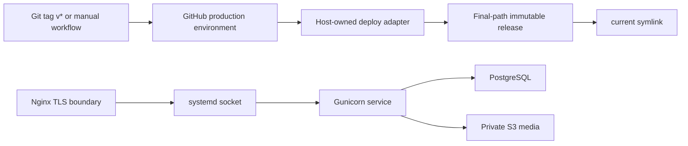

# Production deployment

This runbook describes the repository contract. It does not authorize a live deploy. Host, DNS/TLS, PostgreSQL, S3, credentials, systemd/Nginx installation, service actions and migrations require a separate owner-approved gate.

## Architecture



Canonical repository artifacts:

- `.github/workflows/deploy.yml` — verify, archive, upload and fixed adapter invocation;
- `deploy/host/django-6-blog-deploy` — trusted host adapter example;
- `scripts/deploy/release.sh` — final-path build, static collection, metadata and cutover;
- `scripts/deploy/rollback.sh` — compatibility-aware code/static rollback only;
- `scripts/deploy/maintenance.sh` and `deploy/systemd/django-6-blog-maintenance@.service` — allowlisted `check`, `migrate`, `collectstatic` boundary;
- `deploy/systemd/django-6-blog.service`, `.socket` and env example — Gunicorn runtime;
- `deploy/nginx/django-6-blog.conf.example` — HTTP redirect, TLS placeholders, static aliases and proxy boundary;
- `deploy/release-metadata.schema.json` — closed release compatibility metadata.

## Production settings

Use `DJANGO_SETTINGS_MODULE=config.settings_production`. The module fails before startup unless:

- `DJANGO_DEBUG=false`;
- `DJANGO_SECRET_KEY` is non-placeholder and at least 50 characters;
- `DJANGO_ALLOWED_HOSTS` contains explicit hosts and no wildcard;
- `DJANGO_CSRF_TRUSTED_ORIGINS` contains HTTPS origins only;
- `DATABASE_URL` is PostgreSQL;
- `DJANGO_MEDIA_STORAGE=s3` and all required `MEDIA_S3_*` values exist.

PostgreSQL connections use `connect_timeout=2` and `statement_timeout=2000` ms. Production media uses the canonical variables in `.env.production.example` and `deploy/systemd/django-6-blog.env.example`. Private Timeweb S3 uses `MEDIA_S3_SIGNED_URLS=true` with empty `MEDIA_S3_CUSTOM_DOMAIN`. HSTS remains disabled until a separately approved live TLS check.

Application secrets live only in `/etc/django-6-blog/django-6-blog.env`, expected as `root:django-blog 0640`. They do not belong in GitHub. GitHub production stores only the five deploy transport secrets listed in `doc/timeweb-deployment-preparation.md`.

## Offline verification

Run without real endpoints or credentials:

```bash
uv lock --check
uv run pytest -q tests/test_production_settings.py blog/test_infra.py blog/test_static_delivery.py blog/test_storage_compat.py tests/test_deploy_artifacts.py
uv run python manage.py check
for file in scripts/deploy/*.sh deploy/host/django-6-blog-deploy; do bash -n "$file"; done
uv run pytest -q
git diff --check
```

CI separately starts PostgreSQL 16, applies migrations, runs `check --deploy`, and verifies health tests. Temporary release tests prove final-path virtualenv execution, safe static collection, pre/post-cutover rollback, metadata verdicts and fixed adapter provenance. These are repository proofs, not host proofs.

## Future live bootstrap gate

Only after Vladimir explicitly approves the live stage, the host operator may follow `doc/timeweb-deployment-preparation.md` and `doc/plans/timeweb-server-bootstrap.md` to:

1. verify OS and SSH fingerprint out of band;
2. create dedicated `deploy`, `django-blog` and backup accounts and narrow permissions;
3. install reviewed units, adapter and Nginx configuration;
4. insert application secrets out of band;
5. configure PostgreSQL, private S3 and TLS;
6. run migrations, static collection, `/api/v1/health/live/` and `/api/v1/health/ready/` checks;
7. run S3 upload/read/delete and backup/rehearsal gates;
8. enable tag deployment only after rollback and reboot-persistence checks.

Before reload, the host operator must replace placeholders and run `nginx -t`. HSTS may be enabled only after HTTPS/proxy behavior is verified. No command in this document grants that approval.

## Release and rollback contract

`release.sh` creates `/srv/django-6-blog/releases/<release-id>` at its final pathname before `uv sync`; it never moves a populated virtualenv. It collects release-local manifest static files, creates validated `release-metadata.json`, checks final-path Gunicorn, then atomically repoints `current`. Readiness failure restores the prior symlink and removes only the failed validated release.

`rollback.sh` permits only `ALLOW_CODE_STATIC_ONLY`. It refuses unknown DB migration state, incompatible schema sequences, irreversible migration boundaries, storage-mode changes and invalid metadata. It never reverses migrations or restores PostgreSQL/media. A refused rollback requires a separately reviewed forward fix or break-glass restore plan.

## Ownership and non-claims

- Vladimir: change approval and live-stage authorization.
- Host operator: SSH/bootstrap, file ownership, systemd/Nginx/TLS and rollback execution.
- Database operator: PostgreSQL provisioning, migration evidence and DB recovery.
- Storage operator: S3 credentials, copy/delta sync, ACL/CORS/Range/cache checks.
- Backup operator and key custodian: see `doc/backup-restore.md`.

Offline PASS does not prove Timeweb compatibility, public DNS/TLS, host permissions, service installation, real PostgreSQL latency/failure behavior, S3 semantics, reboot persistence, backup durability, restore RPO/RTO or a successful production deploy.
