# Production deployment

This runbook describes the active Timeweb production deployment for `exception-blog.ru` and the repository safety contract behind it.

## Active architecture

```mermaid
flowchart LR
    T["Tag v* or workflow_dispatch"] --> V["GitHub-hosted verify job"]
    V --> D["GitHub Deployments API<br/>payload: timeweb-pull-v1"]
    D --> P["Timeweb systemd timer<br/>every 2 minutes"]
    P --> Q["Root-owned deployment poller"]
    Q --> A["Root-owned exact-SHA adapter"]
    A --> G["/srv/django-6-blog/app"]
    G --> U["uv sync + Django checks<br/>migrate + collectstatic"]
    U --> S["systemd Gunicorn service"]
    S --> N["Nginx HTTPS"]
    N --> H["Public health and deploy status"]
```



The VPS pulls deployment intent from `api.github.com`; GitHub-hosted runners do not open SSH connections to Timeweb. This avoids the provider route that timed out between GitHub runners and the VPS. A self-hosted runner is not installed because the VPS cannot reach its assigned `pipelines*.actions.githubusercontent.com` tenant endpoint reliably.

## Trigger and workflow

`.github/workflows/deploy.yml` accepts only:

- a pushed tag matching `v*`;
- an explicit `workflow_dispatch` run.

The workflow:

1. runs repository checks on a GitHub-hosted runner;
2. uses the job-scoped `GITHUB_TOKEN` with `deployments: write` to create a production deployment for the exact `github.sha`;
3. marks the request with `payload.transport = timeweb-pull-v1`;
4. waits for the matching deployment ID and SHA at `https://exception-blog.ru/_deploy/status`;
5. records the explicit GitHub deployment as success or failure after the matching VPS result.

No deploy SSH key, host, port or application secret is required in GitHub. Application secrets remain only in `/etc/django-6-blog/django-6-blog.env` on the VPS.

## VPS pull boundary

Canonical active artifacts:

- `deploy/host/django-6-blog-deployment-poller` — reads public deployment metadata from the GitHub API, accepts only the `timeweb-pull-v1` marker, processes each deployment ID once and publishes an atomic status file;
- `deploy/systemd/django-6-blog-deployment-poller.service` — root-owned oneshot poller;
- `deploy/systemd/django-6-blog-deployment-poller.timer` — persistent two-minute schedule;
- `deploy/host/django-6-blog-checkout-deploy` — fixed-origin, exact-SHA deployment adapter for the active checkout layout;
- `deploy/nginx/django-6-blog.conf.example` — includes the read-only `/_deploy/status` endpoint.

Installed paths:

```text
/usr/local/sbin/django-6-blog-deployment-poller
/usr/local/sbin/django-6-blog-checkout-deploy
/etc/systemd/system/django-6-blog-deployment-poller.service
/etc/systemd/system/django-6-blog-deployment-poller.timer
/var/lib/django-6-blog/deployment-status.json
/var/lib/django-6-blog/last-deployment-id
```

The status document contains only:

```json
{
  "deployment_id": 123,
  "sha": "40-character commit",
  "status": "in_progress | success | failure"
}
```

It contains no logs, credentials or environment values.

## Exact-SHA adapter contract

`django-6-blog-checkout-deploy`:

- accepts exactly one lowercase 40-character commit SHA;
- requires root and a non-blocking deployment lock;
- refuses a changed tracked worktree;
- verifies the fixed origin is `https://github.com/VladimirMonin/django_6_blog.git`;
- fetches only `origin/main` and `v*` tags over Git HTTP/1.1 with five bounded retries for transient Timeweb resets;
- permits only a commit reachable from `origin/main` or pointed to by a `v*` tag;
- runs `uv sync --frozen` as the application user;
- runs `check --deploy`, migrations and static collection through transient systemd units using the protected production `EnvironmentFile`;
- restarts `django-6-blog.service`, requires readiness on `127.0.0.1:8000`, then checks home, liveness and readiness through local Nginx HTTPS with the production hostname and certificate;
- restores the preceding code revision after readiness failure only when no migration file changed;
- refuses automatic code rollback after a migration-bearing deployment.

The timer executes the root-owned poller directly. No repository-provided shell fragment, deployment secret or arbitrary command is accepted from GitHub.

## Current runtime layout

The live Timeweb service currently uses:

```text
checkout:      /srv/django-6-blog/app
virtualenv:    /srv/django-6-blog/app/.venv
static root:   /srv/django-6-blog/app/staticfiles
service:       django-6-blog.service
Gunicorn:      127.0.0.1:8000
production env:/etc/django-6-blog/django-6-blog.env
```

The immutable release artifacts under `scripts/deploy/`, `deploy/host/django-6-blog-deploy`, release metadata and rollback tests remain the reviewed future release-layout contract. They are not claimed as the active Timeweb layout until the service is deliberately migrated from `/app` to `/current`.

## Production settings

Use `DJANGO_SETTINGS_MODULE=config.settings_production`. Startup fails closed unless:

- `DJANGO_DEBUG=false`;
- `DJANGO_SECRET_KEY` is non-placeholder and at least 50 characters;
- `DJANGO_ALLOWED_HOSTS` contains explicit hosts and no wildcard;
- `DJANGO_CSRF_TRUSTED_ORIGINS` contains HTTPS origins only;
- `DATABASE_URL` is PostgreSQL;
- `DJANGO_MEDIA_STORAGE=s3` and all required `MEDIA_S3_*` values exist.

Application secrets stay in `/etc/django-6-blog/django-6-blog.env`, expected as a non-public root-owned file readable by the application service account. They do not belong in GitHub deployments, workflow logs or the public status document.

## Verification

Repository gate:

```bash
uv lock --check
uv run pytest -q tests/test_production_settings.py blog/test_infra.py blog/test_static_delivery.py blog/test_storage_compat.py tests/test_deploy_artifacts.py tests/test_backup_script_safety.py
uv run python manage.py check
uv run pytest -q
git diff --check
```

VPS checks:

```bash
systemctl status django-6-blog-deployment-poller.timer
systemctl status django-6-blog-deployment-poller.service
journalctl -u django-6-blog-deployment-poller.service
cat /var/lib/django-6-blog/deployment-status.json
```

Public checks:

```bash
curl --fail https://exception-blog.ru/
curl --fail https://exception-blog.ru/api/v1/health/live/
curl --fail https://exception-blog.ru/api/v1/health/ready/
curl --fail https://exception-blog.ru/_deploy/status
```

A successful GitHub job is accepted only after the external status endpoint reports the same deployment ID and SHA. The adapter must also pass direct Gunicorn readiness and local Nginx HTTPS checks for home, liveness and readiness; independent operational probes verify wider public reachability.

## TLS and renewal note

The active certificate was issued with Let’s Encrypt DNS-01 through the Timeweb Cloud DNS API because HTTP-01 and TLS-ALPN-01 were unreliable from some external validation networks. Certificate renewal is a separate operational credential boundary: use a long-lived Timeweb token restricted to DNS management and never place it in GitHub or repository files.
