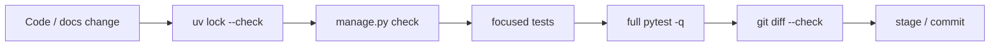

# Development guide

Рабочие правила проекта `django_6_blog`.

## Стек

- Python `>=3.12`, выбирается через `uv`
- Django `6.0.x`; зависимость ограничена как `django>=6.0.5,<6.1`
- SQLite — локальная база; production-модуль требует PostgreSQL
- `django-components` закреплён на `0.143.x`
- `pytest` + `pytest-django` — основной тестовый запуск

## Установка и запуск

```bash
uv sync --python 3.12
uv run python manage.py migrate
uv run python manage.py runserver 127.0.0.1:8036
```

Если нужна другая версия Python, выбирай её через `uv`, например:

```bash
uv sync --python 3.13
```

Не нужно ставить Python через `apt`, `pyenv` или вручную, пока `uv` справляется сам.

## Локальные настройки

Пример локальных переменных лежит в `.env.example`.

```bash
cp .env.example .env
```

Файл `.env` игнорируется Git. Реальные секреты, локальная база `db.sqlite3`, `.venv/` и локальные медиа не должны попадать в коммиты.

Настройки читаются из process environment:

- `DJANGO_SECRET_KEY` — секрет Django
- `DJANGO_DEBUG` — `true` / `false`
- `DJANGO_ALLOWED_HOSTS` — hosts через запятую
- `SITE_AUTHOR` — публичный автор по умолчанию

`.env.example` содержит локальные значения и production placeholders. Для production preparation используй `.env.production.example`; populated `.env.production` игнорируется Git и не передаётся через чат. Production settings не загружают dotenv сами: переменные поставляет process environment/systemd.

## Команды для разработки

```bash
# Быстрый старт
make setup
make migrate
make run

# Проверки
make check
make test

# Операционные команды
uv run python manage.py backup --output backup.json
uv run python manage.py publish_scheduled
uv run python manage.py rebuild_content_html --dry-run
```

## Quality gate



## Проверки перед коммитом

Перед работой агентам нужно прочитать [`../AGENTS.md`](../AGENTS.md) и релевантные файлы из [`../instructions/`](../instructions/). `AGENTS.md` — роутер; атомарные правила живут в `instructions/*.instructions.md`.

```bash
uv lock --check
uv run python manage.py check
uv run pytest -q
git diff --check
git status --short
```

Для изменений production/ops дополнительно запусти focused offline pack из [`../instructions/TEST.quality_gates.instructions.md`](../instructions/TEST.quality_gates.instructions.md). Он не выполняет SSH, systemd/Nginx actions, S3/remote PostgreSQL calls, backup upload или restore.

Дополнительная проверка, что Poetry не вернулся:

```bash
git grep -nEi 'poetry|poetry-core' -- pyproject.toml README.md uv.lock || true
git ls-files | grep -E '(^|/)poetry\.lock$' && exit 1 || true
```

## Публичный блог

Публичная часть показывает только записи, которые одновременно:

- `Post.status = published`
- `Post.deleted_at IS NULL`

Поддерживаются:

- категории
- теги
- поиск по заголовку, Markdown-контенту, категории и тегам
- content-type filter (`article` / `video` / `audio` / `podcast`)
- series landing + series navigation
- SEO-friendly пагинация обычными ссылками
- HTMX-частичные ответы для поиска и догрузки карточек
- class-based views для списка, деталки, страницы «О блоге» и toggle-like endpoint
- счётчик просмотров: один просмотр поста на одну anonymous session
- лайки: один переключаемый лайк поста на одну anonymous session
- централизованная история взаимодействий в `SessionPostInteraction`
- read-depth telemetry в `PostView`

Фильтры передаются query-string параметрами:

- `?search=...`
- `?category=slug`
- `?tag=slug`
- `?type=video`
- `?page=2`

## API и агентская публикация

Agent API lives under `/api/v1/` and uses `ApiKey` tokens.

Поддерживаются:

- publish / bulk publish
- list / detail
- status transitions
- soft delete
- stats
- public health
- public read-depth endpoint

API keys имеют permissions + expiry. На mutating endpoints пишутся `AuditLog` записи и structured JSON logs.

## Импорт Obsidian-заметки

Полная справка по CLI-командам импорта: [`doc/cli.md`](cli.md).

Для проверки реального Markdown и медиа используются ignored test assets в `tests/assets/`.

Сбор заметки и всех локальных Obsidian/Markdown assets в одну папку:

```bash
uv run python manage.py collect_note_assets \
  "/path/to/vault/10_Lessons/LM Studio/01-токены-параметры-и-встраивания.md" \
  tests/assets/obsidian/lm-studio-lesson-01 \
  --vault-root "/path/to/vault" \
  --clean \
  --title "LM Studio: токены, параметры и встраивания" \
  --description "Короткое описание для карточки."
```

Дальше:

```bash
uv run python manage.py import_obsidian_note \
  tests/assets/obsidian/lm-studio-lesson-01/01-токены-параметры-и-встраивания.md \
  --assets-dir tests/assets/obsidian/lm-studio-lesson-01 \
  --slug lm-studio-lesson-01 \
  --replace
```

Команда:

- читает Markdown-файл
- требует `description` во frontmatter и сохраняет его в `Post.description`
- берёт `title` из frontmatter, затем из первого H1 в теле заметки, затем из имени файла
- не требует и не сохраняет автора в Obsidian/frontmatter: публичный автор задаётся дефолтом сайта (`SITE_AUTHOR`)
- копирует найденные медиа в `media/posts/<post-slug>/`
- понимает Obsidian embeds и стандартные Markdown images
- проверяет битые локальные ссылки перед импортом
- создаёт/заменяет пост при `--replace`
- конвертирует Markdown в HTML при сохранении `Post`

Отдельно проверить ссылки без создания поста:

```bash
uv run python manage.py import_obsidian_note path/to/article.md \
  --assets-dir path/to/assets \
  --check-links
```

## Что не коммитить

Перед `git add` проверяй, что в staged-файлы не попали:

- `.env`
- `.venv/`
- `db.sqlite3`
- `media/posts/*` и другие локальные загрузки
- `tests/assets/*` с локальными исходниками для smoke-проверок
- `__pycache__/` и `*.pyc`
