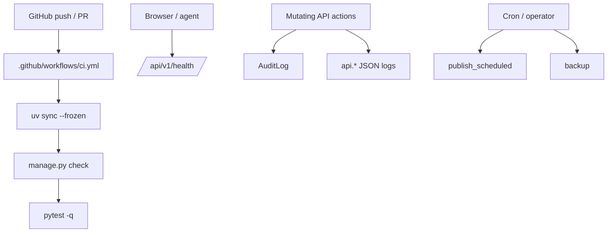

# Infrastructure

## Runtime map



## CI

GitHub Actions workflow: `.github/workflows/ci.yml`

Runs on push to `main` and on PRs:
- `uv sync --frozen`
- `uv run python manage.py check`
- `uv run pytest -q`

## Health Endpoint

Public, no API key required:

```http
GET /api/v1/health/
```

Returns:

```json
{
  "status": "ok",
  "db": "ok",
  "post_count": 42,
  "version": "1.0"
}
```

Use it for local smoke, uptime probes, and quick DB sanity checks.

## Backup

```bash
uv run python manage.py backup [--output FILE]
```

Dumps posts as JSON to stdout or a file. The command is intended for operator recovery / export, not for versioned fixtures.

## Scheduled Publishing

```bash
uv run python manage.py publish_scheduled
```

Publishes draft posts whose `published_at` timestamp has arrived. Intended for cron or scheduler use.

## Environment Variables

See `.env.example` for all supported variables:

| Variable | Default | Description |
|---|---|---|
| `DJANGO_SECRET_KEY` | dev placeholder | Django secret key |
| `DJANGO_DEBUG` | `True` | Debug mode |
| `DJANGO_ALLOWED_HOSTS` | `localhost,127.0.0.1,testserver` | Comma-separated allowed hosts |
| `SITE_AUTHOR` | `*** Name` | Public site author default |

## Makefile

| Target | Action |
|---|---|
| `make setup` | `uv sync --python 3.12` |
| `make migrate` | `uv run python manage.py migrate` |
| `make run` | `uv run python manage.py runserver 127.0.0.1:8036` |
| `make test` | `uv run pytest -q` |
| `make check` | `uv run python manage.py check` |

## Structured Logging

API actions are logged via Python `logging` with JSON output on `api.*` loggers.

Current shape in `config/settings.py`:

- custom `_JsonFormatter`
- console handler
- logger family: `api`
- payload includes:
  - `timestamp`
  - `level`
  - `logger`
  - `message`
  - any JSON-serializable `extra` fields

### What is currently logged

- publish / replace style mutations
- bulk publish
- status changes
- soft delete operations

### What is **not** yet a separate log stream

- request/response access log for every API request
- dedicated health failure alerts
- dedicated rate-limit hit stream
- correlation/request IDs

That is intentional: the project currently has a useful minimum, not a full observability stack.
