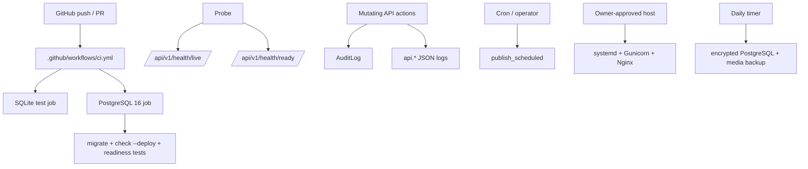

# Infrastructure

## Runtime map



## CI

GitHub Actions workflow: `.github/workflows/ci.yml`

Runs on push to `main` and on PRs:

- SQLite job: `uv sync --frozen`, Django check and full pytest;
- PostgreSQL 16 service job: migrations, production `check --deploy`, production-settings and readiness tests.

`.github/workflows/deploy.yml` is separate: only `v*` tags or manual dispatch, after a full verification job, and only through the fixed host adapter. Its existence does not authorize or prove a live deployment.

## Health endpoints

Public, no API key required:

| Endpoint | Database | Success | Failure |
|---|---:|---|---|
| `GET /api/v1/health/live/` | no | `200 {"status":"ok"}` | process-level failure only |
| `GET /api/v1/health/ready/` | `SELECT 1` | `200 {"status":"ok"}` | sanitized `503 {"status":"unavailable"}` |
| `GET /api/v1/health/` | same as readiness | compatibility alias | same sanitized 503 |

All probes are public, GET-only and return `Cache-Control: no-store`. Readiness logs a stable event without exception text, DSN or credentials. Use liveness for process supervision and readiness for traffic admission.

## Backup and deployment

`uv run python manage.py backup` remains a JSON content export; it is not a production database/media backup. The encrypted PostgreSQL + media contour, pruning and restore gates are documented in [`backup-restore.md`](backup-restore.md). Immutable release, systemd/Gunicorn, Nginx and rollback are documented in [`deployment.md`](deployment.md).

## Scheduled Publishing

```bash
uv run python manage.py publish_scheduled
```

Publishes draft posts whose `published_at` timestamp has arrived. Intended for cron or scheduler use.

## Environment Variables

See `.env.example` for local values and production placeholders. `.env.production.example` and `deploy/systemd/django-6-blog.env.example` are the canonical production templates:

| Variable | Default | Description |
|---|---|---|
| `DJANGO_SECRET_KEY` | dev placeholder | Django secret key |
| `DJANGO_DEBUG` | `True` | Debug mode |
| `DJANGO_ALLOWED_HOSTS` | `localhost,127.0.0.1,testserver` | Comma-separated allowed hosts |
| `SITE_AUTHOR` | `*** Name` | Public site author default |
| `DATABASE_URL` | placeholder only | Production PostgreSQL URL |
| `DJANGO_CSRF_TRUSTED_ORIGINS` | placeholder only | Comma-separated HTTPS origins |
| `DJANGO_MEDIA_STORAGE` | `s3` in production | Production fails closed on any other value |
| `MEDIA_S3_ENDPOINT_URL`, `MEDIA_S3_BUCKET_NAME`, `MEDIA_S3_REGION_NAME` | placeholders | S3 location |
| `MEDIA_S3_AUTH_ID`, `MEDIA_S3_AUTH_MATERIAL` | placeholders | Opaque S3 credentials; never log or commit |
| `MEDIA_S3_CUSTOM_DOMAIN` | empty for private mode | Hostname only; incompatible with signed URLs |
| `MEDIA_S3_SIGNED_URLS`, `MEDIA_S3_SIGNED_URL_TTL_SECONDS` | `true`, `3600` in private example | Presigned URL policy |
| `MEDIA_S3_CACHE_CONTROL`, `MEDIA_S3_FILE_OVERWRITE` | private cache, `false` | Object/cache policy |
| `MEDIA_S3_ADDRESSING_STYLE`, `MEDIA_S3_SIGNATURE_VERSION`, `MEDIA_S3_VERIFY_SSL` | `path`, `s3v4`, `true` | S3 transport policy |

Production settings validate configuration without opening a network connection. Real secrets belong out of band in `/etc/django-6-blog/django-6-blog.env`, not GitHub or repository files.

## Makefile

| Target | Action |
|---|---|
| `make setup` | `uv sync --python 3.12` |
| `make migrate` | `uv run python manage.py migrate` |
| `make run` | `uv run python manage.py runserver 127.0.0.1:8036` |
| `make test` | `uv run pytest -q` |
| `make check` | `uv run python manage.py check` |

## Structured Logging

API actions are logged via Python `logging` with JSON output on `api.*` loggers.

Current shape in `config/settings.py`:

- custom `_JsonFormatter`
- console handler
- logger family: `api`
- payload includes:
  - `timestamp`
  - `level`
  - `logger`
  - `message`
  - any JSON-serializable `extra` fields

### What is currently logged

- publish / replace style mutations
- bulk publish
- status changes
- soft delete operations

### What is **not** yet a separate log stream

- request/response access log for every API request
- dedicated health failure alerts
- dedicated rate-limit hit stream
- correlation/request IDs

That is intentional: the project currently has a useful minimum, not a full observability stack.

## Offline/live boundary

Repository tests use temporary release trees, fake tools, pathless storage and CI PostgreSQL. They may validate settings, scripts, manifests, rollback verdicts and redaction. They must not access Timeweb, real credentials, SSH, DNS/TLS, remote PostgreSQL/S3, systemd/Nginx, backup destinations or production data.

Live bootstrap inputs and gates are listed in [`timeweb-deployment-preparation.md`](timeweb-deployment-preparation.md). Passing offline checks does not prove host permissions, TLS, S3 semantics, backup durability, restore RPO/RTO, reboot persistence or a successful deploy.
