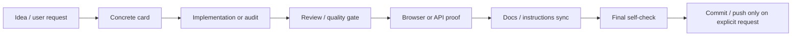
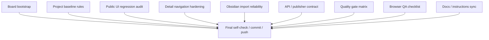

# Kanban workflow

Этот документ описывает, как вести разработку `django_6_blog` через Hermes Kanban.

## Доска проекта

```text
slug: django-6-blog
name: Django 6 Blog
default workdir: /home/v/code/django_6_blog
source of truth: Hermes Kanban CLI / board database
```

Browser dashboard и Telegram-уведомления считаются view/reporting layer. Состояние задач, зависимости и финальные handoff проверяются через CLI.

## Назначение

Kanban используется не как отдельный TODO-лист, а как агентный pipeline для проверяемых слайсов:



## Стартовая структура доски

Начальная доска заведена как planning/probe board. Dispatch не запускается автоматически до явного решения.

| Card | Purpose |
|---|---|
| Board bootstrap and operating map | Удерживает общую карту перехода проекта на kanban. |
| Project baseline rules | Фиксирует `AGENTS.md`, инструкции, uv/SQLite/visibility/commit rules. |
| Public UI regression audit | Находит UI-регрессии и превращает их в маленькие карточки. |
| Detail navigation hardening | Поддерживает contract detail page: header, breadcrumbs, TOC, anchors, cache. |
| Obsidian import reliability | Проверяет импорт Markdown/frontmatter/media/timecodes. |
| API and publisher CLI contract | Проверяет `/api/v1/`, auth, permissions, publisher CLI и E2E contract. |
| Quality gate matrix | Описывает, какие проверки запускать для разных типов слайсов. |
| Browser QA checklist | Даёт reusable browser/visual QA checklist для публичных страниц. |
| Docs / instructions sync | Проверяет, что docs, instructions и `AGENTS.md` не расходятся с поведением. |
| Final self-check / commit / push | Финальный gate, зависящий от остальных карточек. |

## Зависимости

Финальная карточка должна зависеть от всех рабочих карточек текущей волны.



## Что должна содержать карточка

Каждая карточка по проекту должна быть конкретной и проверяемой.

Минимальный contract:

```text
Project: django_6_blog
Repo: /home/v/code/django_6_blog
Read first:
- AGENTS.md
- relevant instructions/*.instructions.md
- relevant doc/*.md
- exact code/templates/static files if known

Task:
One narrow objective.

Done when:
- measurable condition 1
- measurable condition 2
- tests/browser/API evidence listed

Reporting:
- short Russian summary
- exact blocker if blocked
```

Не создавать карточки вида «улучшить UI» или «проверить API» без точного scope, файлов и done condition.

## Рабочий порядок

1. Проверить board и карточку через CLI:

   ```bash
   hermes kanban --board django-6-blog show <task-id>
   hermes kanban --board django-6-blog stats
   ```

2. Прочитать `AGENTS.md` и инструкции из карточки.
3. Выполнить только указанный слайс.
4. Закрыть evidence gate:
   - focused tests;
   - `uv run python manage.py check`;
   - browser/API proof, если слайс user-visible или endpoint-visible;
   - `git diff --check` перед handoff.
5. Если менялось поведение, проверить docs/instructions sync.
6. Коммит и push выполнять только по явной просьбе пользователя.

## Reporting rules

Telegram-отчёты по kanban должны быть короткими и на русском:

- что изменилось;
- что проверено;
- что заблокировано;
- какой input нужен от пользователя.

Не отправлять сырой dump доски, длинные логи и нечитаемые full-page screenshots без запроса.

## Когда использовать dispatch

Dispatch уместен, когда:

- карточки уже конкретны;
- зависимости выставлены;
- есть assignee/profile strategy;
- пользователь ожидает автономное выполнение.

Для planning/probe board dispatch не запускать автоматически. Сначала закрыть baseline/rules card или явно подтвердить старт рабочих lanes.

## Commit/push gate

Финальная карточка должна запускать стандартный safety gate:

```bash
git status --short --branch
git diff --stat
git diff --cached --stat
git ls-files --others --exclude-standard
uv lock --check
uv run python manage.py check
uv run pytest -q
git diff --check
```

Перед staging проверять, что не попадают:

- `.env`
- `.venv/`
- `db.sqlite3`
- `media/posts/*`
- `tests/assets/*`
- `__pycache__/`
- `*.pyc`
- секреты или локальные runtime artifacts
