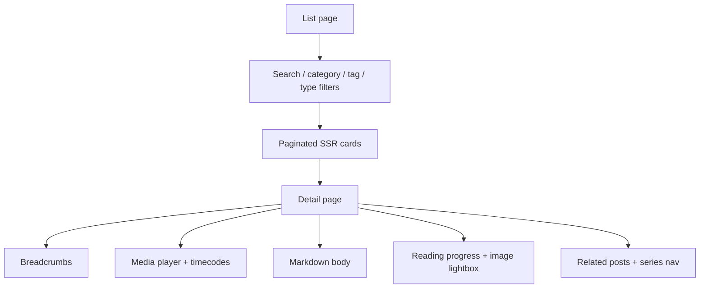
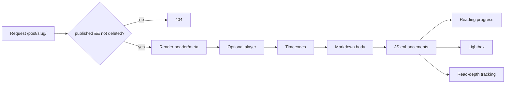

# Публичный UI

Публичный UI строится как SSR-first Django приложение с HTMX progressive enhancement. Без JavaScript все основные URL, фильтры и detail pages должны оставаться рабочими.

## Структура страницы

## Лента постов

`PostListView` показывает только записи, которые одновременно:

- `status = published`
- `deleted_at IS NULL`

Поддерживаются query parameters:

- `search` — поиск по заголовку, Markdown-контенту, категории и тегам
- `category` — slug категории
- `tag` — slug тега
- `type` — `article | video | audio | podcast`
- `page` — номер страницы

Пагинация остаётся обычными ссылками. HTMX используется для частичного обновления списка и догрузки карточек, но не должен ломать обычную навигацию без JavaScript.

## Поиск по кириллице

SQLite `icontains` ограничен ASCII-поведением, поэтому для не-ASCII поисковых строк используется дополнительный Python `casefold` pass по уже ограниченному queryset. Если поиск или фильтры меняются, кириллицу нужно проверять отдельно.

## Карточки

Карточка должна использовать:

- `Post.description` для excerpt
- `cover_media` как обложку, если есть image media
- type badge для `article` / `video` / `audio` / `podcast`
- placeholder для no-cover состояний
- category/tag links как обычные URL
- copy-link control с абсолютной canonical-ссылкой на detail page

Не показывай в карточке:

- сырой Markdown
- frontmatter
- служебные blocks
- первый H1 из body

## Detail page

Detail page отвечает за:

- header с title, badges, tags и author meta
- breadcrumbs
- session reactions
- optional media player
- timecodes panel
- rendered Markdown body
- reading progress bar
- lightbox для изображений в `.markdown-content`
- related posts
- series navigation (`prev` / `next` / position), если пост входит в серию
- back link к списку

`draft`, `archived` и soft-deleted записи публично не открываются.

## Detail flow

## Навигация и discovery

Публичная поверхность теперь включает:

- breadcrumbs
- related posts
- TOC для длинных материалов
- series landing page `/series/<slug>/`
- content-type filter на листинге

Это часть информационной архитектуры сайта, а не случайные украшения. Если меняется detail/list UX, нужно проверять эти блоки как систему, а не по одному элементу.

## Link previews и шаринг

Detail page должен отдавать OpenGraph/Twitter metadata для красивых карточек ссылок в Telegram, VK и других сетях:

- `og:type=article`
- `og:title` из `Post.title`
- `og:description` из `Post.description`
- `og:url` как абсолютный URL текущего detail page
- `og:image` / `twitter:image`, если у поста есть `cover_media`

В ленте и на detail page есть кнопка копирования ссылки. Это не сеть-специфичная share-кнопка: она копирует универсальный абсолютный URL.

## HTMX partials

HTMX partials должны возвращать только нужный фрагмент:

- search/filter update — список карточек + связанную UI-обвязку
- load more — только дополнительные карточки
- like toggle — только reactions block

Обычный full-page response должен оставаться корректным для тех же URL.

## Reactions и telemetry

Просмотры и лайки anonymous-session based:

- один просмотр поста на одну session
- лайк переключаемый, один активный лайк на session/post
- история хранится в `SessionPostInteraction`
- агрегаты `view_count` и `like_count` живут на `Post`

Отдельно read-depth telemetry уходит через публичный endpoint `POST /api/v1/posts/<slug>/read-depth/` и пишет `PostView`.

## Frontend quality obligations

Для detail/list UI важны:

- skip-link и понятные focus states
- lazy-load изображений
- mobile-friendly typography
- отсутствие duplicate primary media players
- корректная работа progress/lightbox/timecodes на живой странице

## Visual QA

Если меняется видимая поверхность:

1. Запусти релевантные tests.
2. Проверь страницу в браузере.
3. Посмотри console errors.
4. Проверь ключевые состояния, а не только happy screenshot.
5. Для пользовательского visual feedback приложи 2–4 читаемых WebP-кропа, а не огромные full-page screenshots.
6. Перед отправкой проверь кроп глазами: важный UI не должен быть пустым, мыльным или обрезанным.
