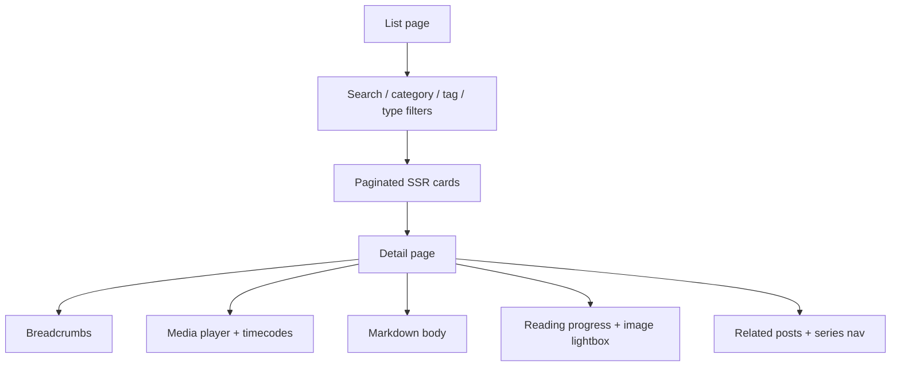
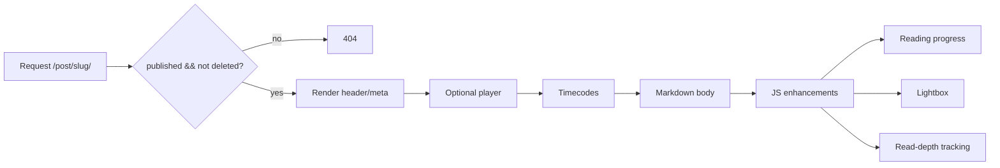

# Публичный UI

Публичный UI строится как SSR-first Django приложение с HTMX progressive enhancement. Без JavaScript все основные URL, фильтры и detail pages должны оставаться рабочими.

## Структура страницы

```mermaid
flowchart TD
    A[List page] --> B[Search / category / tag / type filters]
    B --> C[Paginated SSR cards]
    C --> D[Detail page]
    D --> E[Breadcrumbs]
    D --> F[Media player + timecodes]
    D --> G[Markdown body]
    D --> H[Reading progress + image lightbox]
    D --> I[Related posts + series nav]
```

## Лента постов

`PostListView` показывает только записи, которые одновременно:

- `status = published`
- `deleted_at IS NULL`

Поддерживаются query parameters:

- `search` — поиск по заголовку, Markdown-контенту, категории и тегам
- `category` — slug категории
- `tag` — slug тега
- `type` — `article | video | audio | podcast`
- `page` — номер страницы

Пагинация остаётся обычными ссылками. HTMX используется для частичного обновления списка и догрузки карточек, но не должен ломать обычную навигацию без JavaScript.

Все ссылки пагинации, «Загрузить ещё», категорий, тегов и типов строятся из
одного `request.GET` / `QueryDict`: активные `search`, `category`, `tag` и
`type` сохраняются и в SSR, и в HTMX. При смене фильтра старые `page` и
`load_more` удаляются, чтобы новая выборка начиналась с первой страницы.

## Поиск по кириллице

SQLite `icontains` ограничен ASCII-поведением, поэтому для не-ASCII поисковых строк используется дополнительный Python `casefold` pass по уже ограниченному queryset. Если поиск или фильтры меняются, кириллицу нужно проверять отдельно.

## Карточки

Карточка должна использовать:

- `Post.description` для excerpt
- `cover_media` как обложку, если есть image media
- type badge для `article` / `video` / `audio` / `podcast`
- placeholder для no-cover состояний
- category/tag links как обычные URL
- copy-link control с абсолютной canonical-ссылкой на detail page

Не показывай в карточке:

- сырой Markdown
- frontmatter
- служебные blocks
- первый H1 из body

## Detail page

Detail page отвечает за:

- header с title, badges, tags и author meta
- breadcrumbs
- session reactions
- optional media player
- timecodes panel
- rendered Markdown body
- reading progress bar
- lightbox для изображений в `.markdown-content`
- related posts
- series navigation (`prev` / `next` / position), если пост входит в серию
- back link к списку
- detail-only return-to-top anchor с SSR fallback на `#post-start`

`draft`, `archived` и soft-deleted записи публично не открываются. Это правило
также действует для лайков, публичной карты/счётчиков тегов и навигации внутри
серии. Лайк soft-deleted записи возвращает `404` и не меняет ни агрегатный
счётчик, ни `SessionPostInteraction`.

## Detail flow

```mermaid
flowchart LR
    A[Request /post/slug/] --> B{published && not deleted?}
    B -- no --> C[404]
    B -- yes --> D[Render header/meta]
    D --> E[Optional player]
    E --> F[Timecodes]
    F --> G[Markdown body]
    G --> H[JS enhancements]
    H --> I[Reading progress]
    H --> J[Lightbox]
    H --> K[Read-depth tracking]
```

## Callout и безопасный HTML

В `.markdown-content` Obsidian callout рендерится как семантический `aside` с
отдельными `.callout-title` и `.callout-body`; складные callout используют
нативные `details` / `summary`. Маркер `[!type]` не выводится пользователю.
Поддерживаются case-insensitive official Obsidian types/aliases, custom title,
вложенный Markdown и безопасный fallback `note` для неизвестного типа. Обычные
blockquote не превращаются в callout.

Перед `body_html|safe` готовый HTML проходит allowlist-санитизацию. Она удаляет
исполняемые теги, `on*`-атрибуты и опасные URL-схемы, но сохраняет разрешённую
Markdown-разметку, Mermaid, HTML5 audio/video body embeds и служебные
классы/ARIA/data-атрибуты компонентов.

Стили callout изолированы `.markdown-content .callout`-селекторами. Для
свёрнутого summary обязателен клавиатурный фокус; проверка detail page включает
отсутствие горизонтального overflow на целевых viewport.

## Навигация и discovery

Публичная поверхность теперь включает:

- breadcrumbs
- related posts
- TOC для длинных материалов
- series landing page `/series/<slug>/`
- content-type filter на листинге

Это часть информационной архитектуры сайта, а не случайные украшения. Если меняется detail/list UX, нужно проверять эти блоки как систему, а не по одному элементу.

В series navigation учитываются только опубликованные, не удалённые записи:
soft-deleted участник не влияет на `prev` / `next`, позицию и общее количество.

## Link previews и шаринг

Detail page должен отдавать OpenGraph/Twitter metadata для красивых карточек ссылок в Telegram, VK и других сетях:

- `og:type=article`
- `og:title` из `Post.title`
- `og:description` из `Post.description`
- `og:url` как абсолютный URL текущего detail page
- `og:image` / `twitter:image`, если у поста есть `cover_media`

В ленте и на detail page есть кнопка копирования ссылки. Это не сеть-специфичная share-кнопка: она копирует универсальный абсолютный URL.

На viewport `<=576px` copy-link и нижняя навигация образуют правую пару одинаковых
тёмных кнопок `44×44`: copy-link слева, переход к статье или назад к списку —
справа. Текст на mobile скрыт, но сохраняется через `aria-label`; на desktop
подписи остаются видимыми. Состояния успешного копирования и ошибки меняют только
семантический цвет copy-link, не геометрию пары. Hover, focus и active также не
меняют размер, вертикальную позицию или центр иконок; оба элемента получают
видимый geometry-neutral focus ring.

## Breadcrumbs и возврат к началу

На mobile (`<=576px`) breadcrumbs не sticky: это одна строка высотой не менее
`44px` с визуальными `Главная / категория`. Полный current title остаётся
visually hidden с `aria-current="page"`, поэтому читатель с assistive technology
сохраняет полный путь; горизонтальный overflow недопустим. На desktop trail
sticky непосредственно под реальной шапкой: Home, категория и сокращённый current
title остаются в одну строку, а section trail продолжает отражать раздел статьи.

Только detail page выводит ровно один тёмный anchor `44×44` без видимого текста,
с белой стрелкой вверх и `aria-label="Вернуться к началу статьи"`. Без JavaScript
это обычная flow-ссылка справа после нижних действий на `#post-start`. При наличии
JavaScript control появляется после одного viewport scroll и становится fixed:
на mobile — `right: 16px`, `bottom: 84px` плюс safe-area; на desktop — `24px/24px`;
`z-index: 1010`. Он скрывается при пересечении с нижними actions и на active/closing
lightbox, учитывает reduced motion, а после возврата фокусируется H1.

## HTMX partials

HTMX partials должны возвращать только нужный фрагмент:

- search/filter update — список карточек + связанную UI-обвязку
- load more — только дополнительные карточки
- like toggle — только reactions block

Обычный full-page response должен оставаться корректным для тех же URL.

## Reactions и telemetry

Просмотры и лайки anonymous-session based:

- один просмотр поста на одну session
- лайк переключаемый, один активный лайк на session/post
- история хранится в `SessionPostInteraction`
- агрегаты `view_count` и `like_count` живут на `Post`

Отдельно read-depth telemetry уходит через публичный endpoint `POST /api/v1/posts/<slug>/read-depth/` и пишет `PostView`.

## Frontend quality obligations

Для detail/list UI важны:

- skip-link и понятные focus states
- ровно один семантический breadcrumb на странице, где он предусмотрен
- доступный navbar toggler (`aria-label`, `aria-controls`, `aria-expanded`)
- `aria-current="page"` только у текущей ссылки пагинатора
- `aria-hidden="true"` у декоративных иконок навигации
- lazy-load изображений
- mobile-friendly typography
- отсутствие duplicate primary media players
- корректная работа progress/lightbox/timecodes на живой странице

## Visual QA

Если меняется видимая поверхность:

1. Запусти релевантные tests.
2. Проверь страницу в браузере.
3. Посмотри console errors.
4. Проверь ключевые состояния, а не только happy screenshot.
5. Для пользовательского visual feedback приложи 2–4 читаемых WebP-кропа, а не огромные full-page screenshots.
6. Перед отправкой проверь кроп глазами: важный UI не должен быть пустым, мыльным или обрезанным.
