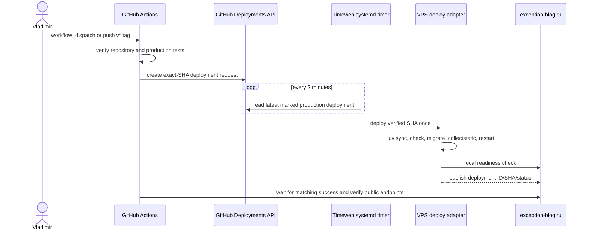

# Timeweb production operations

The active production site is `https://exception-blog.ru/`. Repository behavior and deployment mechanics are documented in `doc/deployment.md`; backup and restore gates are documented in `doc/backup-restore.md`.

## Current resources

- VPS: Ubuntu, Nginx, Gunicorn through `django-6-blog.service`, PostgreSQL on the host.
- Application checkout: `/srv/django-6-blog/app`.
- Production environment: `/etc/django-6-blog/django-6-blog.env`.
- Media: private Timeweb S3 with signed URLs.
- TLS: Let’s Encrypt certificate issued by DNS-01 through the Timeweb Cloud DNS API.
- Deployment: GitHub Actions verify job plus GitHub Deployments API pull transport; no inbound CI SSH.

## Secret boundaries

Populated local files are ignored by Git:

```text
.env.production
.env.deploy
/home/v/.config/django_6_blog/timeweb-bootstrap.toml
```

Tracked references contain placeholders only:

- `.env.production.example`;
- `deploy/systemd/django-6-blog.env.example`.

Never commit or paste populated application env, SSH private keys, S3 keys, PostgreSQL passwords, Timeweb API tokens or TLS private keys into GitHub logs, documentation or task evidence.

## GitHub production environment

The workflow uses the environment named `production`. The active pull transport requires no repository or environment secrets:

- the workflow uses the short-lived job-scoped `GITHUB_TOKEN` only to create a deployment record;
- the VPS reads public deployment metadata from `api.github.com`;
- the host adapter independently verifies the requested SHA against the fixed repository origin and `origin/main`/`v*` reachability;
- application credentials never leave the VPS.

Old `DEPLOY_HOST`, `DEPLOY_PORT`, `DEPLOY_USER`, `DEPLOY_SSH_PRIVATE_KEY` and `DEPLOY_KNOWN_HOSTS` secrets are obsolete for the active workflow and should be removed after the pull deployment is verified.

## Deployment sequence



Expected latency between the GitHub request and host pickup is up to approximately two minutes.

## Installed deployment artifacts

```text
/usr/local/sbin/django-6-blog-checkout-deploy
/usr/local/sbin/django-6-blog-deployment-poller
/etc/systemd/system/django-6-blog-deployment-poller.service
/etc/systemd/system/django-6-blog-deployment-poller.timer
/var/lib/django-6-blog/deployment-status.json
```

Repository sources:

```text
deploy/host/django-6-blog-checkout-deploy
deploy/host/django-6-blog-deployment-poller
deploy/systemd/django-6-blog-deployment-poller.service
deploy/systemd/django-6-blog-deployment-poller.timer
.github/workflows/deploy.yml
```

The poller handles each GitHub deployment ID once. A failed deployment is not retried indefinitely; create a new manual workflow run after diagnosing the server journal.

## Operational checks

```bash
systemctl is-active nginx django-6-blog.service
test -f /var/lib/django-6-blog/deployment-status.json
systemctl is-active django-6-blog-deployment-poller.timer
systemctl list-timers django-6-blog-deployment-poller.timer
journalctl -u django-6-blog-deployment-poller.service
```

Public probes:

```bash
curl --fail https://exception-blog.ru/
curl --fail https://exception-blog.ru/api/v1/health/live/
curl --fail https://exception-blog.ru/api/v1/health/ready/
curl --fail https://exception-blog.ru/_deploy/status
```

The public deployment status intentionally exposes only deployment ID, commit SHA and state. It must never expose command output or environment values.

## TLS

The active Nginx vhost serves:

- HTTP `80` with an ACME webroot exception and redirect to HTTPS;
- HTTPS `443` with the production Let’s Encrypt certificate;
- `/static/` from `/srv/django-6-blog/app/staticfiles/`;
- `/_deploy/status` from the root-owned deployment status file;
- application traffic through Gunicorn at `127.0.0.1:8000`.

HTTP-01 and TLS-ALPN-01 were not selected for renewal because external validation paths were inconsistent. DNS-01 requires a Timeweb Cloud API token with the minimum DNS-management rights. A temporary token is sufficient for one issuance but not for unattended renewal. Keep the renewal token outside GitHub and repository files.

## Failure handling

- GitHub verify failure: the deployment request is not created.
- GitHub deployment request created but not picked up: inspect the timer and VPS access to `api.github.com`.
- Poller reports `failure`: inspect `journalctl -u django-6-blog-deployment-poller.service`, fix the blocker and start a new manual workflow run.
- Readiness failure without migration changes: the adapter restores the preceding code revision.
- Readiness failure with migration changes: automatic code rollback is refused; use a reviewed forward fix or restore plan.
- Public status polling timeout: confirm that Nginx serves `/_deploy/status` and that the deployment ID matches the GitHub run.

## Offline verification

```bash
uv lock --check
uv run pytest -q tests/test_production_settings.py blog/test_infra.py blog/test_static_delivery.py blog/test_storage_compat.py tests/test_deploy_artifacts.py tests/test_backup_script_safety.py
uv run python manage.py check
uv run pytest -q
git diff --check
```

Offline tests prove parsing, authorization and fail-closed repository behavior. The manual workflow run plus VPS journal, exact deployed revision and public HTTPS probes are the live deployment proof.
