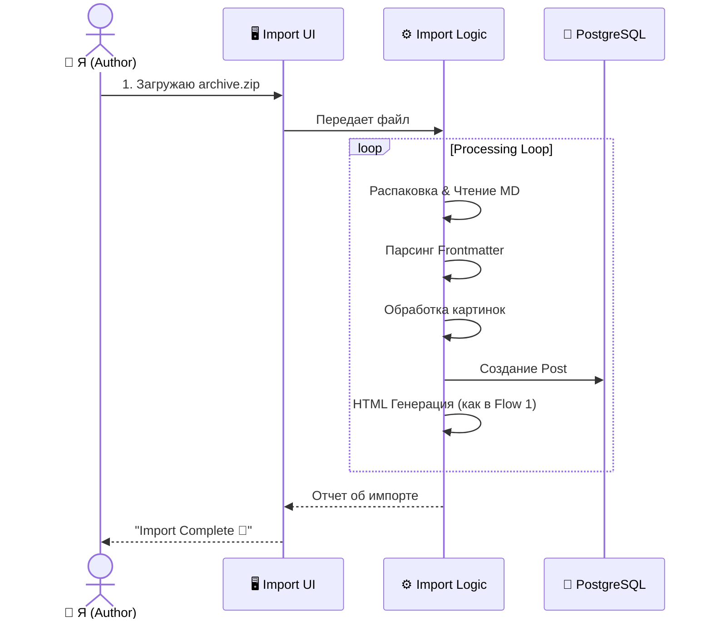

👤 User Story: Публикация и Индексация Контента

Роль: Администратор / Автор блога (Ты)
Контекст: Система полностью развернута (Postgres + pgvector + Chonkie Pipeline). Фаза 3 завершена.

🎭 Акт 1: "Рутина перфекциониста" (Single Post Workflow)

Сценарий: Я только что написал крутую статью про HTMX и хочу опубликовать её так, чтобы каждая строчка кода была доступна в поиске.

1. Написание и Загрузка

Я захожу в Django Admin -> Posts -> Add New.

В поле Content (Markdown) я вставляю текст статьи. Там есть и теория, и блоки кода на Python/JS, и диаграммы Mermaid.

Я прикрепляю обложку (ImageField).

Действие: Я нажимаю кнопку "Save and Continue Editing".

2. Магия под капотом (Post-Processing)

Система сохраняет пост в базе данных.

Markdown Processing:

Конвертация Markdown в HTML.

Обработка блоков кода (подсветка синтаксиса).

Генерация оглавления (TOC) из заголовков H2/H3.

Сохранение обработанного HTML в поле content_html для быстрого отображения.

Визуализация: Прямо в админке я вижу предпросмотр готового поста (как он будет выглядеть на сайте).

3. Проверка результата (Quality Control)

Я открываю пост на сайте.

Вижу красивый HTML с подсветкой кода.

Вижу рабочее оглавление.

Картинки и диаграммы отображаются корректно.

Итог: Пост опубликован и выглядит отлично.

🎭 Акт 2: "Великое переселение" (Bulk Import Workflow)

Сценарий: Я решил перенести 50 старых статей из Obsidian (Markdown файлы) и папку с картинками в новый блог.

1. Подготовка архива

На компьютере я собираю папку my_old_blog/, где лежат .md файлы и папка images/.

Я пакую это всё в migration.zip.

2. Загрузка (Bulk Upload)

Я захожу в Django Admin -> Import Tools -> Bulk Upload.

Загружаю migration.zip.

Нажимаю "Start Import".

3. Обработка (Ingestion Engine)

Сервер принимает архив и начинает его обработку.

Логика:

Распаковка архива.

Чтение каждого .md файла.

Парсинг метаданных (Frontmatter) для заголовка, даты, тегов.

Обработка ссылок на картинки (замена локальных путей на URL медиа-файлов).

Создание объектов Post.

Генерация HTML из Markdown.

Визуализация: Простой лог импорта: "Imported 50 posts. Errors: 0".

4. Финал

Все 50 статей теперь в базе.

Картинки привязаны к постам.

Я могу открыть любую статью и она будет выглядеть так же, как и созданная вручную.

🧬 Диаграммы Процессов (Mermaid)

Flow 1: Публикация (Ручная)

```mermaid
sequenceDiagram
    actor Me as 👤 Я (Author)
    participant Admin as 🖥️ Django Admin
    participant Core as ⚙️ Markdown Engine
    participant DB as 🐘 PostgreSQL

    Me->>Admin: 1. Пишу пост & Жму Save
    Admin->>DB: Сохраняет Raw Markdown
    Admin->>Core: Вызов: process_markdown(post)
    
    rect rgb(20, 40, 60)
        Note over Core: HTML Генерация
        Core->>Core: Markdown -> HTML
        Core->>Core: Syntax Highlighting
        Core->>Core: TOC Generation
    end
    
    Core->>DB: Обновление content_html
    DB-->>Admin: Готово!
    Admin-->>Me: Показывает Preview

```

Flow 2: Импорт (ZIP Архив)

